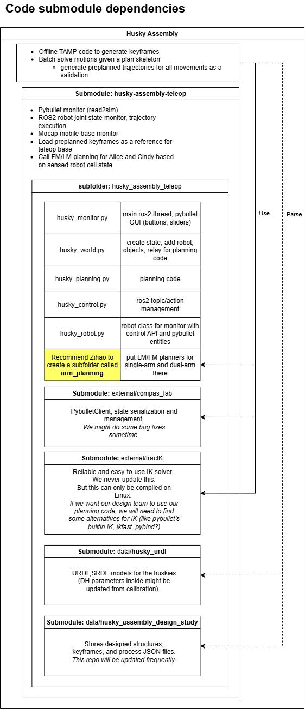

# husky_assembly_teleop

This is a python package for controlling huskies in the mocap space.

# Installation
## Clone and update submodules
Install this library from source by cloning this repo to local and install from source.
```
git clone --recursive git@github.com:yijiangh/husky-assembly-teleop.git
```
The `--recursive` flag when cloning above is used for initializing all the git submodules. You can learn more about submodules [here](https://github.com/CGAL/cgal-swig-bindings/wiki/Installation).

Later in the development, whenever you need to update the submodules, issue the following:
```
git submodule update --init --recursive
```

### Updating Submodules

**Using Cursor's Built-in GitHub Plugin:**
When using Cursor's built-in GitHub plugin, pulling changes will automatically update submodules recursively. The plugin handles submodule updates automatically during pull operations. (I think this is true? Please try!)

**Using Git Command Line:**
When using git command line, `git pull` will only update the main repository. To update all submodules recursively, you need to run:
```bash
git pull
git submodule update --init --recursive
```

Alternatively, you can configure git to automatically update submodules during pulls:
```bash
git config --global submodule.recurse true
```

This setting ensures that commands like `git pull` will also update submodules recursively.

## Python Virtual Environment Setup

It is **strongly recommended** to use a Python virtual environment (venv) for development and running this package. This is especially important because the ROS2 package depends on Python packages (such as `compas_fab`, included as a submodule) that are being developed together with this package and installed locally in "editable" mode. Using a venv allows you to install and update these packages without affecting your global Python environment, which avoids conflicts and keeps your system clean. See [this ROS2 issue comment](https://github.com/ros2/ros2/issues/1094#issuecomment-2916700723) for more details.

If you use the `--system-site-packages` flag when creating your venv, you can use system-installed tools like `colcon` without needing to install them inside the venv. This approach has been used reliably for years.

### One-time venv setup

```bash
# One time setup
python3 -m venv <venv_name> --system-site-packages

# In your build terminal
<venv_name>/bin/activate
python3 -m pip install <your_dependencies>
python3 -m colcon build --symlink-install

# In your running terminal
<venv_name>/bin/activate
source install/setup.bash
ros2 run husky_assembly_teleop husky_monitor
```

## Mocap Connection Setup
Read the [Mocap wiki](https://gitlab.inf.ethz.ch/crl/crl-wiki/-/wikis/HW/OptiTrack) for more information on how to create a rigid body in Motive and how to set the IP address of the OptiTrack server.

## Tracikpy (Linux-only)
Tracikpy is a minimal yet reliable and fast inverse kinematics solver that simply takes a URDF and a target pose and returns a solution.
However, it only works on Linux and is very hard to configure on a Windows machine. Thus, atm we couldn't use it for the Grasshopper/Rhino design interface.

Install system package dependencies for [tracikpy](https://github.com/mjd3/tracikpy):
```
sudo apt-get install libeigen3-dev liborocos-kdl-dev libkdl-parser-dev liburdfdom-dev libnlopt-dev libnlopt-cxx-dev
```
If using a Mac, you can install the dependencies using [Homebrew](https://stackoverflow.com/questions/19688424/why-is-the-apt-get-function-not-working-in-the-terminal-on-mac-os-x-v10-9-maver).

Install python dependencies:
```
pip install -r requirements.txt
```

# Code Structure

This package is intended to be a hardware deployment code. Its relationship to other parts of the overall system is shown below.



# Usage

### Initiate network connection
1. Turn on the power for the TPLink, the OptiTrack system (the Netgear router).
2. Connect your computer to the TPLink via an Ethernet cable.
3. Test your Ethernet connection to the Optitrack server computer by pinging the server's IP address. You can find this by running `ipconfig` in the command prompt on the server PC. Update `MOCAP_IP`'s value in the `husky_monitor.py` script.
4. Find our the IP address of your PC, and then confirm this by pinging it from the PC. Update `CLIENT_IP`'s value in the `husky_monitor.py` script.
5. Open the Motive software on the server PC.

### Register a new rigid body in Motive
6. Then, you will need to register a new rigid body by selecting a few markers on the Motive software, follow [the documentation](https://docs.optitrack.com/motive/rigid-body-tracking). Next, note the `Streaming ID` of the rigid body you just registered. You can find this by clicking on the rigid body in the `Assets` panel in Motive. \
\
Alternatively, activate an already existing rigid body in the `Assets` panel.

### Calibrate rigid body

Add the 3D model to the object in motive and move the pivot until the model aligns with the markers. If more precision is needed, use a probe to sample corners on the real object. These additional probe points can be used to improve the alignment of the model.

### Edit the python script to add your rigid body

Add a `TrackedObject(monitor, name, streaming_id, pos, rot, scale, model)` in `husky_world.py`. This object should now be automatically tracked using mocap.

### Tips 💡 
In pybullet's viewer, you can pan the camera by holding `alt` (or `ctrl`) and dragging the mouse. 
`alt + left` click to rotate the camera. 
`alt + right` click to zoom in and out. 
`alt + middle` click to move the camera up and down. 
You can also zoom in and out by scrolling the mouse wheel.

