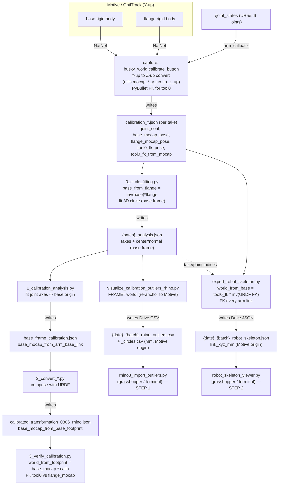

# Coordinate frames in the calibration pipeline

How frames are captured from Motive (OptiTrack) and passed between files — capture →
analysis → calibration → the two Grasshopper/terminal visualizers.

## The one world frame
Everything downstream lives in **one** frame: the **mocap world, Z-up**. Motive streams
Y-up; the capture node rotates Y-up→Z-up about X with **no translation**, so the origin is
unchanged — **mocap-world origin == Motive origin**. PyBullet (capture + FK), the step-1
outlier CSVs (`FRAME='world'`), and the step-2 robot skeleton all use this same origin, so
they overlay directly in Grasshopper.

Two named rigid bodies come from Motive:
- **base_mocap** — rigid body on the Husky base.
- **flange_mocap** — rigid body on the calibration tool (the flange).

## Flow

## File-by-file (frame in → frame out)

| File | Reads | Frame in | Writes | Frame out |
|---|---|---|---|---|
| `husky_world.py::calibrate_button` (~604-745) | NatNet rigid bodies, `/joint_states` | Motive Y-up → converted Z-up | `calibration_*.json` | mocap world (Z-up, Motive origin) |
| `0_circle_fitting.py` (:66) | `calibration_*.json` | mocap world | `{batch}_analysis.json` (center/normal) | **base_mocap** frame (`inv(base)*flange`) |
| `1_calibration_analysis.py` | `{batch}_analysis.json` | base frame circles | `base_frame_calibration.json` | `base_mocap_from_arm_base_link` |
| `2_convert_and_visualize_transformation.py` (:98-103) | `base_frame_calibration.json` + URDF | — | `calibrated_transformation_0806_rhino.json` | `base_mocap_from_base_footprint` |
| `3_verify_calibration.py` (:101-111) | `calibrated_transformation_*.json`, `calibration_*.json` | mocap world | plots only | mocap world |
| `visualize_calibration_outliers_rhino.py` | `{batch}_analysis.json` | base frame (re-anchored, `FRAME='world'`) | `{date}_{batch}_rhino_{outliers,circles}.csv` | **mocap world (Motive origin), mm** |
| `rhino8_import_outliers.py` — **step 1** | the two CSVs | mocap world mm | GH geometry / terminal | mocap world (Motive origin) |
| `export_robot_skeleton.py` | `{batch}_analysis.json` (`tool0_fk_pose`,`joint_conf`) | mocap world | `{date}_{batch}_robot_skeleton.json` | **mocap world (Motive origin), mm** |
| `robot_skeleton_viewer.py` — **step 2** | the skeleton JSON | mocap world mm | GH skeleton / terminal | mocap world (Motive origin) |

## Notes
- **Why two frames appear:** circle FITTING is done in the **base_mocap** frame (subtracting
  base motion makes a clean circle); the visualizers re-express everything back into the
  **mocap world** so all overlays share the Motive origin.
- **Step-2 placement is calibration-free:** it anchors the robot so its tool0 lands on the
  captured `tool0_fk_pose` (already in mocap world), `world_from_base = tool0_fk_pose ∘
  inv(URDF FK base→tool0)`. So step 2 works on **any date**, even ones without a
  `calibrated_transformation_*.json` (e.g. 20260615). The base-calibration path
  (`base_mocap * base_mocap_from_base_footprint`, used by `3_verify`) only exists for dates
  that ran steps 1–2 (e.g. 20260608).
- **Convert math:** `utils.mocap_pos_y_up_to_z_up` (:37-42), `mocap_quat_y_up_to_z_up`
  (:45-51); default convention `"rhino"` (`husky_monitor.py:100`). Rigid bodies arrive in
  `husky_monitor.py::receive_rigid_body_frame` (~4069-4071); joints in
  `husky_robot.py::arm_callback` (~511).

## PENDING (round-5 changes — NOT yet folded into the diagram/table above; discuss presentation)
The diagram + table still describe the older CSV / tool0_fk flow. What actually changed in the
visualizers (to be re-drawn once we agree how to present it):
- **No more derived CSV.** `visualize_calibration_outliers_rhino.py` no longer fits/writes
  `_outliers.csv`/`_circles.csv`. It now just **copies `{batch}_analysis.json` → Drive/<date>/**.
  (`{batch}_analysis.json` already = unchanged raw_data + the base-frame circle fit.)
- **Step-1 viewer reads raw analysis, not CSV.** `rhino8_import_outliers.py` reads
  `Drive/<date>/{batch}_analysis.json`, **reuses the stored fit** (no re-fit), and moves the
  circle + flange points into Motive world with **pure-Python pose math** (no numpy/pybullet, so it
  runs in GH CPython). Points come from `flange_mocap_pose`; circle from the stored base-frame
  `center`/`normal` moved to Motive via the first sample's `base_mocap_pose`. Output is **grouped
  per curve** (GH DataTree branch `{i}`), colored per curve, with on-point labels. Modes:
  grasshopper + terminal (Rhino-bake dropped).
- **Step-2 robot placement no longer uses `tool0_fk_pose`.** `export_robot_skeleton.py` now anchors
  the **URDF flange link onto `flange_mocap_pose`**: `world_from_base = flange_mocap_pose ∘
  inv(URDF FK base→flange)`. CAVEAT: this ignores the fixed offset between the flange mocap RIGID
  BODY and the URDF flange link (the thing calibration solves) → arm pose is APPROXIMATE.
- **Origins:** all visualizer outputs are Motive world; `tool0_fk_pose` / `tool0_fk_from_mocap`
  are no longer used anywhere in the visualization path.
