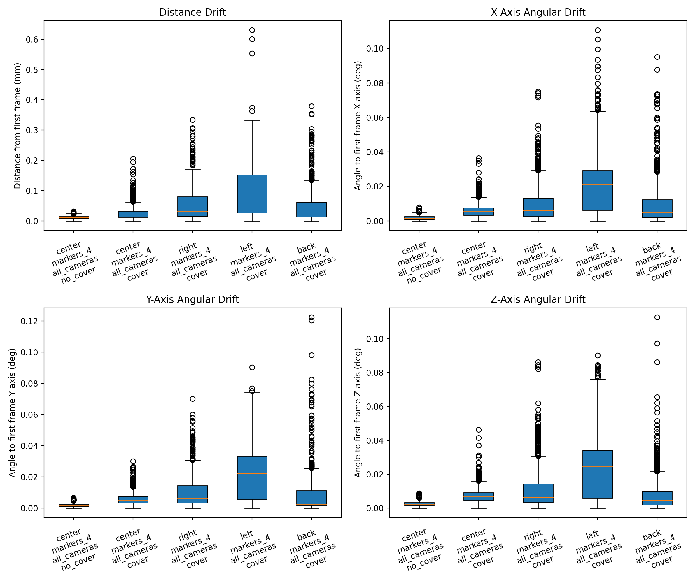
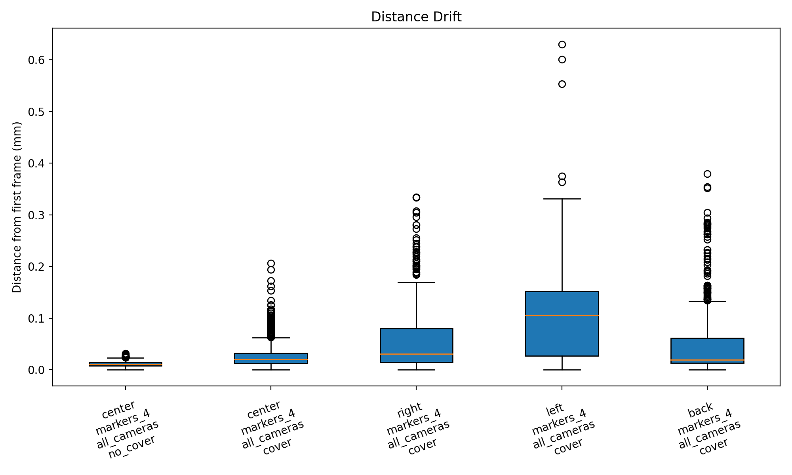
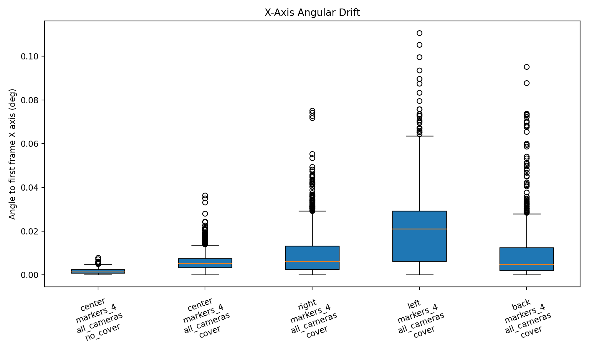
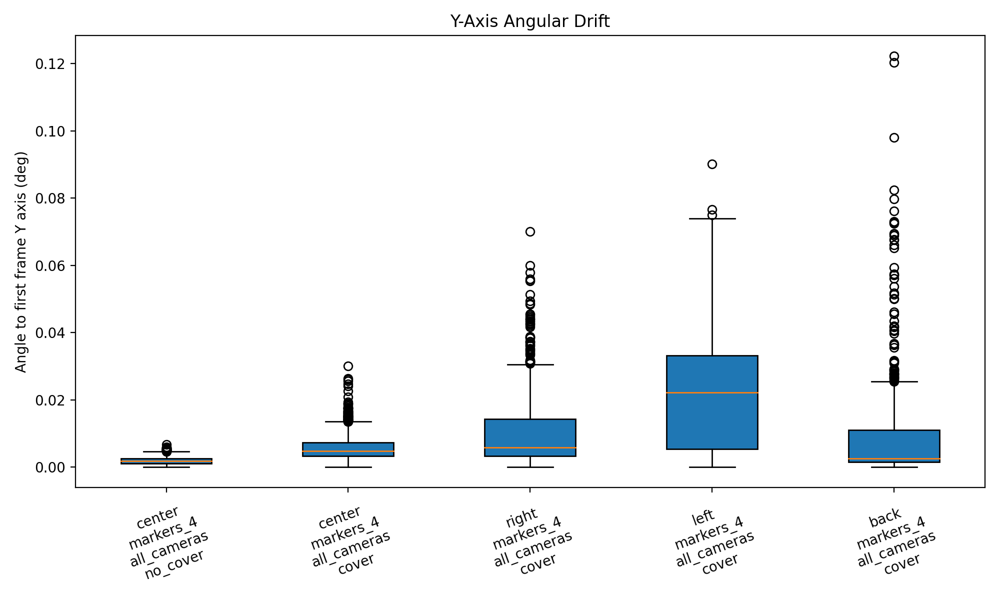
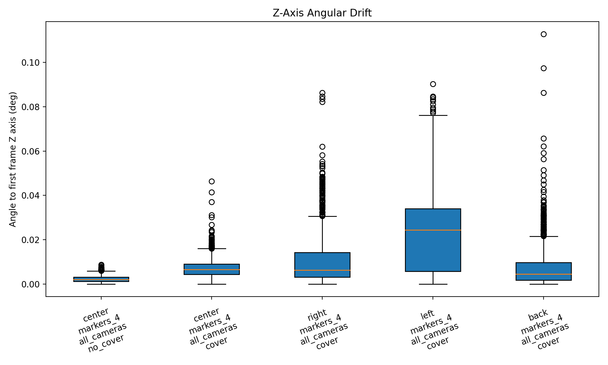
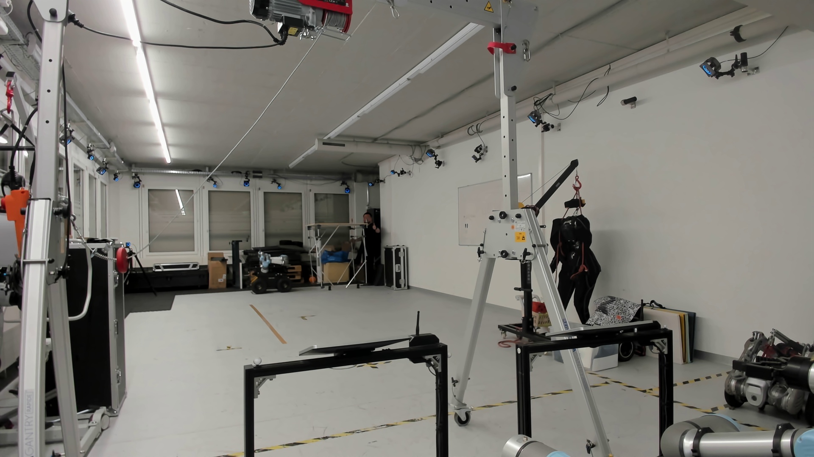
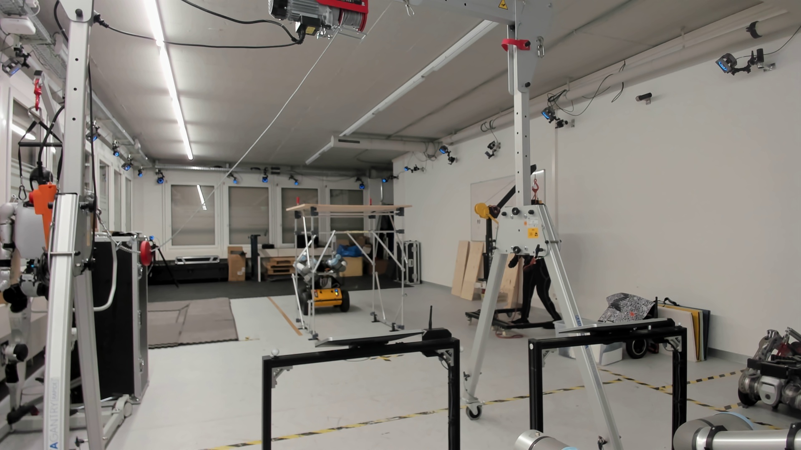
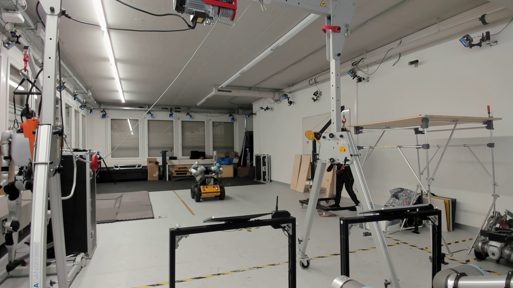
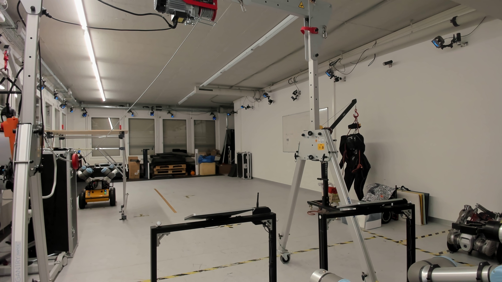
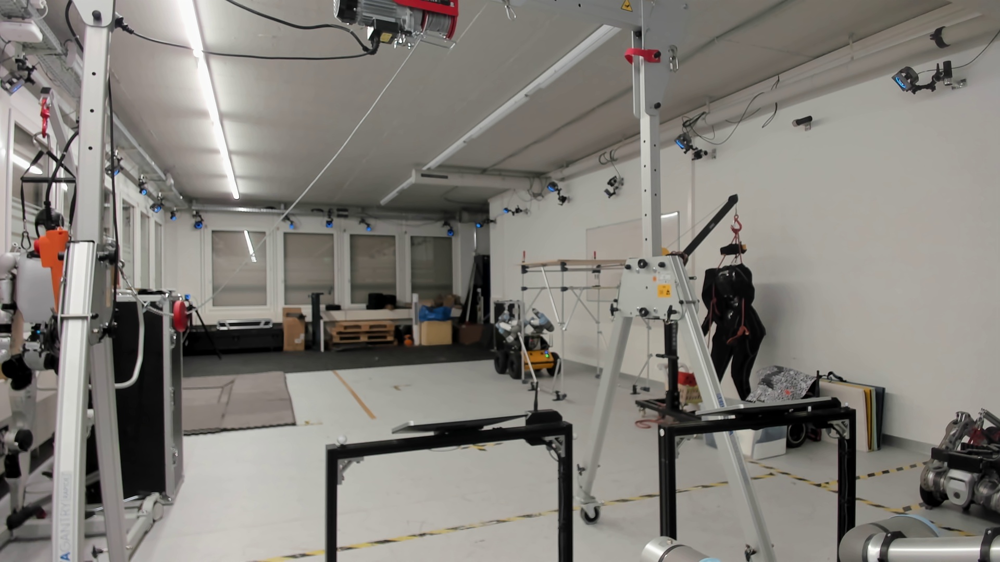

# MoCap Experiment Report

- Generated at: `2026-03-11T16:51:31.950265`
- Grouped by: `take.workspace_position, take.marker_configuration, take.camera_configuration, take.cover_configuration`
- Number of takes: `5`
- Number of groups: `5`

## Plots

### Distance Drift

### X-Axis Angular Drift

### Y-Axis Angular Drift

### Z-Axis Angular Drift

## Group Summary

| Group | Takes | Frames | Distance median (mm) | Distance p95 (mm) | X median (deg) | Y median (deg) | Z median (deg) |
| --- | ---: | ---: | ---: | ---: | ---: | ---: | ---: |
| back / markers_4 / all_cameras / cover | 1 | 1201 | 0.019 | 0.137 | 0.005 | 0.003 | 0.004 |
| center / markers_4 / all_cameras / cover | 1 | 1201 | 0.020 | 0.070 | 0.005 | 0.005 | 0.007 |
| center / markers_4 / all_cameras / no_cover | 1 | 1201 | 0.011 | 0.020 | 0.001 | 0.002 | 0.002 |
| left / markers_4 / all_cameras / cover | 1 | 1201 | 0.106 | 0.217 | 0.021 | 0.022 | 0.024 |
| right / markers_4 / all_cameras / cover | 1 | 1201 | 0.031 | 0.145 | 0.006 | 0.006 | 0.006 |

## MoCap Camera Inventory

### back / markers_4 / all_cameras / cover

- Camera count: `21`
- `PrimeX 22 #72300`
- `PrimeX 22 #72657`
- `PrimeX 13 #66105`
- `PrimeX 13 #66078`
- `PrimeX 13 #66106`
- `PrimeX 22 #72318`
- `PrimeX 22 #72653`
- `PrimeX 22 #72708`
- `PrimeX 22 #72655`
- `PrimeX 22 #72652`
- `PrimeX 13 #66077`
- `PrimeX 22 #72654`
- `PrimeX 22 #72656`
- `PrimeX 22 #72317`
- `Prime 13 #31325`
- `Prime 13 #31327`
- `Prime 13 #31323`
- `Prime 13 #31329`
- `Prime 13 #31324`
- `Prime 13 #31328`
- `Prime 13 #31326`

### center / markers_4 / all_cameras / cover

- Camera count: `21`
- `PrimeX 22 #72300`
- `PrimeX 22 #72657`
- `PrimeX 13 #66105`
- `PrimeX 13 #66078`
- `PrimeX 13 #66106`
- `PrimeX 22 #72318`
- `PrimeX 22 #72653`
- `PrimeX 22 #72708`
- `PrimeX 22 #72655`
- `PrimeX 22 #72652`
- `PrimeX 13 #66077`
- `PrimeX 22 #72654`
- `PrimeX 22 #72656`
- `PrimeX 22 #72317`
- `Prime 13 #31325`
- `Prime 13 #31327`
- `Prime 13 #31323`
- `Prime 13 #31329`
- `Prime 13 #31324`
- `Prime 13 #31328`
- `Prime 13 #31326`

### center / markers_4 / all_cameras / no_cover

- Camera count: `21`
- `PrimeX 22 #72300`
- `PrimeX 22 #72657`
- `PrimeX 13 #66105`
- `PrimeX 13 #66078`
- `PrimeX 13 #66106`
- `PrimeX 22 #72318`
- `PrimeX 22 #72653`
- `PrimeX 22 #72708`
- `PrimeX 22 #72655`
- `PrimeX 22 #72652`
- `PrimeX 13 #66077`
- `PrimeX 22 #72654`
- `PrimeX 22 #72656`
- `PrimeX 22 #72317`
- `Prime 13 #31325`
- `Prime 13 #31327`
- `Prime 13 #31323`
- `Prime 13 #31329`
- `Prime 13 #31324`
- `Prime 13 #31328`
- `Prime 13 #31326`

### left / markers_4 / all_cameras / cover

- Camera count: `21`
- `PrimeX 22 #72300`
- `PrimeX 22 #72657`
- `PrimeX 13 #66105`
- `PrimeX 13 #66078`
- `PrimeX 13 #66106`
- `PrimeX 22 #72318`
- `PrimeX 22 #72653`
- `PrimeX 22 #72708`
- `PrimeX 22 #72655`
- `PrimeX 22 #72652`
- `PrimeX 13 #66077`
- `PrimeX 22 #72654`
- `PrimeX 22 #72656`
- `PrimeX 22 #72317`
- `Prime 13 #31325`
- `Prime 13 #31327`
- `Prime 13 #31323`
- `Prime 13 #31329`
- `Prime 13 #31324`
- `Prime 13 #31328`
- `Prime 13 #31326`

### right / markers_4 / all_cameras / cover

- Camera count: `21`
- `PrimeX 22 #72300`
- `PrimeX 22 #72657`
- `PrimeX 13 #66105`
- `PrimeX 13 #66078`
- `PrimeX 13 #66106`
- `PrimeX 22 #72318`
- `PrimeX 22 #72653`
- `PrimeX 22 #72708`
- `PrimeX 22 #72655`
- `PrimeX 22 #72652`
- `PrimeX 13 #66077`
- `PrimeX 22 #72654`
- `PrimeX 22 #72656`
- `PrimeX 22 #72317`
- `Prime 13 #31325`
- `Prime 13 #31327`
- `Prime 13 #31323`
- `Prime 13 #31329`
- `Prime 13 #31324`
- `Prime 13 #31328`
- `Prime 13 #31326`

## Configuration References

### back / markers_4 / all_cameras / cover

**Workspace**

### center / markers_4 / all_cameras / cover

**Workspace**

### center / markers_4 / all_cameras / no_cover

**Workspace**

### left / markers_4 / all_cameras / cover

**Workspace**

### right / markers_4 / all_cameras / cover

**Workspace**

## Webcam Timelapse

### center_markers4_allcameras_nocover_take1 | center | markers_4 | all_cameras | no_cover | take1

- Status: `created`
- Captured frames: `41`
- Frame interval: `0.5` sec
- Video: `../reference_media/20260311_153610_center_markers4_allcameras_nocover_take1--center--markers_4--all_cameras--no_cover--take1/workspace_timelapse.mp4`

<video controls preload="metadata" src="../reference_media/20260311_153610_center_markers4_allcameras_nocover_take1--center--markers_4--all_cameras--no_cover--take1/workspace_timelapse.mp4" style="max-width: 100%; height: auto;"></video>

### ws_center_markers4_allcameras_cover_take1 | center | markers_4 | all_cameras | cover | take1

- Status: `created`
- Captured frames: `41`
- Frame interval: `0.5` sec
- Video: `../reference_media/20260311_160437_ws_center_markers4_allcameras_cover_take1--center--markers_4--all_cameras--cover--take1/workspace_timelapse.mp4`

<video controls preload="metadata" src="../reference_media/20260311_160437_ws_center_markers4_allcameras_cover_take1--center--markers_4--all_cameras--cover--take1/workspace_timelapse.mp4" style="max-width: 100%; height: auto;"></video>

### ws_right_markers4_allcameras_cover_take1 | right | markers_4 | all_cameras | cover | take1

- Status: `created`
- Captured frames: `41`
- Frame interval: `0.5` sec
- Video: `../reference_media/20260311_161602_ws_right_markers4_allcameras_cover_take1--right--markers_4--all_cameras--cover--take1/workspace_timelapse.mp4`

<video controls preload="metadata" src="../reference_media/20260311_161602_ws_right_markers4_allcameras_cover_take1--right--markers_4--all_cameras--cover--take1/workspace_timelapse.mp4" style="max-width: 100%; height: auto;"></video>

### ws_left_markers4_allcameras_cover_take1 | left | markers_4 | all_cameras | cover | take1

- Status: `created`
- Captured frames: `41`
- Frame interval: `0.5` sec
- Video: `../reference_media/20260311_163540_ws_left_markers4_allcameras_cover_take1--left--markers_4--all_cameras--cover--take1/workspace_timelapse.mp4`

<video controls preload="metadata" src="../reference_media/20260311_163540_ws_left_markers4_allcameras_cover_take1--left--markers_4--all_cameras--cover--take1/workspace_timelapse.mp4" style="max-width: 100%; height: auto;"></video>

### ws_back_markers4_allcameras_cover_take1 | back | markers_4 | all_cameras | cover | take1

- Status: `created`
- Captured frames: `41`
- Frame interval: `0.5` sec
- Video: `../reference_media/20260311_164152_ws_back_markers4_allcameras_cover_take1--back--markers_4--all_cameras--cover--take1/workspace_timelapse.mp4`

<video controls preload="metadata" src="../reference_media/20260311_164152_ws_back_markers4_allcameras_cover_take1--back--markers_4--all_cameras--cover--take1/workspace_timelapse.mp4" style="max-width: 100%; height: auto;"></video>

## Take Files

- `center_markers4_allcameras_nocover_take1 | center | markers_4 | all_cameras | no_cover | take1`: `/home/yijiangh/ros2_ws/src/husky-assembly-teleop/data/mocap_experiments/20260311/20260311_cover_study/takes/20260311_153610_center_markers4_allcameras_nocover_take1--center--markers_4--all_cameras--no_cover--take1.json` (1201 frames)
  - `workspace`: `../photo_library/center_markers4_allcameras_nocover_take1__workspace.jpg`
- `ws_center_markers4_allcameras_cover_take1 | center | markers_4 | all_cameras | cover | take1`: `/home/yijiangh/ros2_ws/src/husky-assembly-teleop/data/mocap_experiments/20260311/20260311_cover_study/takes/20260311_160437_ws_center_markers4_allcameras_cover_take1--center--markers_4--all_cameras--cover--take1.json` (1201 frames)
  - `workspace`: `../photo_library/ws_center_markers4_allcameras_cover_take1__workspace.jpg`
- `ws_right_markers4_allcameras_cover_take1 | right | markers_4 | all_cameras | cover | take1`: `/home/yijiangh/ros2_ws/src/husky-assembly-teleop/data/mocap_experiments/20260311/20260311_cover_study/takes/20260311_161602_ws_right_markers4_allcameras_cover_take1--right--markers_4--all_cameras--cover--take1.json` (1201 frames)
  - `workspace`: `../photo_library/ws_right_markers4_allcameras_cover_take1__workspace.jpg`
- `ws_left_markers4_allcameras_cover_take1 | left | markers_4 | all_cameras | cover | take1`: `/home/yijiangh/ros2_ws/src/husky-assembly-teleop/data/mocap_experiments/20260311/20260311_cover_study/takes/20260311_163540_ws_left_markers4_allcameras_cover_take1--left--markers_4--all_cameras--cover--take1.json` (1201 frames)
  - `workspace`: `../photo_library/ws_left_markers4_allcameras_cover_take1__workspace.jpg`
- `ws_back_markers4_allcameras_cover_take1 | back | markers_4 | all_cameras | cover | take1`: `/home/yijiangh/ros2_ws/src/husky-assembly-teleop/data/mocap_experiments/20260311/20260311_cover_study/takes/20260311_164152_ws_back_markers4_allcameras_cover_take1--back--markers_4--all_cameras--cover--take1.json` (1201 frames)
  - `workspace`: `../photo_library/ws_back_markers4_allcameras_cover_take1__workspace.jpg`
