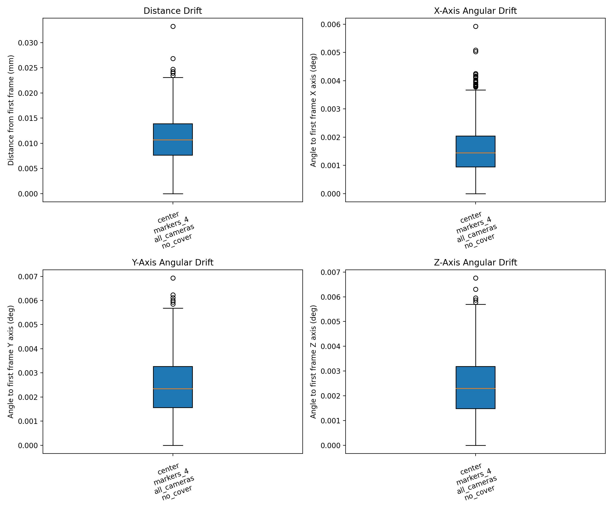
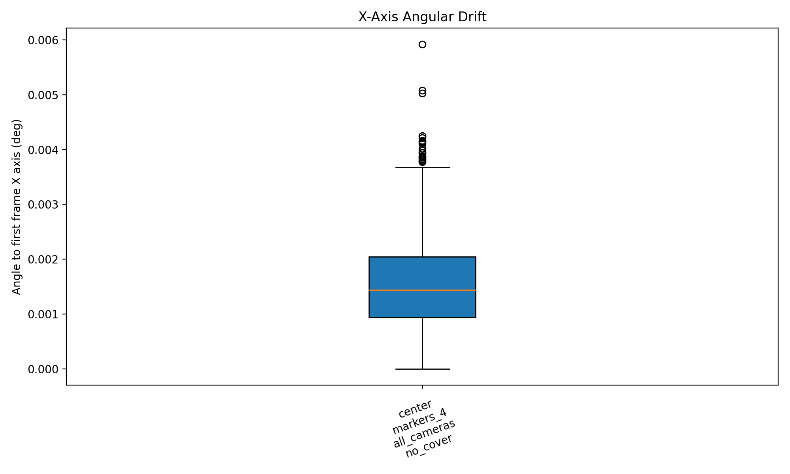
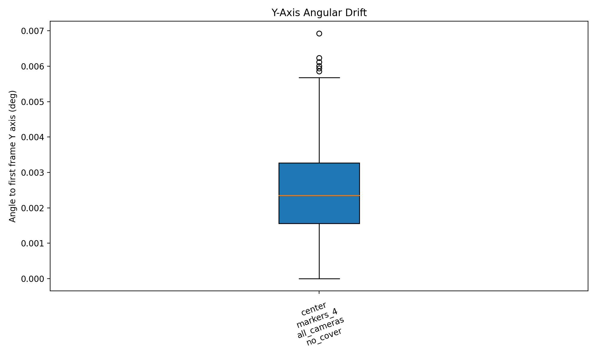
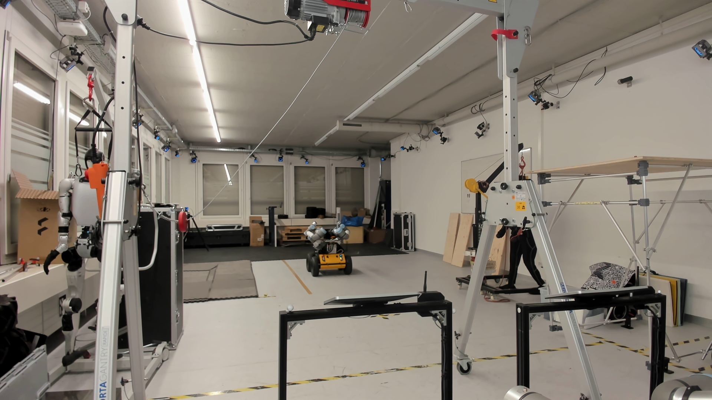

# MoCap Experiment Report

- Generated at: `2026-03-11T14:31:17.974551`
- Grouped by: `take.workspace_position, take.marker_configuration, take.camera_configuration, take.cover_configuration`
- Number of takes: `1`
- Number of groups: `1`

## Plots

### Distance Drift

### X-Axis Angular Drift

### Y-Axis Angular Drift

### Z-Axis Angular Drift

## Group Summary

| Group | Takes | Frames | Distance median (mm) | Distance p95 (mm) | X median (deg) | Y median (deg) | Z median (deg) |
| --- | ---: | ---: | ---: | ---: | ---: | ---: | ---: |
| center / markers_4 / all_cameras / no_cover | 1 | 1201 | 0.011 | 0.019 | 0.001 | 0.002 | 0.002 |

## MoCap Camera Inventory

### center / markers_4 / all_cameras / no_cover

- Camera count: `21`
- `PrimeX 22 #72300`
- `PrimeX 22 #72657`
- `PrimeX 13 #66105`
- `PrimeX 13 #66078`
- `PrimeX 13 #66106`
- `PrimeX 22 #72318`
- `PrimeX 22 #72653`
- `PrimeX 22 #72708`
- `PrimeX 22 #72655`
- `PrimeX 22 #72652`
- `PrimeX 13 #66077`
- `PrimeX 22 #72654`
- `PrimeX 22 #72656`
- `PrimeX 22 #72317`
- `Prime 13 #31325`
- `Prime 13 #31327`
- `Prime 13 #31323`
- `Prime 13 #31329`
- `Prime 13 #31324`
- `Prime 13 #31328`
- `Prime 13 #31326`

## Configuration References

### center / markers_4 / all_cameras / no_cover

**Workspace**

## Webcam Timelapse

### center | markers_4 | all_cameras | no_cover | take1

- Status: `created`
- Captured frames: `41`
- Frame interval: `0.5` sec
- Video: `../reference_media/20260311_142337_center--markers_4--all_cameras--no_cover--take1/workspace_timelapse.mp4`

<video controls preload="metadata" src="../reference_media/20260311_142337_center--markers_4--all_cameras--no_cover--take1/workspace_timelapse.mp4" style="max-width: 100%; height: auto;"></video>

## Take Files

- `center | markers_4 | all_cameras | no_cover | take1`: `/home/yijiangh/ros2_ws/src/husky-assembly-teleop/data/mocap_experiments/20260311/default_session/takes/20260311_142337_center--markers_4--all_cameras--no_cover--take1.json` (1201 frames)
  - `workspace`: `../photo_library/20260311_142337_center--markers_4--all_cameras--no_cover--take1__workspace.jpg`
