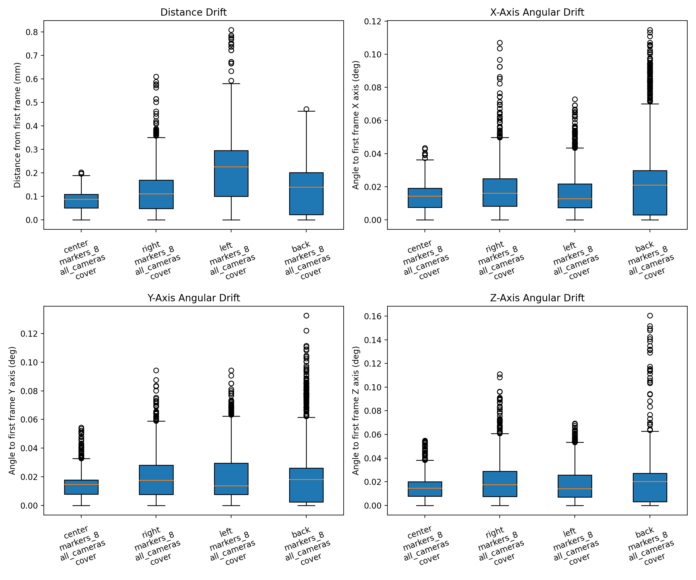
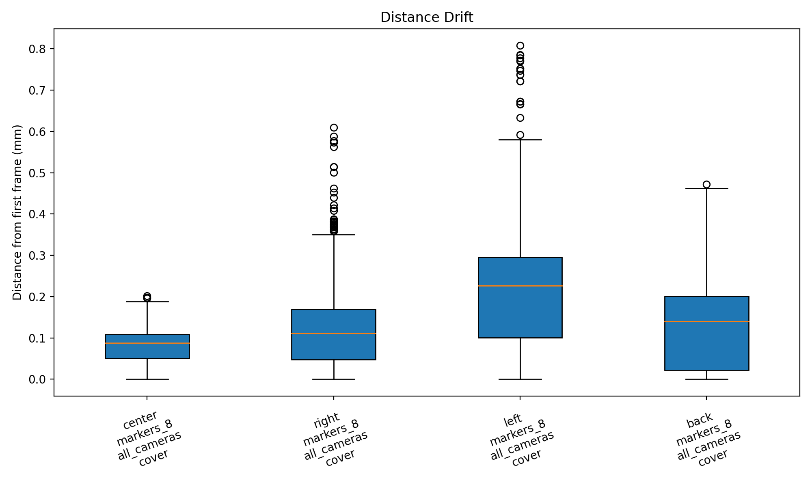
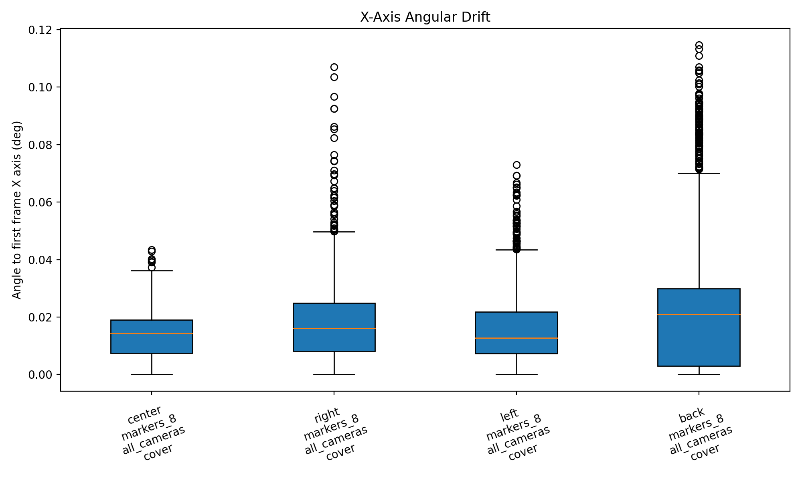
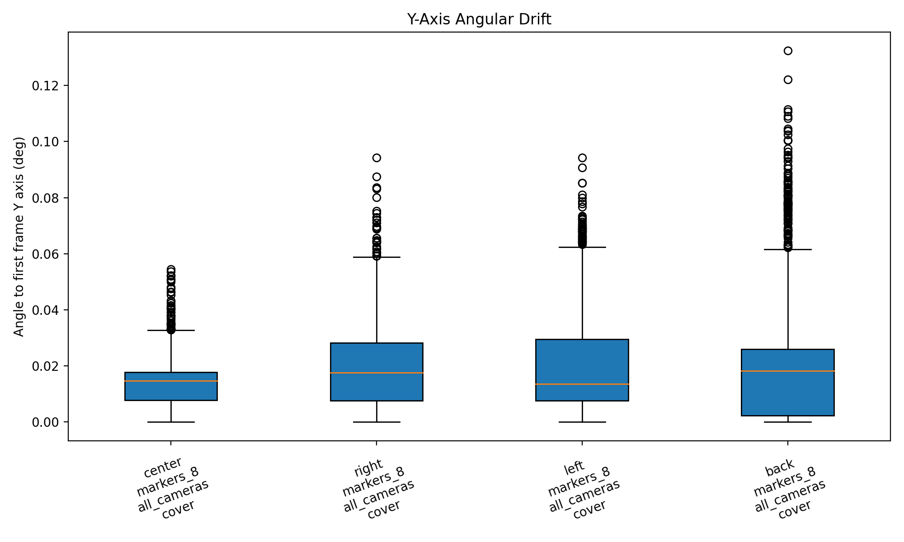
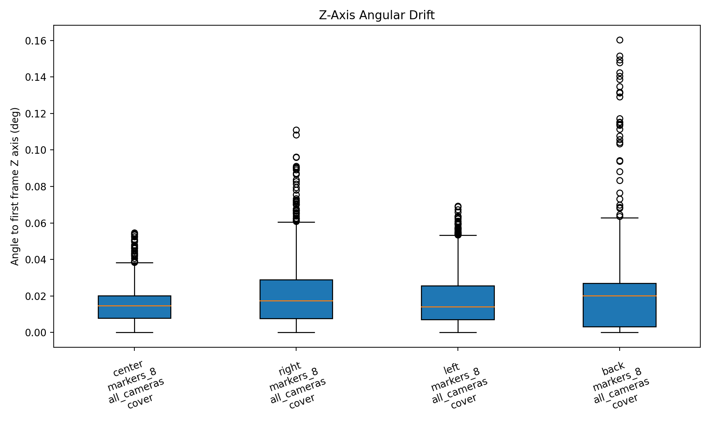
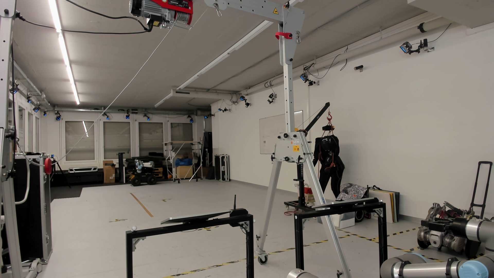
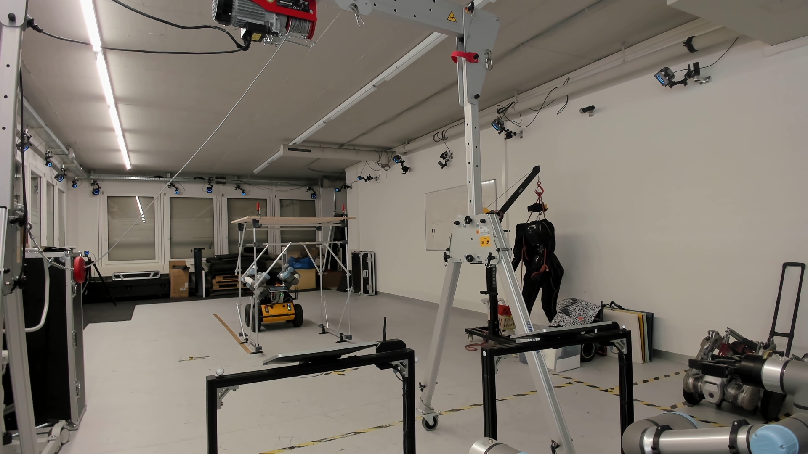
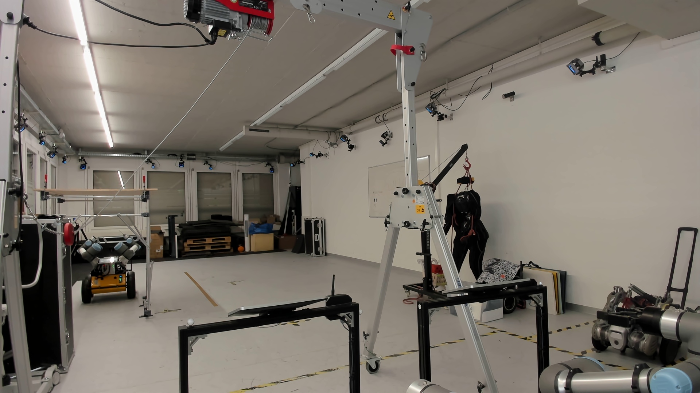
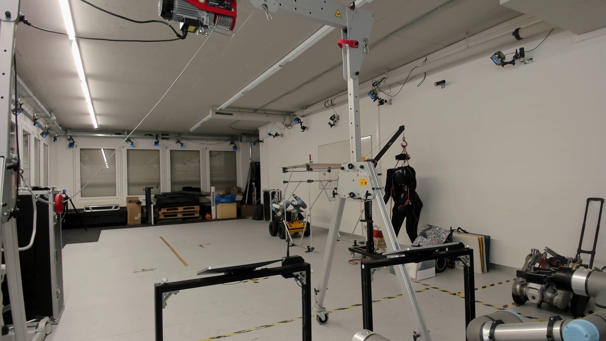

# MoCap Experiment Report

- Generated at: `2026-03-13T15:20:22.317961`
- Grouped by: `take.workspace_position, take.marker_configuration, take.camera_configuration, take.cover_configuration`
- Number of takes: `4`
- Number of groups: `4`

## Plots

### Distance Drift

### X-Axis Angular Drift

### Y-Axis Angular Drift

### Z-Axis Angular Drift

## Group Summary

| Group | Takes | Frames | Distance median (mm) | Distance p95 (mm) | X median (deg) | Y median (deg) | Z median (deg) |
| --- | ---: | ---: | ---: | ---: | ---: | ---: | ---: |
| back / markers_8 / all_cameras / cover | 1 | 2101 | 0.139 | 0.309 | 0.021 | 0.018 | 0.020 |
| center / markers_8 / all_cameras / cover | 1 | 2101 | 0.088 | 0.144 | 0.014 | 0.015 | 0.015 |
| left / markers_8 / all_cameras / cover | 1 | 2102 | 0.226 | 0.425 | 0.013 | 0.014 | 0.014 |
| right / markers_8 / all_cameras / cover | 1 | 2100 | 0.111 | 0.285 | 0.016 | 0.018 | 0.017 |

## MoCap Camera Inventory

### back / markers_8 / all_cameras / cover

- Camera count: `21`
- `PrimeX 22 #72657`
- `PrimeX 22 #72653`
- `PrimeX 22 #72654`
- `PrimeX 22 #72652`
- `PrimeX 22 #72317`
- `PrimeX 22 #72655`
- `PrimeX 22 #72300`
- `PrimeX 22 #72708`
- `PrimeX 22 #72656`
- `PrimeX 22 #72318`
- `Prime 13 #31328`
- `PrimeX 13 #66106`
- `Prime 13 #31323`
- `Prime 13 #31327`
- `PrimeX 13 #66078`
- `Prime 13 #31326`
- `Prime 13 #31325`
- `PrimeX 13 #66077`
- `PrimeX 13 #66105`
- `Prime 13 #31324`
- `Prime 13 #31329`

### center / markers_8 / all_cameras / cover

- Camera count: `21`
- `PrimeX 22 #72657`
- `PrimeX 22 #72653`
- `PrimeX 22 #72654`
- `PrimeX 22 #72652`
- `PrimeX 22 #72317`
- `PrimeX 22 #72655`
- `PrimeX 22 #72300`
- `PrimeX 22 #72708`
- `PrimeX 22 #72656`
- `PrimeX 22 #72318`
- `Prime 13 #31328`
- `PrimeX 13 #66106`
- `Prime 13 #31323`
- `Prime 13 #31327`
- `PrimeX 13 #66078`
- `Prime 13 #31326`
- `Prime 13 #31325`
- `PrimeX 13 #66077`
- `PrimeX 13 #66105`
- `Prime 13 #31324`
- `Prime 13 #31329`

### left / markers_8 / all_cameras / cover

- Camera count: `21`
- `PrimeX 22 #72657`
- `PrimeX 22 #72653`
- `PrimeX 22 #72654`
- `PrimeX 22 #72652`
- `PrimeX 22 #72317`
- `PrimeX 22 #72655`
- `PrimeX 22 #72300`
- `PrimeX 22 #72708`
- `PrimeX 22 #72656`
- `PrimeX 22 #72318`
- `Prime 13 #31328`
- `PrimeX 13 #66106`
- `Prime 13 #31323`
- `Prime 13 #31327`
- `PrimeX 13 #66078`
- `Prime 13 #31326`
- `Prime 13 #31325`
- `PrimeX 13 #66077`
- `PrimeX 13 #66105`
- `Prime 13 #31324`
- `Prime 13 #31329`

### right / markers_8 / all_cameras / cover

- Camera count: `21`
- `PrimeX 22 #72657`
- `PrimeX 22 #72653`
- `PrimeX 22 #72654`
- `PrimeX 22 #72652`
- `PrimeX 22 #72317`
- `PrimeX 22 #72655`
- `PrimeX 22 #72300`
- `PrimeX 22 #72708`
- `PrimeX 22 #72656`
- `PrimeX 22 #72318`
- `Prime 13 #31328`
- `PrimeX 13 #66106`
- `Prime 13 #31323`
- `Prime 13 #31327`
- `PrimeX 13 #66078`
- `Prime 13 #31326`
- `Prime 13 #31325`
- `PrimeX 13 #66077`
- `PrimeX 13 #66105`
- `Prime 13 #31324`
- `Prime 13 #31329`

## Configuration References

### back / markers_8 / all_cameras / cover

**Workspace**

### center / markers_8 / all_cameras / cover

**Workspace**

### left / markers_8 / all_cameras / cover

**Workspace**

### right / markers_8 / all_cameras / cover

**Workspace**

## Webcam Timelapse

### ws_center_markers8_allcameras_cover_take1 | center | markers_8 | all_cameras | cover | take1

- Status: `created`
- Captured frames: `71`
- Frame interval: `0.5` sec
- Video: `../reference_media/20260313_142414_ws_center_markers8_allcameras_cover_take1--center--markers_8--all_cameras--cover--take1/workspace_timelapse.mp4`

<video controls preload="metadata" src="../reference_media/20260313_142414_ws_center_markers8_allcameras_cover_take1--center--markers_8--all_cameras--cover--take1/workspace_timelapse.mp4" style="max-width: 100%; height: auto;"></video>

### ws_right_markers8_allcameras_cover_take1 | right | markers_8 | all_cameras | cover | take1

- Status: `created`
- Captured frames: `71`
- Frame interval: `0.5` sec
- Video: `../reference_media/20260313_143031_ws_right_markers8_allcameras_cover_take1--right--markers_8--all_cameras--cover--take1/workspace_timelapse.mp4`

<video controls preload="metadata" src="../reference_media/20260313_143031_ws_right_markers8_allcameras_cover_take1--right--markers_8--all_cameras--cover--take1/workspace_timelapse.mp4" style="max-width: 100%; height: auto;"></video>

### ws_left_markers8_allcameras_cover_take1 | left | markers_8 | all_cameras | cover | take1

- Status: `created`
- Captured frames: `71`
- Frame interval: `0.5` sec
- Video: `../reference_media/20260313_143313_ws_left_markers8_allcameras_cover_take1--left--markers_8--all_cameras--cover--take1/workspace_timelapse.mp4`

<video controls preload="metadata" src="../reference_media/20260313_143313_ws_left_markers8_allcameras_cover_take1--left--markers_8--all_cameras--cover--take1/workspace_timelapse.mp4" style="max-width: 100%; height: auto;"></video>

### ws_back_markers8_allcameras_cover_take1 | back | markers_8 | all_cameras | cover | take1

- Status: `created`
- Captured frames: `71`
- Frame interval: `0.5` sec
- Video: `../reference_media/20260313_143628_ws_back_markers8_allcameras_cover_take1--back--markers_8--all_cameras--cover--take1/workspace_timelapse.mp4`

<video controls preload="metadata" src="../reference_media/20260313_143628_ws_back_markers8_allcameras_cover_take1--back--markers_8--all_cameras--cover--take1/workspace_timelapse.mp4" style="max-width: 100%; height: auto;"></video>

## Take Files

- `ws_center_markers8_allcameras_cover_take1 | center | markers_8 | all_cameras | cover | take1`: `/home/yijiangh/ros2_ws/src/husky-assembly-teleop/data/mocap_experiments/20260313/20260313_cover_study/takes/20260313_142414_ws_center_markers8_allcameras_cover_take1--center--markers_8--all_cameras--cover--take1.json` (2101 frames)
  - `workspace`: `../photo_library/ws_center_markers8_allcameras_cover_take1__workspace.jpg`
- `ws_right_markers8_allcameras_cover_take1 | right | markers_8 | all_cameras | cover | take1`: `/home/yijiangh/ros2_ws/src/husky-assembly-teleop/data/mocap_experiments/20260313/20260313_cover_study/takes/20260313_143031_ws_right_markers8_allcameras_cover_take1--right--markers_8--all_cameras--cover--take1.json` (2100 frames)
  - `workspace`: `../photo_library/ws_right_markers8_allcameras_cover_take1__workspace.jpg`
- `ws_left_markers8_allcameras_cover_take1 | left | markers_8 | all_cameras | cover | take1`: `/home/yijiangh/ros2_ws/src/husky-assembly-teleop/data/mocap_experiments/20260313/20260313_cover_study/takes/20260313_143313_ws_left_markers8_allcameras_cover_take1--left--markers_8--all_cameras--cover--take1.json` (2102 frames)
  - `workspace`: `../photo_library/ws_left_markers8_allcameras_cover_take1__workspace.jpg`
- `ws_back_markers8_allcameras_cover_take1 | back | markers_8 | all_cameras | cover | take1`: `/home/yijiangh/ros2_ws/src/husky-assembly-teleop/data/mocap_experiments/20260313/20260313_cover_study/takes/20260313_143628_ws_back_markers8_allcameras_cover_take1--back--markers_8--all_cameras--cover--take1.json` (2101 frames)
  - `workspace`: `../photo_library/ws_back_markers8_allcameras_cover_take1__workspace.jpg`
