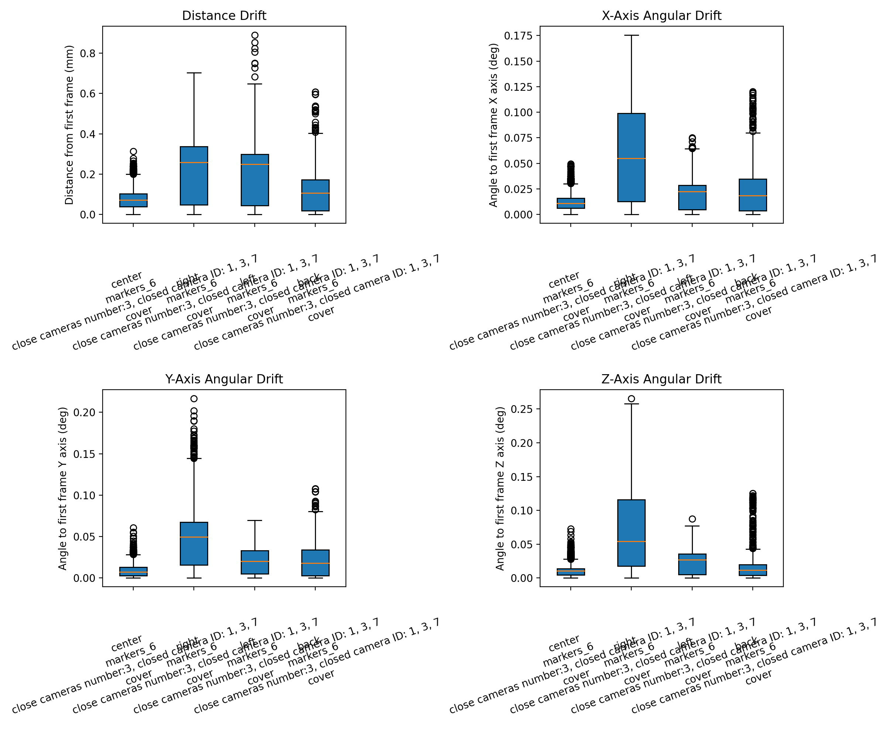
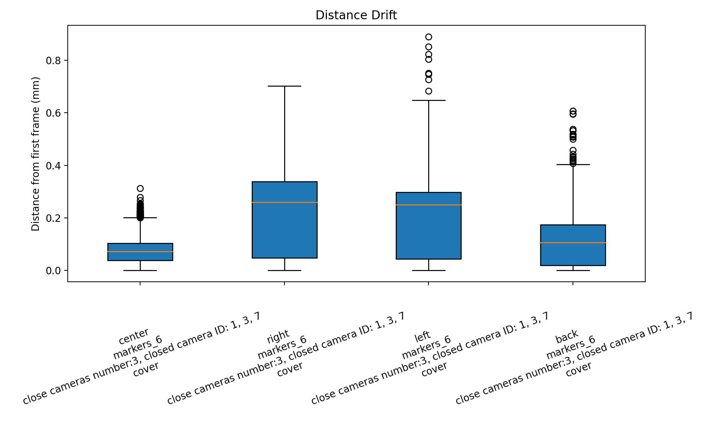
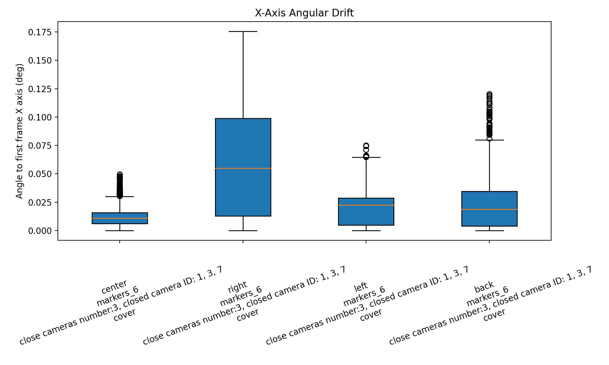
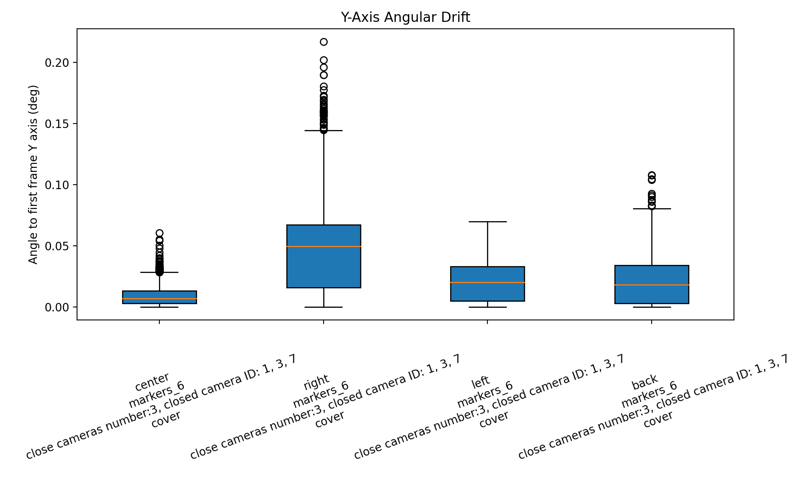
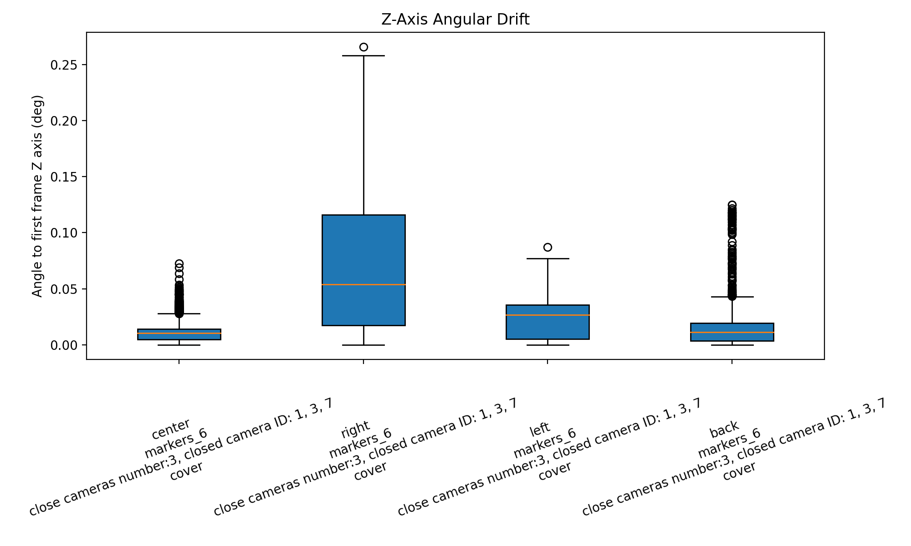
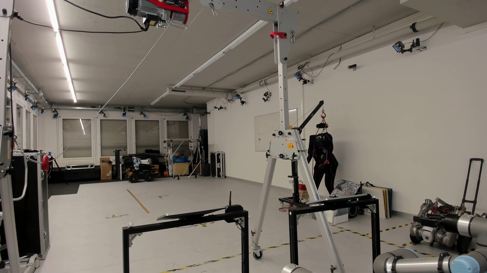
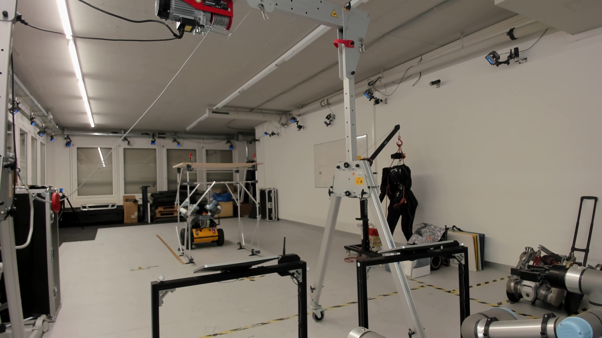
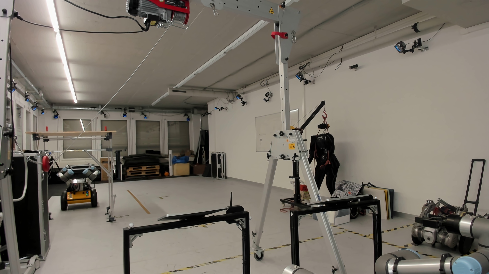
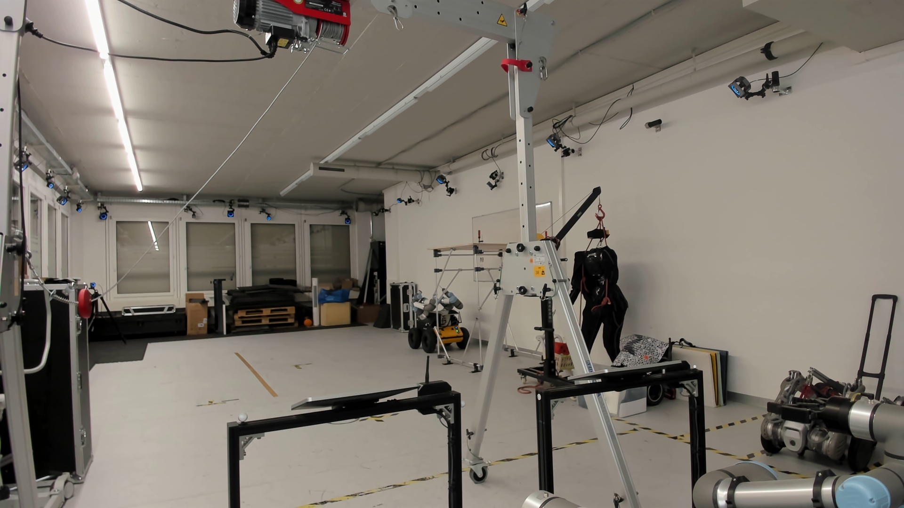

# MoCap Experiment Report

- Generated at: `2026-03-13T16:23:44.867570`
- Grouped by: `take.workspace_position, take.marker_configuration, take.camera_configuration, take.cover_configuration`
- Number of takes: `4`
- Number of groups: `4`

## Plots

### Distance Drift

### X-Axis Angular Drift

### Y-Axis Angular Drift

### Z-Axis Angular Drift

## Group Summary

| Group | Takes | Frames | Distance median (mm) | Distance p95 (mm) | X median (deg) | Y median (deg) | Z median (deg) |
| --- | ---: | ---: | ---: | ---: | ---: | ---: | ---: |
| back / markers_6 / close cameras number:3, closed camera ID: 1, 3, 7 / cover | 1 | 2101 | 0.106 | 0.262 | 0.019 | 0.018 | 0.011 |
| center / markers_6 / close cameras number:3, closed camera ID: 1, 3, 7 / cover | 1 | 2101 | 0.072 | 0.203 | 0.011 | 0.007 | 0.010 |
| left / markers_6 / close cameras number:3, closed camera ID: 1, 3, 7 / cover | 1 | 2101 | 0.250 | 0.471 | 0.022 | 0.020 | 0.027 |
| right / markers_6 / close cameras number:3, closed camera ID: 1, 3, 7 / cover | 1 | 2101 | 0.259 | 0.481 | 0.055 | 0.050 | 0.054 |

## MoCap Camera Inventory

### back / markers_6 / close cameras number:3, closed camera ID: 1, 3, 7 / cover

- Camera count: `21`
- `PrimeX 22 #72657`
- `PrimeX 22 #72653`
- `PrimeX 22 #72654`
- `PrimeX 22 #72652`
- `PrimeX 22 #72317`
- `PrimeX 22 #72655`
- `PrimeX 22 #72300`
- `PrimeX 22 #72708`
- `PrimeX 22 #72656`
- `PrimeX 22 #72318`
- `Prime 13 #31328`
- `PrimeX 13 #66106`
- `Prime 13 #31323`
- `Prime 13 #31327`
- `PrimeX 13 #66078`
- `Prime 13 #31326`
- `Prime 13 #31325`
- `PrimeX 13 #66077`
- `PrimeX 13 #66105`
- `Prime 13 #31324`
- `Prime 13 #31329`

### center / markers_6 / close cameras number:3, closed camera ID: 1, 3, 7 / cover

- Camera count: `21`
- `PrimeX 22 #72657`
- `PrimeX 22 #72653`
- `PrimeX 22 #72654`
- `PrimeX 22 #72652`
- `PrimeX 22 #72317`
- `PrimeX 22 #72655`
- `PrimeX 22 #72300`
- `PrimeX 22 #72708`
- `PrimeX 22 #72656`
- `PrimeX 22 #72318`
- `Prime 13 #31328`
- `PrimeX 13 #66106`
- `Prime 13 #31323`
- `Prime 13 #31327`
- `PrimeX 13 #66078`
- `Prime 13 #31326`
- `Prime 13 #31325`
- `PrimeX 13 #66077`
- `PrimeX 13 #66105`
- `Prime 13 #31324`
- `Prime 13 #31329`

### left / markers_6 / close cameras number:3, closed camera ID: 1, 3, 7 / cover

- Camera count: `21`
- `PrimeX 22 #72657`
- `PrimeX 22 #72653`
- `PrimeX 22 #72654`
- `PrimeX 22 #72652`
- `PrimeX 22 #72317`
- `PrimeX 22 #72655`
- `PrimeX 22 #72300`
- `PrimeX 22 #72708`
- `PrimeX 22 #72656`
- `PrimeX 22 #72318`
- `Prime 13 #31328`
- `PrimeX 13 #66106`
- `Prime 13 #31323`
- `Prime 13 #31327`
- `PrimeX 13 #66078`
- `Prime 13 #31326`
- `Prime 13 #31325`
- `PrimeX 13 #66077`
- `PrimeX 13 #66105`
- `Prime 13 #31324`
- `Prime 13 #31329`

### right / markers_6 / close cameras number:3, closed camera ID: 1, 3, 7 / cover

- Camera count: `21`
- `PrimeX 22 #72657`
- `PrimeX 22 #72653`
- `PrimeX 22 #72654`
- `PrimeX 22 #72652`
- `PrimeX 22 #72317`
- `PrimeX 22 #72655`
- `PrimeX 22 #72300`
- `PrimeX 22 #72708`
- `PrimeX 22 #72656`
- `PrimeX 22 #72318`
- `Prime 13 #31328`
- `PrimeX 13 #66106`
- `Prime 13 #31323`
- `Prime 13 #31327`
- `PrimeX 13 #66078`
- `Prime 13 #31326`
- `Prime 13 #31325`
- `PrimeX 13 #66077`
- `PrimeX 13 #66105`
- `Prime 13 #31324`
- `Prime 13 #31329`

## Configuration References

### back / markers_6 / close cameras number:3, closed camera ID: 1, 3, 7 / cover

**Workspace**

### center / markers_6 / close cameras number:3, closed camera ID: 1, 3, 7 / cover

**Workspace**

### left / markers_6 / close cameras number:3, closed camera ID: 1, 3, 7 / cover

**Workspace**

### right / markers_6 / close cameras number:3, closed camera ID: 1, 3, 7 / cover

**Workspace**

## Webcam Timelapse

### ws_center_markers6_allcameras_cover_take1 | center | markers_6 | close cameras number:3, closed camera ID: 1, 3, 7 | cover | take1

- Status: `created`
- Captured frames: `71`
- Frame interval: `0.5` sec
- Video: `../reference_media/20260313_161013_ws_center_markers6_allcameras_cover_take1--center--markers_6--close-cameras-number3-closed-camera-id-1-3-7--cover--take1/workspace_timelapse.mp4`

<video controls preload="metadata" src="../reference_media/20260313_161013_ws_center_markers6_allcameras_cover_take1--center--markers_6--close-cameras-number3-closed-camera-id-1-3-7--cover--take1/workspace_timelapse.mp4" style="max-width: 100%; height: auto;"></video>

### ws_right_markers6_allcameras_cover_take1 | right | markers_6 | close cameras number:3, closed camera ID: 1, 3, 7 | cover | take1

- Status: `created`
- Captured frames: `71`
- Frame interval: `0.5` sec
- Video: `../reference_media/20260313_161517_ws_right_markers6_allcameras_cover_take1--right--markers_6--close-cameras-number3-closed-camera-id-1-3-7--cover--take1/workspace_timelapse.mp4`

<video controls preload="metadata" src="../reference_media/20260313_161517_ws_right_markers6_allcameras_cover_take1--right--markers_6--close-cameras-number3-closed-camera-id-1-3-7--cover--take1/workspace_timelapse.mp4" style="max-width: 100%; height: auto;"></video>

### ws_left_markers6_allcameras_cover_take1 | left | markers_6 | close cameras number:3, closed camera ID: 1, 3, 7 | cover | take1

- Status: `created`
- Captured frames: `71`
- Frame interval: `0.5` sec
- Video: `../reference_media/20260313_161736_ws_left_markers6_allcameras_cover_take1--left--markers_6--close-cameras-number3-closed-camera-id-1-3-7--cover--take1/workspace_timelapse.mp4`

<video controls preload="metadata" src="../reference_media/20260313_161736_ws_left_markers6_allcameras_cover_take1--left--markers_6--close-cameras-number3-closed-camera-id-1-3-7--cover--take1/workspace_timelapse.mp4" style="max-width: 100%; height: auto;"></video>

### ws_back_markers6_allcameras_cover_take1 | back | markers_6 | close cameras number:3, closed camera ID: 1, 3, 7 | cover | take1

- Status: `created`
- Captured frames: `71`
- Frame interval: `0.5` sec
- Video: `../reference_media/20260313_162033_ws_back_markers6_allcameras_cover_take1--back--markers_6--close-cameras-number3-closed-camera-id-1-3-7--cover--take1/workspace_timelapse.mp4`

<video controls preload="metadata" src="../reference_media/20260313_162033_ws_back_markers6_allcameras_cover_take1--back--markers_6--close-cameras-number3-closed-camera-id-1-3-7--cover--take1/workspace_timelapse.mp4" style="max-width: 100%; height: auto;"></video>

## Take Files

- `ws_center_markers6_allcameras_cover_take1 | center | markers_6 | close cameras number:3, closed camera ID: 1, 3, 7 | cover | take1`: `/home/yijiangh/ros2_ws/src/husky-assembly-teleop/data/mocap_experiments/20260313/20260313_cover_study_02/takes/20260313_161013_ws_center_markers6_allcameras_cover_take1--center--markers_6--close-cameras-number3-closed-camera-id-1-3-7--cover--take1.json` (2101 frames)
  - `workspace`: `../photo_library/ws_center_markers6_allcameras_cover_take1__workspace.jpg`
- `ws_right_markers6_allcameras_cover_take1 | right | markers_6 | close cameras number:3, closed camera ID: 1, 3, 7 | cover | take1`: `/home/yijiangh/ros2_ws/src/husky-assembly-teleop/data/mocap_experiments/20260313/20260313_cover_study_02/takes/20260313_161517_ws_right_markers6_allcameras_cover_take1--right--markers_6--close-cameras-number3-closed-camera-id-1-3-7--cover--take1.json` (2101 frames)
  - `workspace`: `../photo_library/ws_right_markers6_allcameras_cover_take1__workspace.jpg`
- `ws_left_markers6_allcameras_cover_take1 | left | markers_6 | close cameras number:3, closed camera ID: 1, 3, 7 | cover | take1`: `/home/yijiangh/ros2_ws/src/husky-assembly-teleop/data/mocap_experiments/20260313/20260313_cover_study_02/takes/20260313_161736_ws_left_markers6_allcameras_cover_take1--left--markers_6--close-cameras-number3-closed-camera-id-1-3-7--cover--take1.json` (2101 frames)
  - `workspace`: `../photo_library/ws_left_markers6_allcameras_cover_take1__workspace.jpg`
- `ws_back_markers6_allcameras_cover_take1 | back | markers_6 | close cameras number:3, closed camera ID: 1, 3, 7 | cover | take1`: `/home/yijiangh/ros2_ws/src/husky-assembly-teleop/data/mocap_experiments/20260313/20260313_cover_study_02/takes/20260313_162033_ws_back_markers6_allcameras_cover_take1--back--markers_6--close-cameras-number3-closed-camera-id-1-3-7--cover--take1.json` (2101 frames)
  - `workspace`: `../photo_library/ws_back_markers6_allcameras_cover_take1__workspace.jpg`
