# MoCap Experiment Report

- Generated at: `2026-03-17T16:02:59.985206`
- Grouped by: `take.workspace_position, take.marker_configuration, take.camera_configuration, take.cover_configuration`
- Number of takes: `16`
- Number of groups: `16`

## Condition Profiles

- X axis: `workspace_position`
- Y axis: `camera_configuration`

### Combined Overview

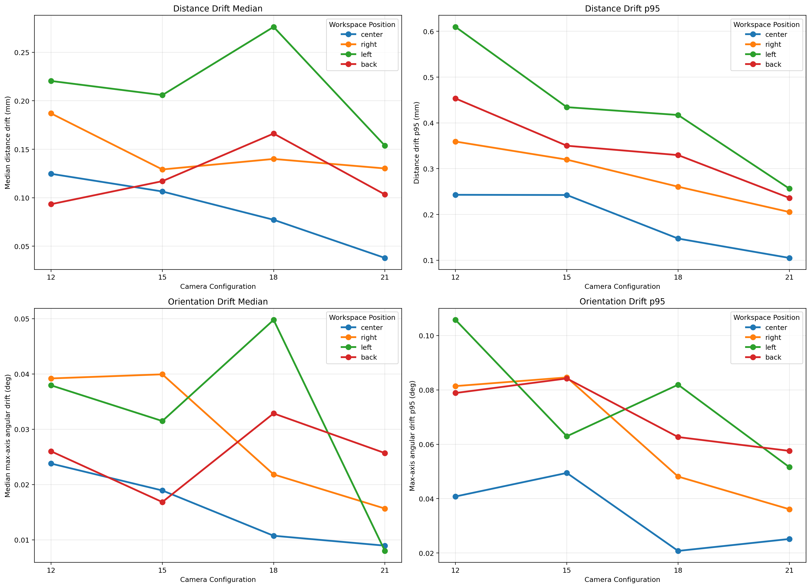

### Distance Drift Median

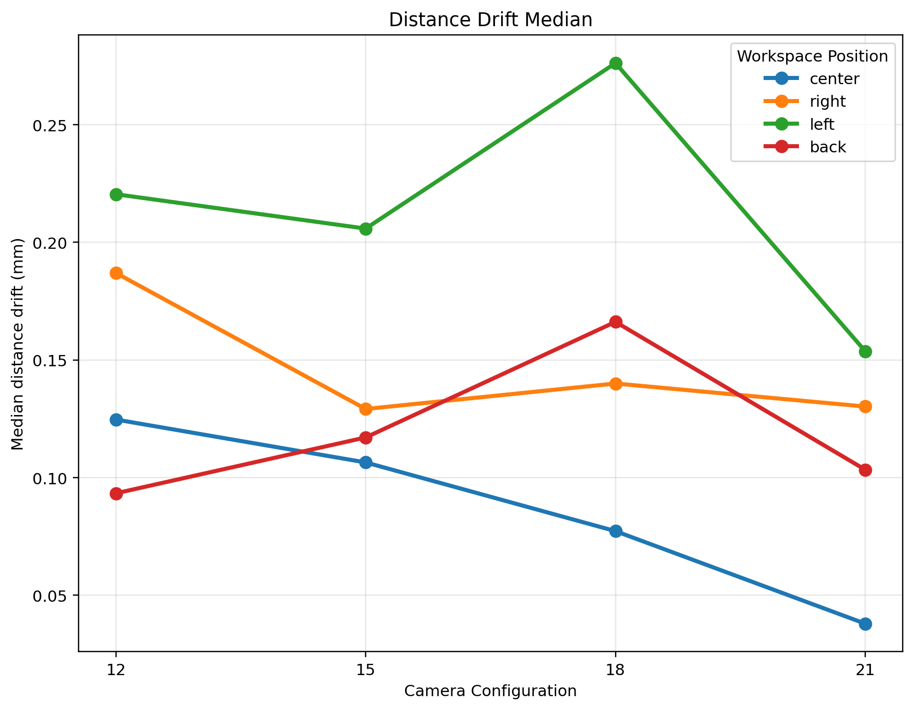

### Distance Drift p95

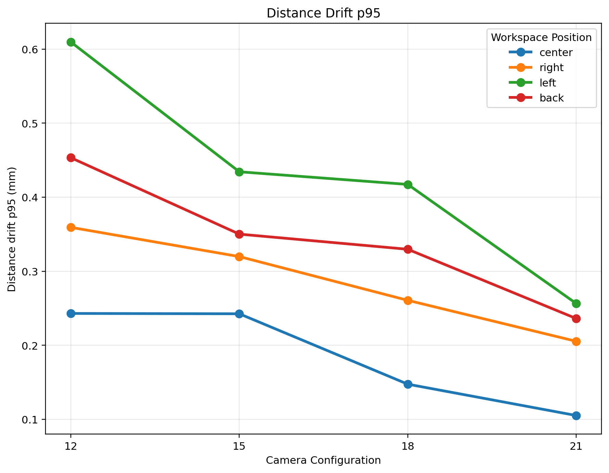

### Orientation Drift Median

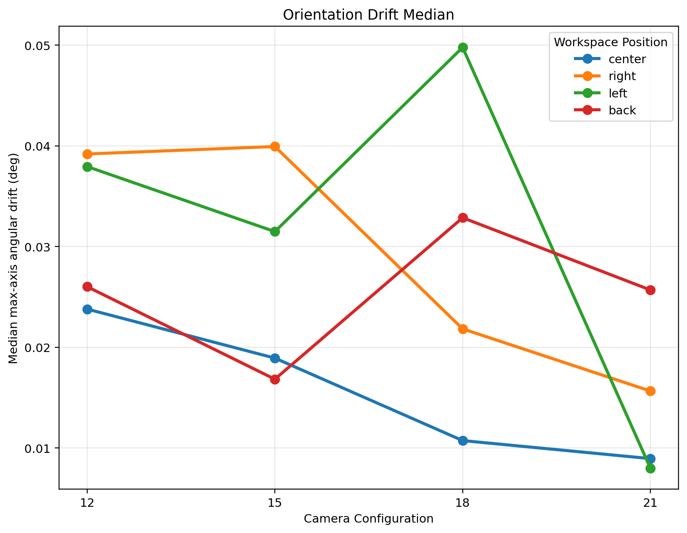

### Orientation Drift p95

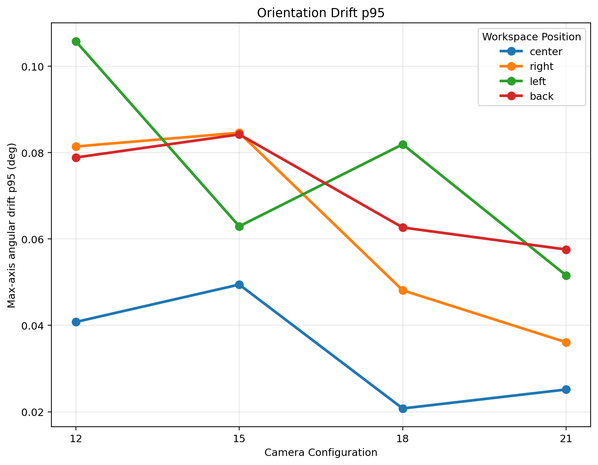

## Condition Summary Table

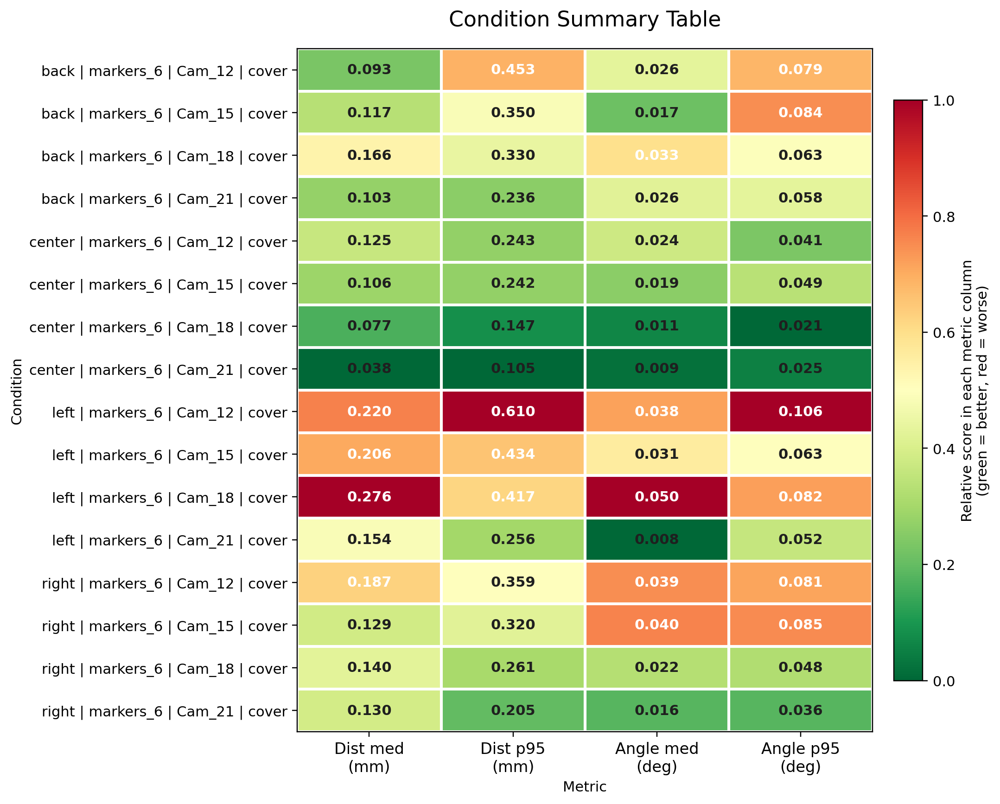

## Group Summary

| Group | Takes | Frames | Distance median (mm) | Distance p95 (mm) | Angle max median (deg) | Angle max p95 (deg) | X median (deg) | Y median (deg) | Z median (deg) |
| --- | ---: | ---: | ---: | ---: | ---: | ---: | ---: | ---: | ---: |
| back / markers_6 / Cam_12 / cover | 1 | 2101 | 0.093 | 0.453 | 0.026 | 0.079 | 0.021 | 0.024 | 0.021 |
| back / markers_6 / Cam_15 / cover | 1 | 2101 | 0.117 | 0.350 | 0.017 | 0.084 | 0.014 | 0.014 | 0.013 |
| back / markers_6 / Cam_18 / cover | 1 | 2101 | 0.166 | 0.330 | 0.033 | 0.063 | 0.009 | 0.032 | 0.026 |
| back / markers_6 / Cam_21 / cover | 1 | 2101 | 0.103 | 0.236 | 0.026 | 0.058 | 0.019 | 0.023 | 0.019 |
| center / markers_6 / Cam_12 / cover | 1 | 2101 | 0.125 | 0.243 | 0.024 | 0.041 | 0.020 | 0.020 | 0.015 |
| center / markers_6 / Cam_15 / cover | 1 | 2101 | 0.106 | 0.242 | 0.019 | 0.049 | 0.010 | 0.017 | 0.018 |
| center / markers_6 / Cam_18 / cover | 1 | 2101 | 0.077 | 0.147 | 0.011 | 0.021 | 0.010 | 0.006 | 0.010 |
| center / markers_6 / Cam_21 / cover | 1 | 2101 | 0.038 | 0.105 | 0.009 | 0.025 | 0.007 | 0.006 | 0.008 |
| left / markers_6 / Cam_12 / cover | 1 | 2102 | 0.220 | 0.610 | 0.038 | 0.106 | 0.014 | 0.028 | 0.029 |
| left / markers_6 / Cam_15 / cover | 1 | 2101 | 0.206 | 0.434 | 0.031 | 0.063 | 0.026 | 0.021 | 0.025 |
| left / markers_6 / Cam_18 / cover | 1 | 2101 | 0.276 | 0.417 | 0.050 | 0.082 | 0.009 | 0.050 | 0.047 |
| left / markers_6 / Cam_21 / cover | 1 | 2101 | 0.154 | 0.256 | 0.008 | 0.052 | 0.007 | 0.006 | 0.007 |
| right / markers_6 / Cam_12 / cover | 1 | 2101 | 0.187 | 0.359 | 0.039 | 0.081 | 0.038 | 0.037 | 0.035 |
| right / markers_6 / Cam_15 / cover | 1 | 2101 | 0.129 | 0.320 | 0.040 | 0.085 | 0.026 | 0.029 | 0.037 |
| right / markers_6 / Cam_18 / cover | 1 | 2101 | 0.140 | 0.261 | 0.022 | 0.048 | 0.012 | 0.020 | 0.018 |
| right / markers_6 / Cam_21 / cover | 1 | 2101 | 0.130 | 0.205 | 0.016 | 0.036 | 0.013 | 0.014 | 0.014 |

## Appendix: Detailed Boxplots

_These per-frame boxplots are retained for debugging, but the heatmaps, line profiles, and summary table above should be the primary comparison figures for multi-condition sessions._

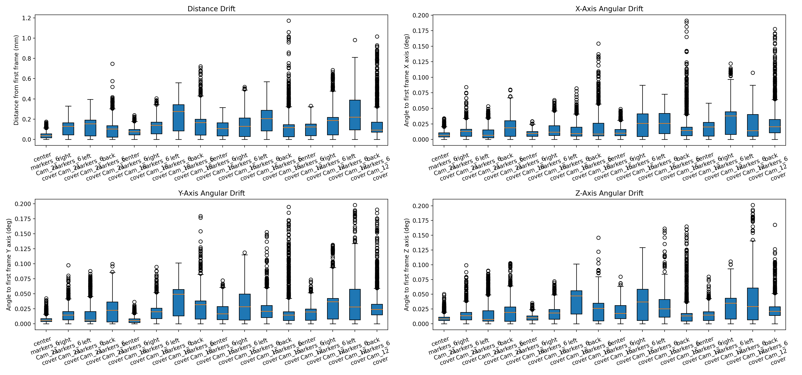

### Distance Drift

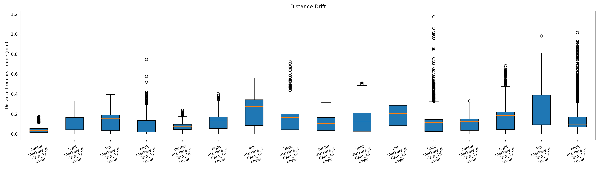

### X-Axis Angular Drift

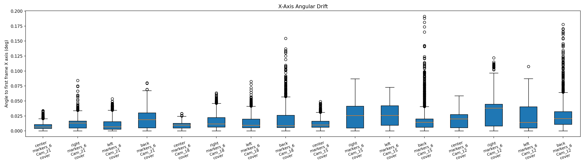

### Y-Axis Angular Drift

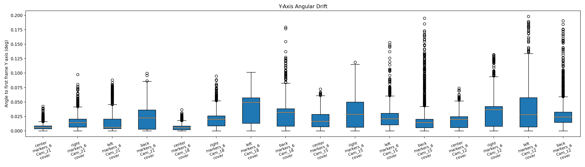

### Z-Axis Angular Drift

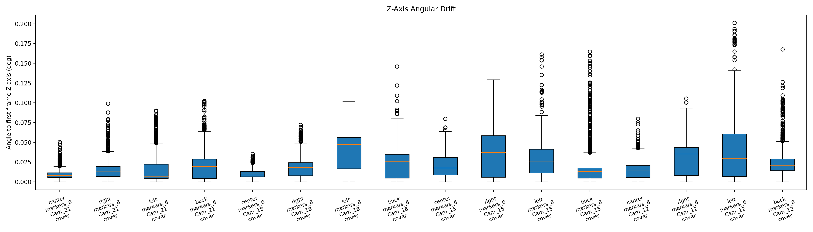

## MoCap Camera Inventory

### back / markers_6 / Cam_12 / cover

- Camera count: `21`
- `PrimeX 22 #72657`
- `PrimeX 22 #72653`
- `PrimeX 22 #72654`
- `PrimeX 22 #72652`
- `PrimeX 22 #72317`
- `PrimeX 22 #72655`
- `PrimeX 22 #72300`
- `PrimeX 22 #72708`
- `PrimeX 22 #72656`
- `PrimeX 22 #72318`
- `PrimeX 13 #66106`
- `Prime 13 #31323`
- `Prime 13 #31327`
- `PrimeX 13 #66078`
- `Prime 13 #31326`
- `Prime 13 #31325`
- `Prime 13 #31328`
- `PrimeX 13 #66077`
- `PrimeX 13 #66105`
- `Prime 13 #31324`
- `Prime 13 #31329`

### back / markers_6 / Cam_15 / cover

- Camera count: `21`
- `PrimeX 22 #72657`
- `PrimeX 22 #72653`
- `PrimeX 22 #72654`
- `PrimeX 22 #72652`
- `PrimeX 22 #72317`
- `PrimeX 22 #72655`
- `PrimeX 22 #72300`
- `PrimeX 22 #72708`
- `PrimeX 22 #72656`
- `PrimeX 22 #72318`
- `PrimeX 13 #66106`
- `Prime 13 #31323`
- `Prime 13 #31327`
- `PrimeX 13 #66078`
- `Prime 13 #31326`
- `Prime 13 #31325`
- `Prime 13 #31328`
- `PrimeX 13 #66077`
- `PrimeX 13 #66105`
- `Prime 13 #31324`
- `Prime 13 #31329`

### back / markers_6 / Cam_18 / cover

- Camera count: `21`
- `PrimeX 22 #72657`
- `PrimeX 22 #72653`
- `PrimeX 22 #72654`
- `PrimeX 22 #72652`
- `PrimeX 22 #72317`
- `PrimeX 22 #72655`
- `PrimeX 22 #72300`
- `PrimeX 22 #72708`
- `PrimeX 22 #72656`
- `PrimeX 22 #72318`
- `PrimeX 13 #66106`
- `Prime 13 #31323`
- `Prime 13 #31327`
- `PrimeX 13 #66078`
- `Prime 13 #31326`
- `Prime 13 #31325`
- `Prime 13 #31328`
- `PrimeX 13 #66077`
- `PrimeX 13 #66105`
- `Prime 13 #31324`
- `Prime 13 #31329`

### back / markers_6 / Cam_21 / cover

- Camera count: `21`
- `PrimeX 22 #72657`
- `PrimeX 22 #72653`
- `PrimeX 22 #72654`
- `PrimeX 22 #72652`
- `PrimeX 22 #72317`
- `PrimeX 22 #72655`
- `PrimeX 22 #72300`
- `PrimeX 22 #72708`
- `PrimeX 22 #72656`
- `PrimeX 22 #72318`
- `PrimeX 13 #66106`
- `Prime 13 #31323`
- `Prime 13 #31327`
- `PrimeX 13 #66078`
- `Prime 13 #31326`
- `Prime 13 #31325`
- `Prime 13 #31328`
- `PrimeX 13 #66077`
- `PrimeX 13 #66105`
- `Prime 13 #31324`
- `Prime 13 #31329`

### center / markers_6 / Cam_12 / cover

- Camera count: `21`
- `PrimeX 22 #72657`
- `PrimeX 22 #72653`
- `PrimeX 22 #72654`
- `PrimeX 22 #72652`
- `PrimeX 22 #72317`
- `PrimeX 22 #72655`
- `PrimeX 22 #72300`
- `PrimeX 22 #72708`
- `PrimeX 22 #72656`
- `PrimeX 22 #72318`
- `PrimeX 13 #66106`
- `Prime 13 #31323`
- `Prime 13 #31327`
- `PrimeX 13 #66078`
- `Prime 13 #31326`
- `Prime 13 #31325`
- `Prime 13 #31328`
- `PrimeX 13 #66077`
- `PrimeX 13 #66105`
- `Prime 13 #31324`
- `Prime 13 #31329`

### center / markers_6 / Cam_15 / cover

- Camera count: `21`
- `PrimeX 22 #72657`
- `PrimeX 22 #72653`
- `PrimeX 22 #72654`
- `PrimeX 22 #72652`
- `PrimeX 22 #72317`
- `PrimeX 22 #72655`
- `PrimeX 22 #72300`
- `PrimeX 22 #72708`
- `PrimeX 22 #72656`
- `PrimeX 22 #72318`
- `PrimeX 13 #66106`
- `Prime 13 #31323`
- `Prime 13 #31327`
- `PrimeX 13 #66078`
- `Prime 13 #31326`
- `Prime 13 #31325`
- `Prime 13 #31328`
- `PrimeX 13 #66077`
- `PrimeX 13 #66105`
- `Prime 13 #31324`
- `Prime 13 #31329`

### center / markers_6 / Cam_18 / cover

- Camera count: `21`
- `PrimeX 22 #72657`
- `PrimeX 22 #72653`
- `PrimeX 22 #72654`
- `PrimeX 22 #72652`
- `PrimeX 22 #72317`
- `PrimeX 22 #72655`
- `PrimeX 22 #72300`
- `PrimeX 22 #72708`
- `PrimeX 22 #72656`
- `PrimeX 22 #72318`
- `PrimeX 13 #66106`
- `Prime 13 #31323`
- `Prime 13 #31327`
- `PrimeX 13 #66078`
- `Prime 13 #31326`
- `Prime 13 #31325`
- `Prime 13 #31328`
- `PrimeX 13 #66077`
- `PrimeX 13 #66105`
- `Prime 13 #31324`
- `Prime 13 #31329`

### center / markers_6 / Cam_21 / cover

- Camera count: `21`
- `PrimeX 22 #72657`
- `PrimeX 22 #72653`
- `PrimeX 22 #72654`
- `PrimeX 22 #72652`
- `PrimeX 22 #72317`
- `PrimeX 22 #72655`
- `PrimeX 22 #72300`
- `PrimeX 22 #72708`
- `PrimeX 22 #72656`
- `PrimeX 22 #72318`
- `PrimeX 13 #66106`
- `Prime 13 #31323`
- `Prime 13 #31327`
- `PrimeX 13 #66078`
- `Prime 13 #31326`
- `Prime 13 #31325`
- `Prime 13 #31328`
- `PrimeX 13 #66077`
- `PrimeX 13 #66105`
- `Prime 13 #31324`
- `Prime 13 #31329`

### left / markers_6 / Cam_12 / cover

- Camera count: `21`
- `PrimeX 22 #72657`
- `PrimeX 22 #72653`
- `PrimeX 22 #72654`
- `PrimeX 22 #72652`
- `PrimeX 22 #72317`
- `PrimeX 22 #72655`
- `PrimeX 22 #72300`
- `PrimeX 22 #72708`
- `PrimeX 22 #72656`
- `PrimeX 22 #72318`
- `PrimeX 13 #66106`
- `Prime 13 #31323`
- `Prime 13 #31327`
- `PrimeX 13 #66078`
- `Prime 13 #31326`
- `Prime 13 #31325`
- `Prime 13 #31328`
- `PrimeX 13 #66077`
- `PrimeX 13 #66105`
- `Prime 13 #31324`
- `Prime 13 #31329`

### left / markers_6 / Cam_15 / cover

- Camera count: `21`
- `PrimeX 22 #72657`
- `PrimeX 22 #72653`
- `PrimeX 22 #72654`
- `PrimeX 22 #72652`
- `PrimeX 22 #72317`
- `PrimeX 22 #72655`
- `PrimeX 22 #72300`
- `PrimeX 22 #72708`
- `PrimeX 22 #72656`
- `PrimeX 22 #72318`
- `PrimeX 13 #66106`
- `Prime 13 #31323`
- `Prime 13 #31327`
- `PrimeX 13 #66078`
- `Prime 13 #31326`
- `Prime 13 #31325`
- `Prime 13 #31328`
- `PrimeX 13 #66077`
- `PrimeX 13 #66105`
- `Prime 13 #31324`
- `Prime 13 #31329`

### left / markers_6 / Cam_18 / cover

- Camera count: `21`
- `PrimeX 22 #72657`
- `PrimeX 22 #72653`
- `PrimeX 22 #72654`
- `PrimeX 22 #72652`
- `PrimeX 22 #72317`
- `PrimeX 22 #72655`
- `PrimeX 22 #72300`
- `PrimeX 22 #72708`
- `PrimeX 22 #72656`
- `PrimeX 22 #72318`
- `PrimeX 13 #66106`
- `Prime 13 #31323`
- `Prime 13 #31327`
- `PrimeX 13 #66078`
- `Prime 13 #31326`
- `Prime 13 #31325`
- `Prime 13 #31328`
- `PrimeX 13 #66077`
- `PrimeX 13 #66105`
- `Prime 13 #31324`
- `Prime 13 #31329`

### left / markers_6 / Cam_21 / cover

- Camera count: `21`
- `PrimeX 22 #72657`
- `PrimeX 22 #72653`
- `PrimeX 22 #72654`
- `PrimeX 22 #72652`
- `PrimeX 22 #72317`
- `PrimeX 22 #72655`
- `PrimeX 22 #72300`
- `PrimeX 22 #72708`
- `PrimeX 22 #72656`
- `PrimeX 22 #72318`
- `PrimeX 13 #66106`
- `Prime 13 #31323`
- `Prime 13 #31327`
- `PrimeX 13 #66078`
- `Prime 13 #31326`
- `Prime 13 #31325`
- `Prime 13 #31328`
- `PrimeX 13 #66077`
- `PrimeX 13 #66105`
- `Prime 13 #31324`
- `Prime 13 #31329`

### right / markers_6 / Cam_12 / cover

- Camera count: `21`
- `PrimeX 22 #72657`
- `PrimeX 22 #72653`
- `PrimeX 22 #72654`
- `PrimeX 22 #72652`
- `PrimeX 22 #72317`
- `PrimeX 22 #72655`
- `PrimeX 22 #72300`
- `PrimeX 22 #72708`
- `PrimeX 22 #72656`
- `PrimeX 22 #72318`
- `PrimeX 13 #66106`
- `Prime 13 #31323`
- `Prime 13 #31327`
- `PrimeX 13 #66078`
- `Prime 13 #31326`
- `Prime 13 #31325`
- `Prime 13 #31328`
- `PrimeX 13 #66077`
- `PrimeX 13 #66105`
- `Prime 13 #31324`
- `Prime 13 #31329`

### right / markers_6 / Cam_15 / cover

- Camera count: `21`
- `PrimeX 22 #72657`
- `PrimeX 22 #72653`
- `PrimeX 22 #72654`
- `PrimeX 22 #72652`
- `PrimeX 22 #72317`
- `PrimeX 22 #72655`
- `PrimeX 22 #72300`
- `PrimeX 22 #72708`
- `PrimeX 22 #72656`
- `PrimeX 22 #72318`
- `PrimeX 13 #66106`
- `Prime 13 #31323`
- `Prime 13 #31327`
- `PrimeX 13 #66078`
- `Prime 13 #31326`
- `Prime 13 #31325`
- `Prime 13 #31328`
- `PrimeX 13 #66077`
- `PrimeX 13 #66105`
- `Prime 13 #31324`
- `Prime 13 #31329`

### right / markers_6 / Cam_18 / cover

- Camera count: `21`
- `PrimeX 22 #72657`
- `PrimeX 22 #72653`
- `PrimeX 22 #72654`
- `PrimeX 22 #72652`
- `PrimeX 22 #72317`
- `PrimeX 22 #72655`
- `PrimeX 22 #72300`
- `PrimeX 22 #72708`
- `PrimeX 22 #72656`
- `PrimeX 22 #72318`
- `PrimeX 13 #66106`
- `Prime 13 #31323`
- `Prime 13 #31327`
- `PrimeX 13 #66078`
- `Prime 13 #31326`
- `Prime 13 #31325`
- `Prime 13 #31328`
- `PrimeX 13 #66077`
- `PrimeX 13 #66105`
- `Prime 13 #31324`
- `Prime 13 #31329`

### right / markers_6 / Cam_21 / cover

- Camera count: `21`
- `PrimeX 22 #72657`
- `PrimeX 22 #72653`
- `PrimeX 22 #72654`
- `PrimeX 22 #72652`
- `PrimeX 22 #72317`
- `PrimeX 22 #72655`
- `PrimeX 22 #72300`
- `PrimeX 22 #72708`
- `PrimeX 22 #72656`
- `PrimeX 22 #72318`
- `PrimeX 13 #66106`
- `Prime 13 #31323`
- `Prime 13 #31327`
- `PrimeX 13 #66078`
- `Prime 13 #31326`
- `Prime 13 #31325`
- `Prime 13 #31328`
- `PrimeX 13 #66077`
- `PrimeX 13 #66105`
- `Prime 13 #31324`
- `Prime 13 #31329`

## Configuration References

### back / markers_6 / Cam_12 / cover

**Workspace**

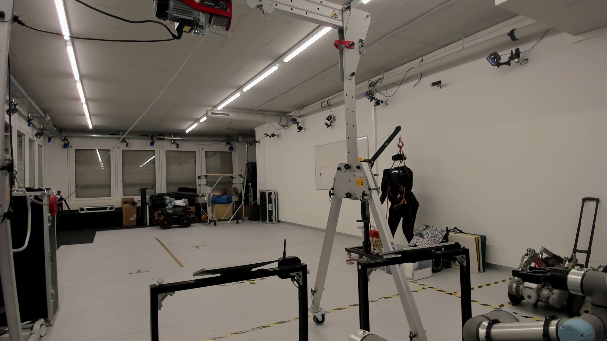

### back / markers_6 / Cam_15 / cover

**Workspace**

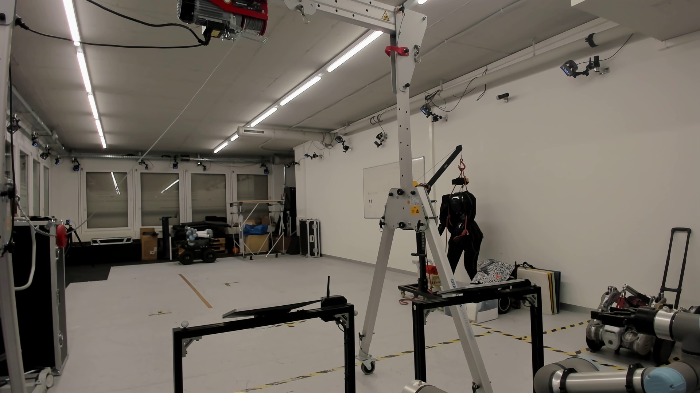

### back / markers_6 / Cam_18 / cover

**Workspace**

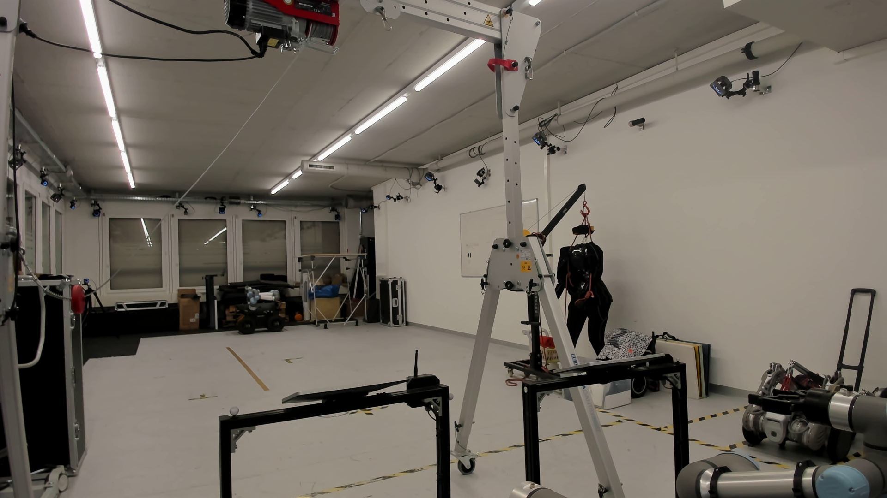

### back / markers_6 / Cam_21 / cover

**Workspace**

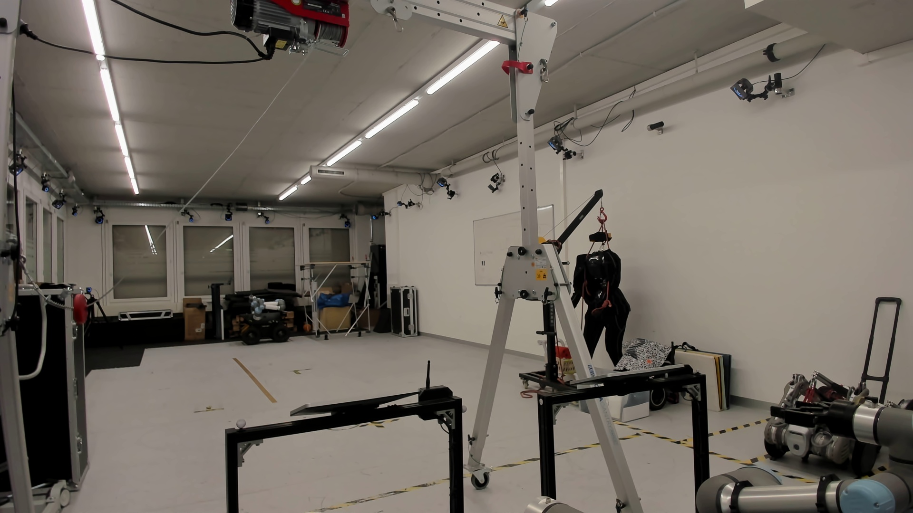

### center / markers_6 / Cam_12 / cover

**Workspace**

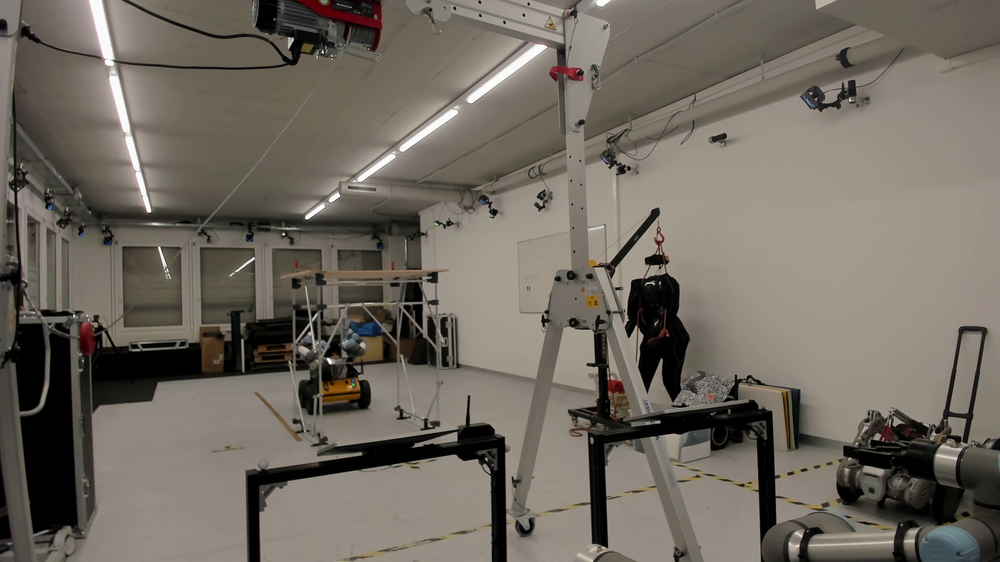

### center / markers_6 / Cam_15 / cover

**Workspace**

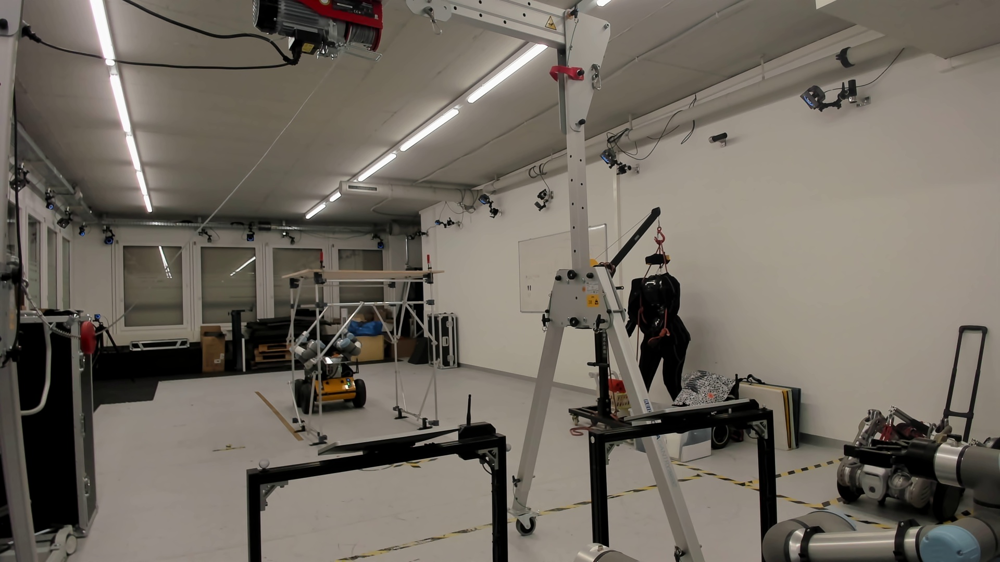

### center / markers_6 / Cam_18 / cover

**Workspace**

### center / markers_6 / Cam_21 / cover

**Workspace**

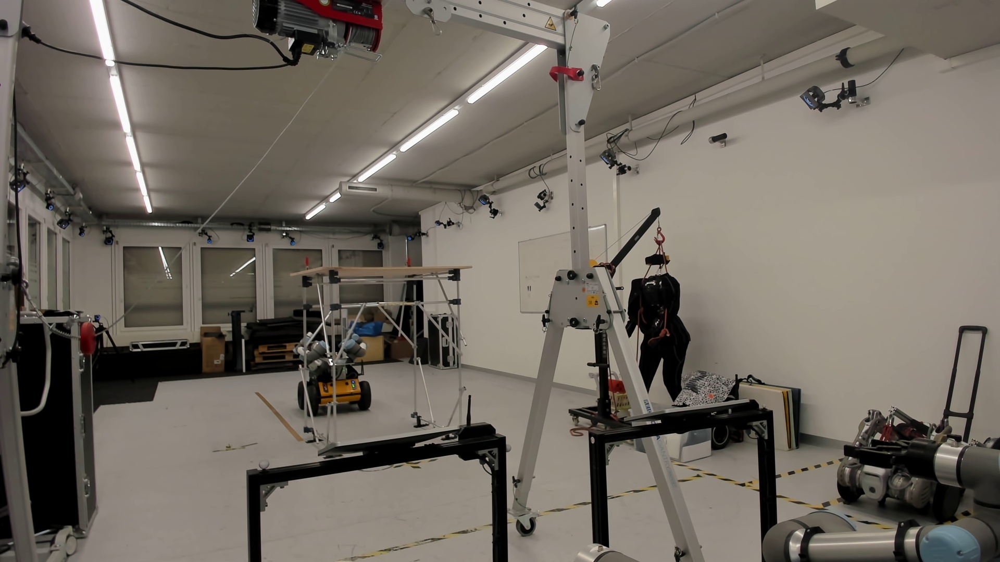

### left / markers_6 / Cam_12 / cover

**Workspace**

### left / markers_6 / Cam_15 / cover

**Workspace**

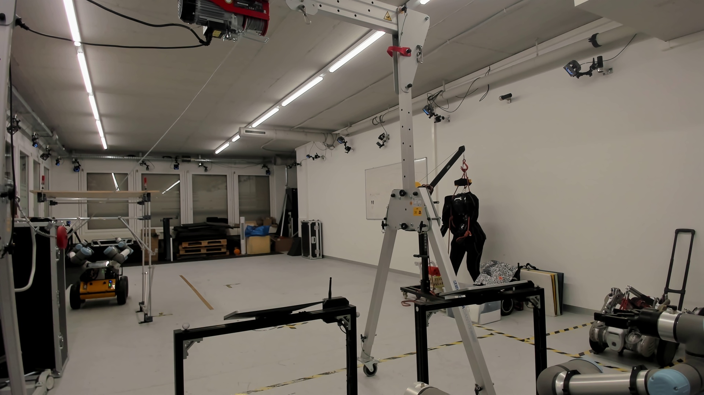

### left / markers_6 / Cam_18 / cover

**Workspace**

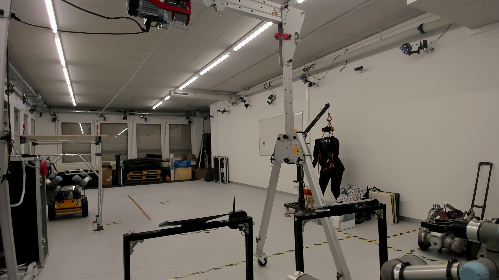

### left / markers_6 / Cam_21 / cover

**Workspace**

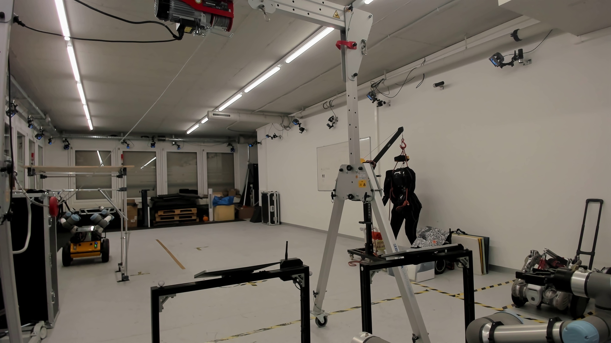

### right / markers_6 / Cam_12 / cover

**Workspace**

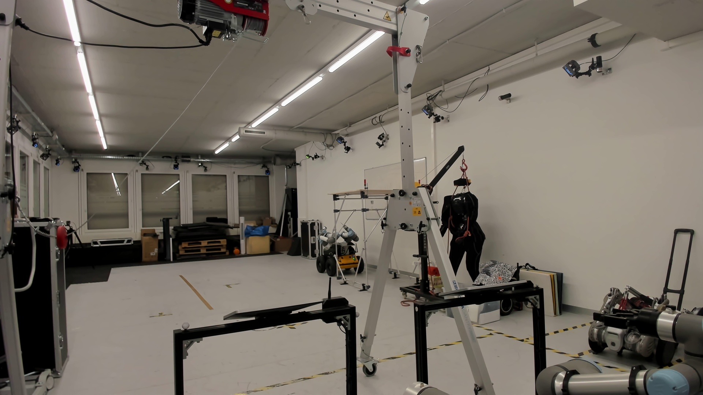

### right / markers_6 / Cam_15 / cover

**Workspace**

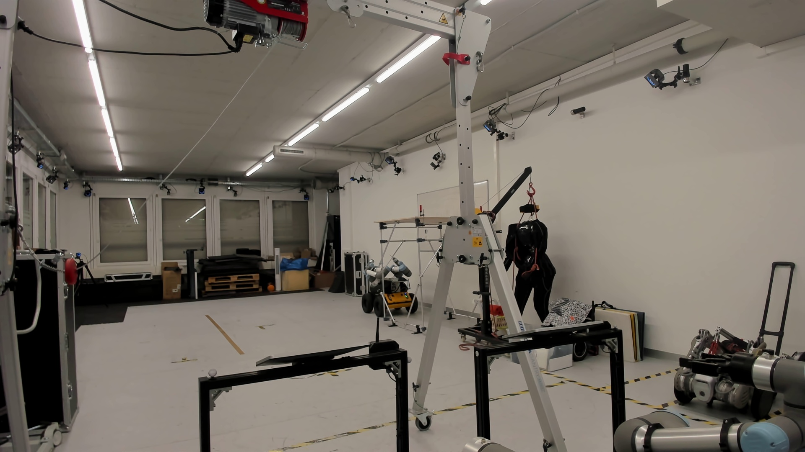

### right / markers_6 / Cam_18 / cover

**Workspace**

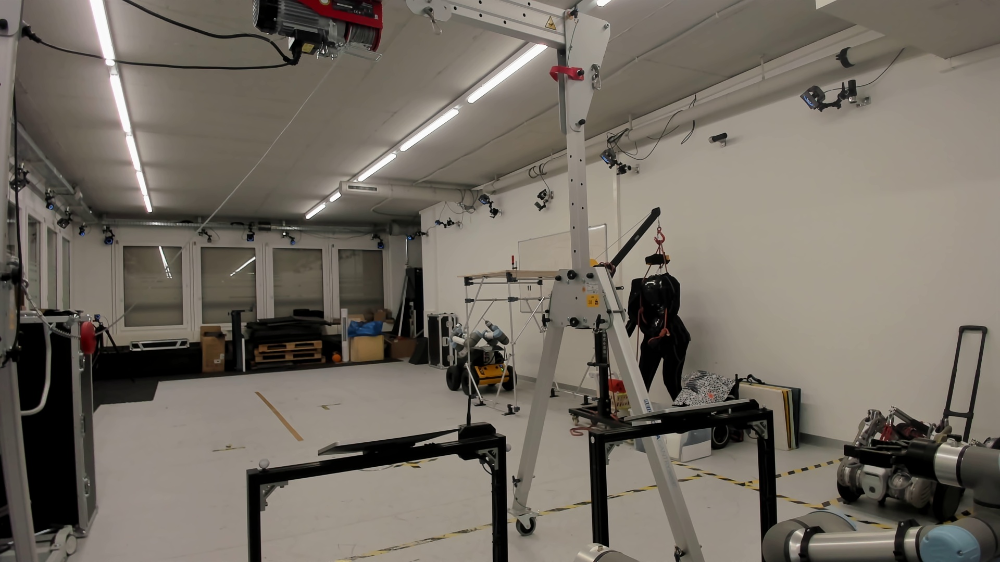

### right / markers_6 / Cam_21 / cover

**Workspace**

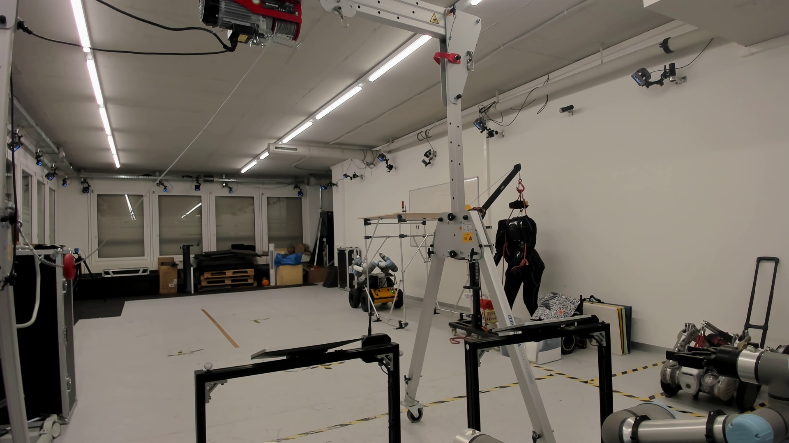

## Webcam Timelapse

### ws_center_markers6_cam21_cover_take1 | center | markers_6 | Cam_21 | cover | take1

- Status: `created`
- Captured frames: `71`
- Frame interval: `0.5` sec
- Video: `../reference_media/20260316_143701_ws_center_markers6_cam21_cover_take1--center--markers_6--cam_21--cover--take1/workspace_timelapse.mp4`

<video controls preload="metadata" src="../reference_media/20260316_143701_ws_center_markers6_cam21_cover_take1--center--markers_6--cam_21--cover--take1/workspace_timelapse.mp4" style="max-width: 100%; height: auto;"></video>

### ws_right_markers6_cam21_cover_take1 | right | markers_6 | Cam_21 | cover | take1

- Status: `created`
- Captured frames: `71`
- Frame interval: `0.5` sec
- Video: `../reference_media/20260316_144024_ws_right_markers6_cam21_cover_take1--right--markers_6--cam_21--cover--take1/workspace_timelapse.mp4`

<video controls preload="metadata" src="../reference_media/20260316_144024_ws_right_markers6_cam21_cover_take1--right--markers_6--cam_21--cover--take1/workspace_timelapse.mp4" style="max-width: 100%; height: auto;"></video>

### ws_left_markers6_cam21_cover_take1 | left | markers_6 | Cam_21 | cover | take1

- Status: `created`
- Captured frames: `71`
- Frame interval: `0.5` sec
- Video: `../reference_media/20260316_144437_ws_left_markers6_cam21_cover_take1--left--markers_6--cam_21--cover--take1/workspace_timelapse.mp4`

<video controls preload="metadata" src="../reference_media/20260316_144437_ws_left_markers6_cam21_cover_take1--left--markers_6--cam_21--cover--take1/workspace_timelapse.mp4" style="max-width: 100%; height: auto;"></video>

### ws_back_markers6_cam21_cover_take1 | back | markers_6 | Cam_21 | cover | take1

- Status: `created`
- Captured frames: `71`
- Frame interval: `0.5` sec
- Video: `../reference_media/20260316_144730_ws_back_markers6_cam21_cover_take1--back--markers_6--cam_21--cover--take1/workspace_timelapse.mp4`

<video controls preload="metadata" src="../reference_media/20260316_144730_ws_back_markers6_cam21_cover_take1--back--markers_6--cam_21--cover--take1/workspace_timelapse.mp4" style="max-width: 100%; height: auto;"></video>

### ws_center_markers6_cam18_cover_take2 | center | markers_6 | Cam_18 | cover | take1

- Status: `created`
- Captured frames: `71`
- Frame interval: `0.5` sec
- Video: `../reference_media/20260316_145643_ws_center_markers6_cam18_cover_take2--center--markers_6--cam_18--cover--take1/workspace_timelapse.mp4`

<video controls preload="metadata" src="../reference_media/20260316_145643_ws_center_markers6_cam18_cover_take2--center--markers_6--cam_18--cover--take1/workspace_timelapse.mp4" style="max-width: 100%; height: auto;"></video>

### ws_right_markers6_cam18_cover_take2 | right | markers_6 | Cam_18 | cover | take1

- Status: `created`
- Captured frames: `71`
- Frame interval: `0.5` sec
- Video: `../reference_media/20260316_145948_ws_right_markers6_cam18_cover_take2--right--markers_6--cam_18--cover--take1/workspace_timelapse.mp4`

<video controls preload="metadata" src="../reference_media/20260316_145948_ws_right_markers6_cam18_cover_take2--right--markers_6--cam_18--cover--take1/workspace_timelapse.mp4" style="max-width: 100%; height: auto;"></video>

### ws_left_markers6_cam18_cover_take2 | left | markers_6 | Cam_18 | cover | take1

- Status: `created`
- Captured frames: `71`
- Frame interval: `0.5` sec
- Video: `../reference_media/20260316_150149_ws_left_markers6_cam18_cover_take2--left--markers_6--cam_18--cover--take1/workspace_timelapse.mp4`

<video controls preload="metadata" src="../reference_media/20260316_150149_ws_left_markers6_cam18_cover_take2--left--markers_6--cam_18--cover--take1/workspace_timelapse.mp4" style="max-width: 100%; height: auto;"></video>

### ws_back_markers6_cam18_cover_take2 | back | markers_6 | Cam_18 | cover | take1

- Status: `created`
- Captured frames: `71`
- Frame interval: `0.5` sec
- Video: `../reference_media/20260316_150419_ws_back_markers6_cam18_cover_take2--back--markers_6--cam_18--cover--take1/workspace_timelapse.mp4`

<video controls preload="metadata" src="../reference_media/20260316_150419_ws_back_markers6_cam18_cover_take2--back--markers_6--cam_18--cover--take1/workspace_timelapse.mp4" style="max-width: 100%; height: auto;"></video>

### ws_center_markers6_cam15_cover_take3 | center | markers_6 | Cam_15 | cover | take1

- Status: `created`
- Captured frames: `71`
- Frame interval: `0.5` sec
- Video: `../reference_media/20260316_152056_ws_center_markers6_cam15_cover_take3--center--markers_6--cam_15--cover--take1/workspace_timelapse.mp4`

<video controls preload="metadata" src="../reference_media/20260316_152056_ws_center_markers6_cam15_cover_take3--center--markers_6--cam_15--cover--take1/workspace_timelapse.mp4" style="max-width: 100%; height: auto;"></video>

### ws_right_markers6_cam15_cover_take3 | right | markers_6 | Cam_15 | cover | take1

- Status: `created`
- Captured frames: `71`
- Frame interval: `0.5` sec
- Video: `../reference_media/20260316_152254_ws_right_markers6_cam15_cover_take3--right--markers_6--cam_15--cover--take1/workspace_timelapse.mp4`

<video controls preload="metadata" src="../reference_media/20260316_152254_ws_right_markers6_cam15_cover_take3--right--markers_6--cam_15--cover--take1/workspace_timelapse.mp4" style="max-width: 100%; height: auto;"></video>

### ws_left_markers6_cam15_cover_take3 | left | markers_6 | Cam_15 | cover | take1

- Status: `created`
- Captured frames: `71`
- Frame interval: `0.5` sec
- Video: `../reference_media/20260316_153447_ws_left_markers6_cam15_cover_take3--left--markers_6--cam_15--cover--take1/workspace_timelapse.mp4`

<video controls preload="metadata" src="../reference_media/20260316_153447_ws_left_markers6_cam15_cover_take3--left--markers_6--cam_15--cover--take1/workspace_timelapse.mp4" style="max-width: 100%; height: auto;"></video>

### ws_back_markers6_cam15_cover_take3 | back | markers_6 | Cam_15 | cover | take1

- Status: `created`
- Captured frames: `71`
- Frame interval: `0.5` sec
- Video: `../reference_media/20260316_153732_ws_back_markers6_cam15_cover_take3--back--markers_6--cam_15--cover--take1/workspace_timelapse.mp4`

<video controls preload="metadata" src="../reference_media/20260316_153732_ws_back_markers6_cam15_cover_take3--back--markers_6--cam_15--cover--take1/workspace_timelapse.mp4" style="max-width: 100%; height: auto;"></video>

### ws_center_markers6_cam12_cover_take4 | center | markers_6 | Cam_12 | cover | take1

- Status: `created`
- Captured frames: `71`
- Frame interval: `0.5` sec
- Video: `../reference_media/20260316_154617_ws_center_markers6_cam12_cover_take4--center--markers_6--cam_12--cover--take1/workspace_timelapse.mp4`

<video controls preload="metadata" src="../reference_media/20260316_154617_ws_center_markers6_cam12_cover_take4--center--markers_6--cam_12--cover--take1/workspace_timelapse.mp4" style="max-width: 100%; height: auto;"></video>

### ws_right_markers6_cam12_cover_take4 | right | markers_6 | Cam_12 | cover | take1

- Status: `created`
- Captured frames: `71`
- Frame interval: `0.5` sec
- Video: `../reference_media/20260316_154812_ws_right_markers6_cam12_cover_take4--right--markers_6--cam_12--cover--take1/workspace_timelapse.mp4`

<video controls preload="metadata" src="../reference_media/20260316_154812_ws_right_markers6_cam12_cover_take4--right--markers_6--cam_12--cover--take1/workspace_timelapse.mp4" style="max-width: 100%; height: auto;"></video>

### ws_left_markers6_cam12_cover_take4 | left | markers_6 | Cam_12 | cover | take1

- Status: `created`
- Captured frames: `71`
- Frame interval: `0.5` sec
- Video: `../reference_media/20260316_155028_ws_left_markers6_cam12_cover_take4--left--markers_6--cam_12--cover--take1/workspace_timelapse.mp4`

<video controls preload="metadata" src="../reference_media/20260316_155028_ws_left_markers6_cam12_cover_take4--left--markers_6--cam_12--cover--take1/workspace_timelapse.mp4" style="max-width: 100%; height: auto;"></video>

### ws_back_markers6_cam12_cover_take4 | back | markers_6 | Cam_12 | cover | take1

- Status: `created`
- Captured frames: `71`
- Frame interval: `0.5` sec
- Video: `../reference_media/20260316_155236_ws_back_markers6_cam12_cover_take4--back--markers_6--cam_12--cover--take1/workspace_timelapse.mp4`

<video controls preload="metadata" src="../reference_media/20260316_155236_ws_back_markers6_cam12_cover_take4--back--markers_6--cam_12--cover--take1/workspace_timelapse.mp4" style="max-width: 100%; height: auto;"></video>

## Take Files

- `ws_center_markers6_cam21_cover_take1 | center | markers_6 | Cam_21 | cover | take1`: `/home/yijiangh/ros2_ws/src/husky-assembly-teleop/data/mocap_experiments/20260316/20260316_cover_study_camera_reduction/takes/20260316_143701_ws_center_markers6_cam21_cover_take1--center--markers_6--cam_21--cover--take1.json` (2101 frames)
  - `workspace`: `../photo_library/ws_center_markers6_cam21_cover_take1__workspace.jpg`
- `ws_right_markers6_cam21_cover_take1 | right | markers_6 | Cam_21 | cover | take1`: `/home/yijiangh/ros2_ws/src/husky-assembly-teleop/data/mocap_experiments/20260316/20260316_cover_study_camera_reduction/takes/20260316_144024_ws_right_markers6_cam21_cover_take1--right--markers_6--cam_21--cover--take1.json` (2101 frames)
  - `workspace`: `../photo_library/ws_right_markers6_cam21_cover_take1__workspace.jpg`
- `ws_left_markers6_cam21_cover_take1 | left | markers_6 | Cam_21 | cover | take1`: `/home/yijiangh/ros2_ws/src/husky-assembly-teleop/data/mocap_experiments/20260316/20260316_cover_study_camera_reduction/takes/20260316_144437_ws_left_markers6_cam21_cover_take1--left--markers_6--cam_21--cover--take1.json` (2101 frames)
  - `workspace`: `../photo_library/ws_left_markers6_cam21_cover_take1__workspace.jpg`
- `ws_back_markers6_cam21_cover_take1 | back | markers_6 | Cam_21 | cover | take1`: `/home/yijiangh/ros2_ws/src/husky-assembly-teleop/data/mocap_experiments/20260316/20260316_cover_study_camera_reduction/takes/20260316_144730_ws_back_markers6_cam21_cover_take1--back--markers_6--cam_21--cover--take1.json` (2101 frames)
  - `workspace`: `../photo_library/ws_back_markers6_cam21_cover_take1__workspace.jpg`
- `ws_center_markers6_cam18_cover_take2 | center | markers_6 | Cam_18 | cover | take1`: `/home/yijiangh/ros2_ws/src/husky-assembly-teleop/data/mocap_experiments/20260316/20260316_cover_study_camera_reduction/takes/20260316_145643_ws_center_markers6_cam18_cover_take2--center--markers_6--cam_18--cover--take1.json` (2101 frames)
  - `workspace`: `../photo_library/ws_center_markers6_cam18_cover_take2__workspace.jpg`
- `ws_right_markers6_cam18_cover_take2 | right | markers_6 | Cam_18 | cover | take1`: `/home/yijiangh/ros2_ws/src/husky-assembly-teleop/data/mocap_experiments/20260316/20260316_cover_study_camera_reduction/takes/20260316_145948_ws_right_markers6_cam18_cover_take2--right--markers_6--cam_18--cover--take1.json` (2101 frames)
  - `workspace`: `../photo_library/ws_right_markers6_cam18_cover_take2__workspace.jpg`
- `ws_left_markers6_cam18_cover_take2 | left | markers_6 | Cam_18 | cover | take1`: `/home/yijiangh/ros2_ws/src/husky-assembly-teleop/data/mocap_experiments/20260316/20260316_cover_study_camera_reduction/takes/20260316_150149_ws_left_markers6_cam18_cover_take2--left--markers_6--cam_18--cover--take1.json` (2101 frames)
  - `workspace`: `../photo_library/ws_left_markers6_cam18_cover_take2__workspace.jpg`
- `ws_back_markers6_cam18_cover_take2 | back | markers_6 | Cam_18 | cover | take1`: `/home/yijiangh/ros2_ws/src/husky-assembly-teleop/data/mocap_experiments/20260316/20260316_cover_study_camera_reduction/takes/20260316_150419_ws_back_markers6_cam18_cover_take2--back--markers_6--cam_18--cover--take1.json` (2101 frames)
  - `workspace`: `../photo_library/ws_back_markers6_cam18_cover_take2__workspace.jpg`
- `ws_center_markers6_cam15_cover_take3 | center | markers_6 | Cam_15 | cover | take1`: `/home/yijiangh/ros2_ws/src/husky-assembly-teleop/data/mocap_experiments/20260316/20260316_cover_study_camera_reduction/takes/20260316_152056_ws_center_markers6_cam15_cover_take3--center--markers_6--cam_15--cover--take1.json` (2101 frames)
  - `workspace`: `../photo_library/ws_center_markers6_cam15_cover_take3__workspace.jpg`
- `ws_right_markers6_cam15_cover_take3 | right | markers_6 | Cam_15 | cover | take1`: `/home/yijiangh/ros2_ws/src/husky-assembly-teleop/data/mocap_experiments/20260316/20260316_cover_study_camera_reduction/takes/20260316_152254_ws_right_markers6_cam15_cover_take3--right--markers_6--cam_15--cover--take1.json` (2101 frames)
  - `workspace`: `../photo_library/ws_right_markers6_cam15_cover_take3__workspace.jpg`
- `ws_left_markers6_cam15_cover_take3 | left | markers_6 | Cam_15 | cover | take1`: `/home/yijiangh/ros2_ws/src/husky-assembly-teleop/data/mocap_experiments/20260316/20260316_cover_study_camera_reduction/takes/20260316_153447_ws_left_markers6_cam15_cover_take3--left--markers_6--cam_15--cover--take1.json` (2101 frames)
  - `workspace`: `../photo_library/ws_left_markers6_cam15_cover_take3__workspace.jpg`
- `ws_back_markers6_cam15_cover_take3 | back | markers_6 | Cam_15 | cover | take1`: `/home/yijiangh/ros2_ws/src/husky-assembly-teleop/data/mocap_experiments/20260316/20260316_cover_study_camera_reduction/takes/20260316_153732_ws_back_markers6_cam15_cover_take3--back--markers_6--cam_15--cover--take1.json` (2101 frames)
  - `workspace`: `../photo_library/ws_back_markers6_cam15_cover_take3__workspace.jpg`
- `ws_center_markers6_cam12_cover_take4 | center | markers_6 | Cam_12 | cover | take1`: `/home/yijiangh/ros2_ws/src/husky-assembly-teleop/data/mocap_experiments/20260316/20260316_cover_study_camera_reduction/takes/20260316_154617_ws_center_markers6_cam12_cover_take4--center--markers_6--cam_12--cover--take1.json` (2101 frames)
  - `workspace`: `../photo_library/ws_center_markers6_cam12_cover_take4__workspace.jpg`
- `ws_right_markers6_cam12_cover_take4 | right | markers_6 | Cam_12 | cover | take1`: `/home/yijiangh/ros2_ws/src/husky-assembly-teleop/data/mocap_experiments/20260316/20260316_cover_study_camera_reduction/takes/20260316_154812_ws_right_markers6_cam12_cover_take4--right--markers_6--cam_12--cover--take1.json` (2101 frames)
  - `workspace`: `../photo_library/ws_right_markers6_cam12_cover_take4__workspace.jpg`
- `ws_left_markers6_cam12_cover_take4 | left | markers_6 | Cam_12 | cover | take1`: `/home/yijiangh/ros2_ws/src/husky-assembly-teleop/data/mocap_experiments/20260316/20260316_cover_study_camera_reduction/takes/20260316_155028_ws_left_markers6_cam12_cover_take4--left--markers_6--cam_12--cover--take1.json` (2102 frames)
  - `workspace`: `../photo_library/ws_left_markers6_cam12_cover_take4__workspace.jpg`
- `ws_back_markers6_cam12_cover_take4 | back | markers_6 | Cam_12 | cover | take1`: `/home/yijiangh/ros2_ws/src/husky-assembly-teleop/data/mocap_experiments/20260316/20260316_cover_study_camera_reduction/takes/20260316_155236_ws_back_markers6_cam12_cover_take4--back--markers_6--cam_12--cover--take1.json` (2101 frames)
  - `workspace`: `../photo_library/ws_back_markers6_cam12_cover_take4__workspace.jpg`
