# MoCap Experiment Report

- Generated at: `2026-03-17T16:02:58.947971`
- Grouped by: `take.workspace_position, take.marker_configuration, take.camera_configuration, take.cover_configuration`
- Number of takes: `12`
- Number of groups: `12`

## Condition Profiles

- X axis: `workspace_position`
- Y axis: `marker_configuration`
- Additional varying fields detected outside the matrix axes: camera_configuration. Interpret matrix trends together with the group summary table.

### Combined Overview

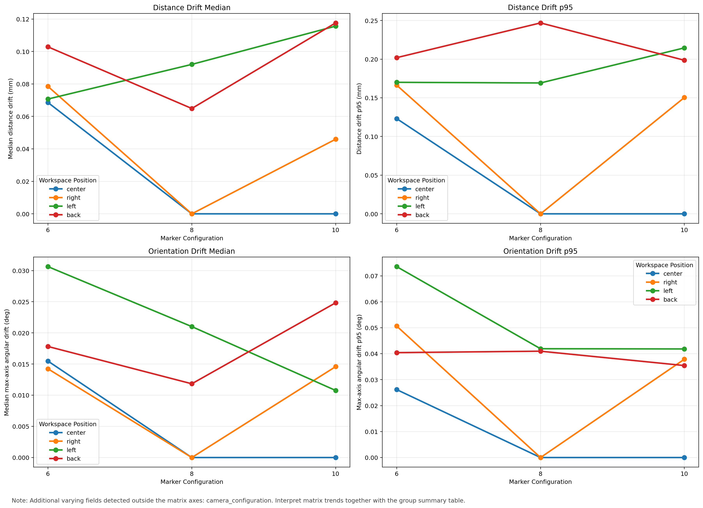

### Distance Drift Median

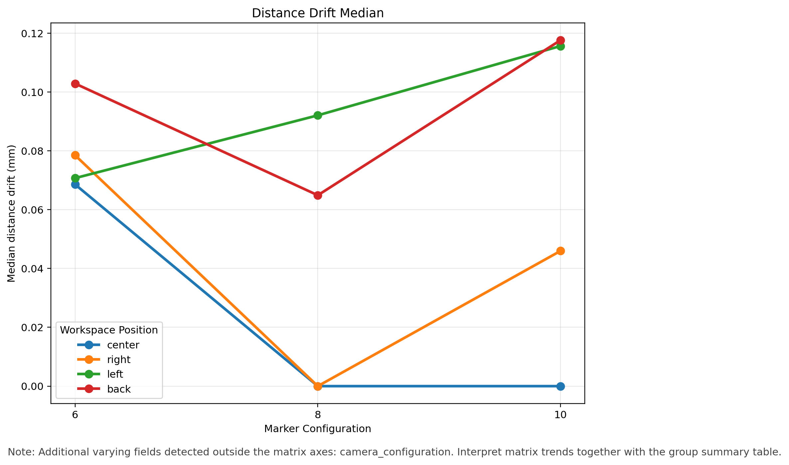

### Distance Drift p95

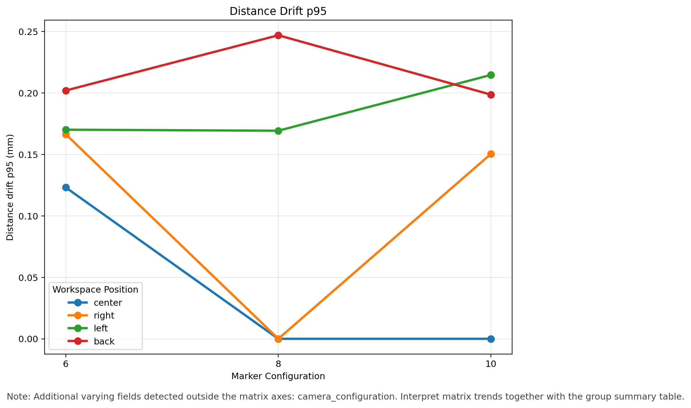

### Orientation Drift Median

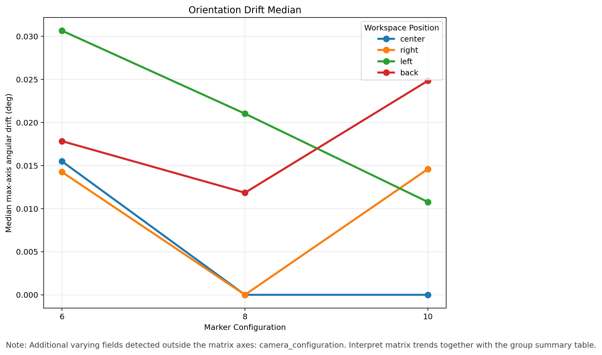

### Orientation Drift p95

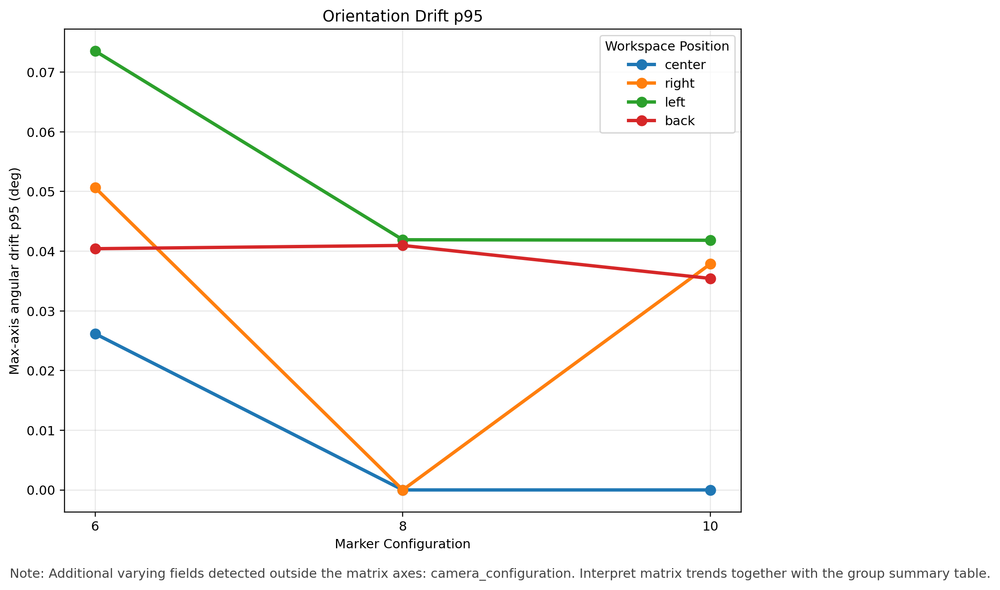

## Condition Summary Table

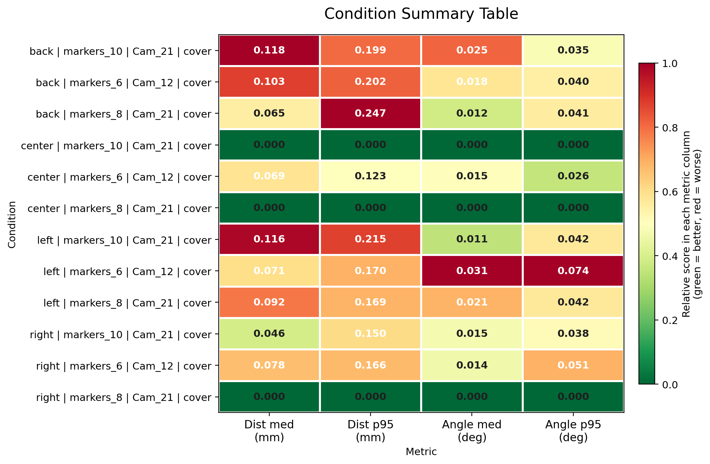

## Group Summary

| Group | Takes | Frames | Distance median (mm) | Distance p95 (mm) | Angle max median (deg) | Angle max p95 (deg) | X median (deg) | Y median (deg) | Z median (deg) |
| --- | ---: | ---: | ---: | ---: | ---: | ---: | ---: | ---: | ---: |
| back / markers_10 / Cam_21 / cover | 1 | 2101 | 0.118 | 0.199 | 0.025 | 0.035 | 0.023 | 0.022 | 0.013 |
| back / markers_6 / Cam_12 / cover | 1 | 2101 | 0.103 | 0.202 | 0.018 | 0.040 | 0.015 | 0.016 | 0.012 |
| back / markers_8 / Cam_21 / cover | 1 | 2101 | 0.065 | 0.247 | 0.012 | 0.041 | 0.009 | 0.010 | 0.009 |
| center / markers_10 / Cam_21 / cover | 1 | 2101 | 0.000 | 0.000 | 0.000 | 0.000 | 0.000 | 0.000 | 0.000 |
| center / markers_6 / Cam_12 / cover | 1 | 2102 | 0.069 | 0.123 | 0.015 | 0.026 | 0.014 | 0.010 | 0.012 |
| center / markers_8 / Cam_21 / cover | 1 | 2101 | 0.000 | 0.000 | 0.000 | 0.000 | 0.000 | 0.000 | 0.000 |
| left / markers_10 / Cam_21 / cover | 1 | 2101 | 0.116 | 0.215 | 0.011 | 0.042 | 0.006 | 0.009 | 0.010 |
| left / markers_6 / Cam_12 / cover | 1 | 2102 | 0.071 | 0.170 | 0.031 | 0.074 | 0.028 | 0.026 | 0.023 |
| left / markers_8 / Cam_21 / cover | 1 | 2101 | 0.092 | 0.169 | 0.021 | 0.042 | 0.011 | 0.020 | 0.019 |
| right / markers_10 / Cam_21 / cover | 1 | 2100 | 0.046 | 0.150 | 0.015 | 0.038 | 0.005 | 0.014 | 0.013 |
| right / markers_6 / Cam_12 / cover | 1 | 2100 | 0.078 | 0.166 | 0.014 | 0.051 | 0.009 | 0.013 | 0.013 |
| right / markers_8 / Cam_21 / cover | 1 | 2101 | 0.000 | 0.000 | 0.000 | 0.000 | 0.000 | 0.000 | 0.000 |

## Appendix: Detailed Boxplots

_These per-frame boxplots are retained for debugging, but the heatmaps, line profiles, and summary table above should be the primary comparison figures for multi-condition sessions._

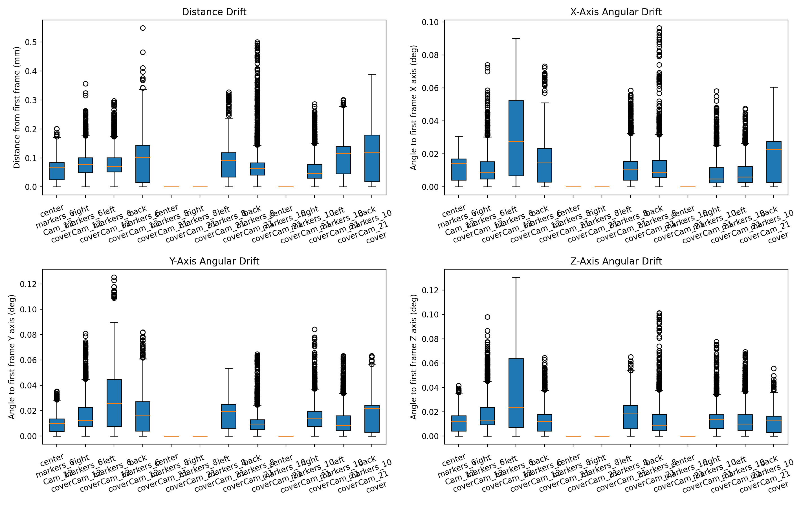

### Distance Drift

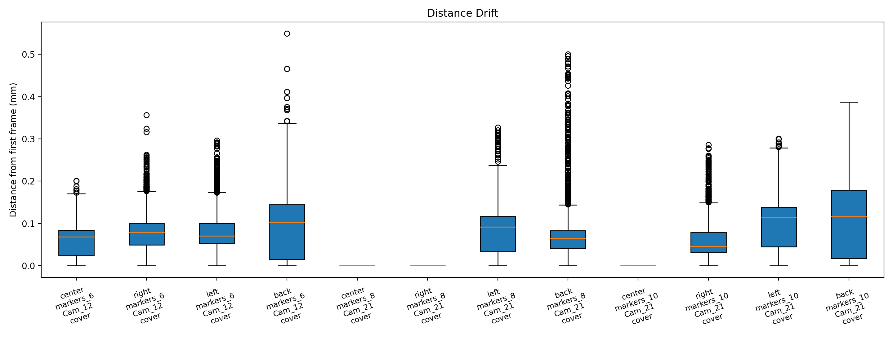

### X-Axis Angular Drift

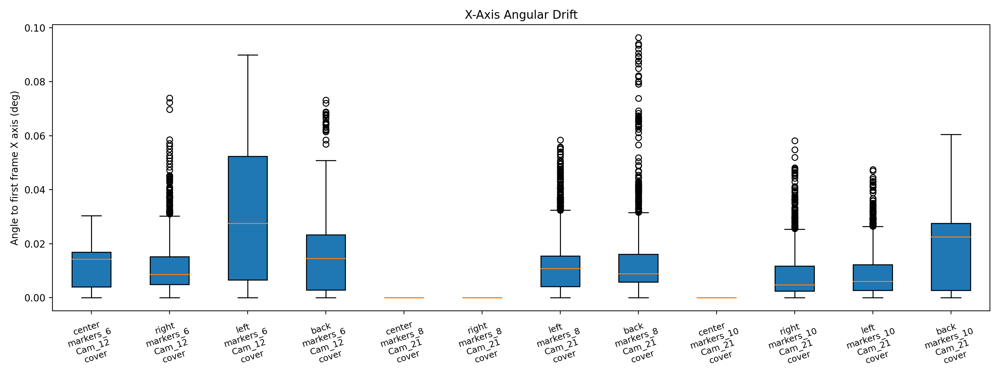

### Y-Axis Angular Drift

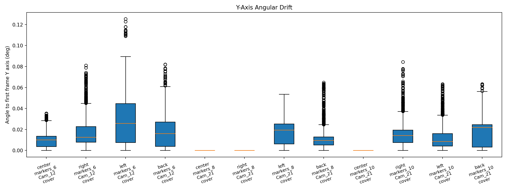

### Z-Axis Angular Drift

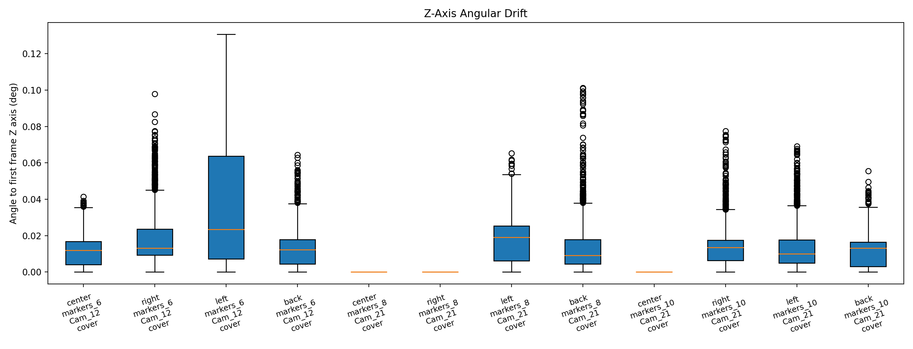

## MoCap Camera Inventory

### back / markers_10 / Cam_21 / cover

- Camera count: `21`
- `PrimeX 22 #72657`
- `PrimeX 22 #72653`
- `PrimeX 22 #72654`
- `PrimeX 22 #72652`
- `PrimeX 22 #72317`
- `PrimeX 22 #72655`
- `PrimeX 22 #72300`
- `PrimeX 22 #72708`
- `PrimeX 22 #72656`
- `PrimeX 22 #72318`
- `Prime 13 #31328`
- `Prime 13 #31323`
- `PrimeX 13 #66106`
- `Prime 13 #31327`
- `PrimeX 13 #66078`
- `Prime 13 #31326`
- `PrimeX 13 #66077`
- `Prime 13 #31325`
- `Prime 13 #31324`
- `PrimeX 13 #66105`
- `Prime 13 #31329`

### back / markers_6 / Cam_12 / cover

- Camera count: `21`
- `PrimeX 22 #72657`
- `PrimeX 22 #72653`
- `PrimeX 22 #72654`
- `PrimeX 22 #72652`
- `PrimeX 22 #72317`
- `PrimeX 22 #72655`
- `PrimeX 22 #72300`
- `PrimeX 22 #72708`
- `PrimeX 22 #72656`
- `PrimeX 22 #72318`
- `Prime 13 #31328`
- `Prime 13 #31323`
- `PrimeX 13 #66106`
- `Prime 13 #31327`
- `PrimeX 13 #66078`
- `Prime 13 #31326`
- `PrimeX 13 #66077`
- `Prime 13 #31325`
- `Prime 13 #31324`
- `PrimeX 13 #66105`
- `Prime 13 #31329`

### back / markers_8 / Cam_21 / cover

- Camera count: `21`
- `PrimeX 22 #72657`
- `PrimeX 22 #72653`
- `PrimeX 22 #72654`
- `PrimeX 22 #72652`
- `PrimeX 22 #72317`
- `PrimeX 22 #72655`
- `PrimeX 22 #72300`
- `PrimeX 22 #72708`
- `PrimeX 22 #72656`
- `PrimeX 22 #72318`
- `Prime 13 #31328`
- `Prime 13 #31323`
- `PrimeX 13 #66106`
- `Prime 13 #31327`
- `PrimeX 13 #66078`
- `Prime 13 #31326`
- `PrimeX 13 #66077`
- `Prime 13 #31325`
- `Prime 13 #31324`
- `PrimeX 13 #66105`
- `Prime 13 #31329`

### center / markers_10 / Cam_21 / cover

- Camera count: `21`
- `PrimeX 22 #72657`
- `PrimeX 22 #72653`
- `PrimeX 22 #72654`
- `PrimeX 22 #72652`
- `PrimeX 22 #72317`
- `PrimeX 22 #72655`
- `PrimeX 22 #72300`
- `PrimeX 22 #72708`
- `PrimeX 22 #72656`
- `PrimeX 22 #72318`
- `Prime 13 #31328`
- `Prime 13 #31323`
- `PrimeX 13 #66106`
- `Prime 13 #31327`
- `PrimeX 13 #66078`
- `Prime 13 #31326`
- `PrimeX 13 #66077`
- `Prime 13 #31325`
- `Prime 13 #31324`
- `PrimeX 13 #66105`
- `Prime 13 #31329`

### center / markers_6 / Cam_12 / cover

- Camera count: `21`
- `PrimeX 22 #72657`
- `PrimeX 22 #72653`
- `PrimeX 22 #72654`
- `PrimeX 22 #72652`
- `PrimeX 22 #72317`
- `PrimeX 22 #72655`
- `PrimeX 22 #72300`
- `PrimeX 22 #72708`
- `PrimeX 22 #72656`
- `PrimeX 22 #72318`
- `Prime 13 #31328`
- `Prime 13 #31323`
- `PrimeX 13 #66106`
- `Prime 13 #31327`
- `PrimeX 13 #66078`
- `Prime 13 #31326`
- `PrimeX 13 #66077`
- `Prime 13 #31325`
- `Prime 13 #31324`
- `PrimeX 13 #66105`
- `Prime 13 #31329`

### center / markers_8 / Cam_21 / cover

- Camera count: `21`
- `PrimeX 22 #72657`
- `PrimeX 22 #72653`
- `PrimeX 22 #72654`
- `PrimeX 22 #72652`
- `PrimeX 22 #72317`
- `PrimeX 22 #72655`
- `PrimeX 22 #72300`
- `PrimeX 22 #72708`
- `PrimeX 22 #72656`
- `PrimeX 22 #72318`
- `Prime 13 #31328`
- `Prime 13 #31323`
- `PrimeX 13 #66106`
- `Prime 13 #31327`
- `PrimeX 13 #66078`
- `Prime 13 #31326`
- `PrimeX 13 #66077`
- `Prime 13 #31325`
- `Prime 13 #31324`
- `PrimeX 13 #66105`
- `Prime 13 #31329`

### left / markers_10 / Cam_21 / cover

- Camera count: `21`
- `PrimeX 22 #72657`
- `PrimeX 22 #72653`
- `PrimeX 22 #72654`
- `PrimeX 22 #72652`
- `PrimeX 22 #72317`
- `PrimeX 22 #72655`
- `PrimeX 22 #72300`
- `PrimeX 22 #72708`
- `PrimeX 22 #72656`
- `PrimeX 22 #72318`
- `Prime 13 #31328`
- `Prime 13 #31323`
- `PrimeX 13 #66106`
- `Prime 13 #31327`
- `PrimeX 13 #66078`
- `Prime 13 #31326`
- `PrimeX 13 #66077`
- `Prime 13 #31325`
- `Prime 13 #31324`
- `PrimeX 13 #66105`
- `Prime 13 #31329`

### left / markers_6 / Cam_12 / cover

- Camera count: `21`
- `PrimeX 22 #72657`
- `PrimeX 22 #72653`
- `PrimeX 22 #72654`
- `PrimeX 22 #72652`
- `PrimeX 22 #72317`
- `PrimeX 22 #72655`
- `PrimeX 22 #72300`
- `PrimeX 22 #72708`
- `PrimeX 22 #72656`
- `PrimeX 22 #72318`
- `Prime 13 #31328`
- `Prime 13 #31323`
- `PrimeX 13 #66106`
- `Prime 13 #31327`
- `PrimeX 13 #66078`
- `Prime 13 #31326`
- `PrimeX 13 #66077`
- `Prime 13 #31325`
- `Prime 13 #31324`
- `PrimeX 13 #66105`
- `Prime 13 #31329`

### left / markers_8 / Cam_21 / cover

- Camera count: `21`
- `PrimeX 22 #72657`
- `PrimeX 22 #72653`
- `PrimeX 22 #72654`
- `PrimeX 22 #72652`
- `PrimeX 22 #72317`
- `PrimeX 22 #72655`
- `PrimeX 22 #72300`
- `PrimeX 22 #72708`
- `PrimeX 22 #72656`
- `PrimeX 22 #72318`
- `Prime 13 #31328`
- `Prime 13 #31323`
- `PrimeX 13 #66106`
- `Prime 13 #31327`
- `PrimeX 13 #66078`
- `Prime 13 #31326`
- `PrimeX 13 #66077`
- `Prime 13 #31325`
- `Prime 13 #31324`
- `PrimeX 13 #66105`
- `Prime 13 #31329`

### right / markers_10 / Cam_21 / cover

- Camera count: `21`
- `PrimeX 22 #72657`
- `PrimeX 22 #72653`
- `PrimeX 22 #72654`
- `PrimeX 22 #72652`
- `PrimeX 22 #72317`
- `PrimeX 22 #72655`
- `PrimeX 22 #72300`
- `PrimeX 22 #72708`
- `PrimeX 22 #72656`
- `PrimeX 22 #72318`
- `Prime 13 #31328`
- `Prime 13 #31323`
- `PrimeX 13 #66106`
- `Prime 13 #31327`
- `PrimeX 13 #66078`
- `Prime 13 #31326`
- `PrimeX 13 #66077`
- `Prime 13 #31325`
- `Prime 13 #31324`
- `PrimeX 13 #66105`
- `Prime 13 #31329`

### right / markers_6 / Cam_12 / cover

- Camera count: `21`
- `PrimeX 22 #72657`
- `PrimeX 22 #72653`
- `PrimeX 22 #72654`
- `PrimeX 22 #72652`
- `PrimeX 22 #72317`
- `PrimeX 22 #72655`
- `PrimeX 22 #72300`
- `PrimeX 22 #72708`
- `PrimeX 22 #72656`
- `PrimeX 22 #72318`
- `Prime 13 #31328`
- `Prime 13 #31323`
- `PrimeX 13 #66106`
- `Prime 13 #31327`
- `PrimeX 13 #66078`
- `Prime 13 #31326`
- `PrimeX 13 #66077`
- `Prime 13 #31325`
- `Prime 13 #31324`
- `PrimeX 13 #66105`
- `Prime 13 #31329`

### right / markers_8 / Cam_21 / cover

- Camera count: `21`
- `PrimeX 22 #72657`
- `PrimeX 22 #72653`
- `PrimeX 22 #72654`
- `PrimeX 22 #72652`
- `PrimeX 22 #72317`
- `PrimeX 22 #72655`
- `PrimeX 22 #72300`
- `PrimeX 22 #72708`
- `PrimeX 22 #72656`
- `PrimeX 22 #72318`
- `Prime 13 #31328`
- `Prime 13 #31323`
- `PrimeX 13 #66106`
- `Prime 13 #31327`
- `PrimeX 13 #66078`
- `Prime 13 #31326`
- `PrimeX 13 #66077`
- `Prime 13 #31325`
- `Prime 13 #31324`
- `PrimeX 13 #66105`
- `Prime 13 #31329`

## Configuration References

### back / markers_10 / Cam_21 / cover

**Workspace**

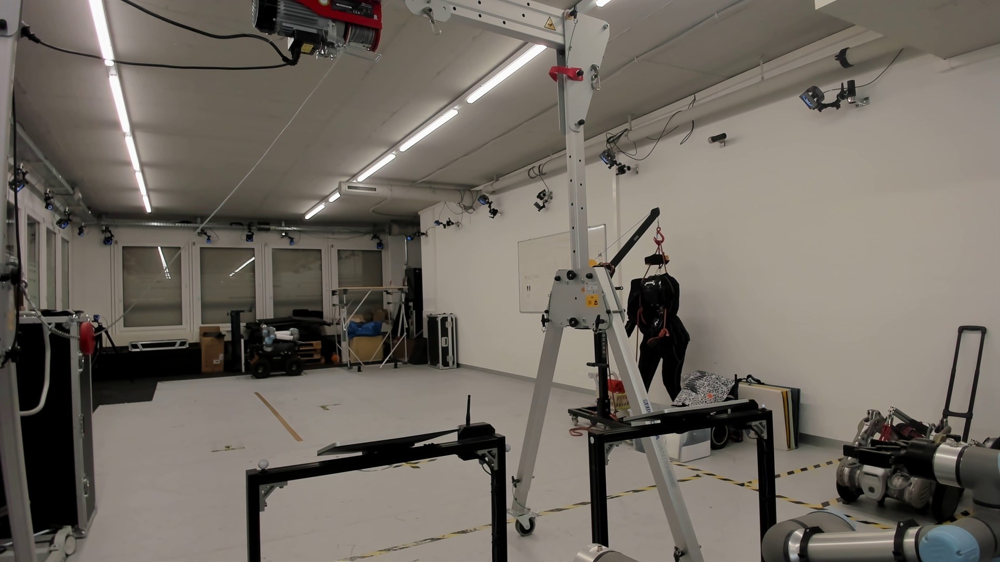

### back / markers_6 / Cam_12 / cover

**Workspace**

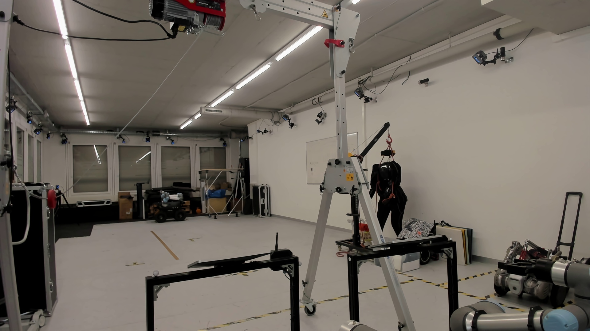

### back / markers_8 / Cam_21 / cover

**Workspace**

### center / markers_10 / Cam_21 / cover

**Workspace**

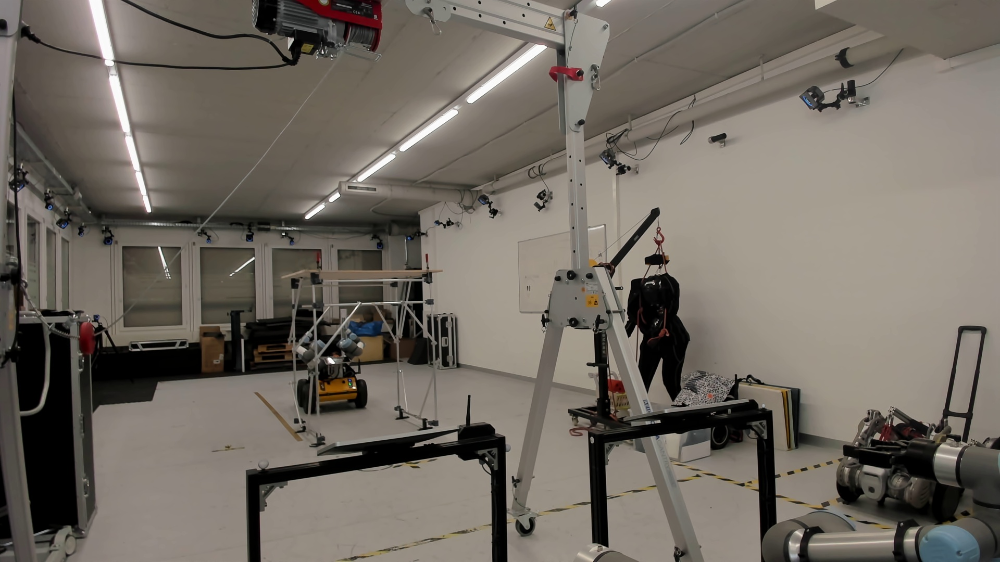

### center / markers_6 / Cam_12 / cover

**Workspace**

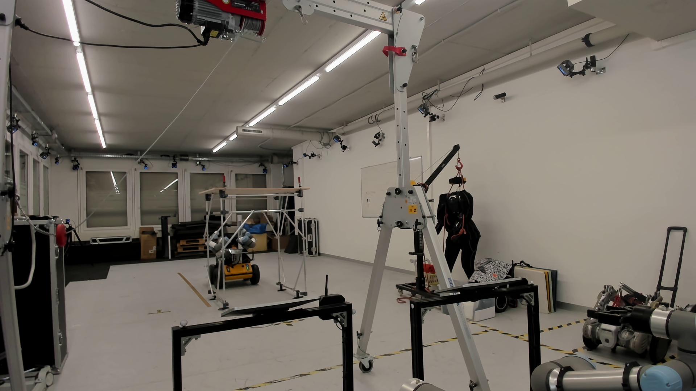

### center / markers_8 / Cam_21 / cover

**Workspace**

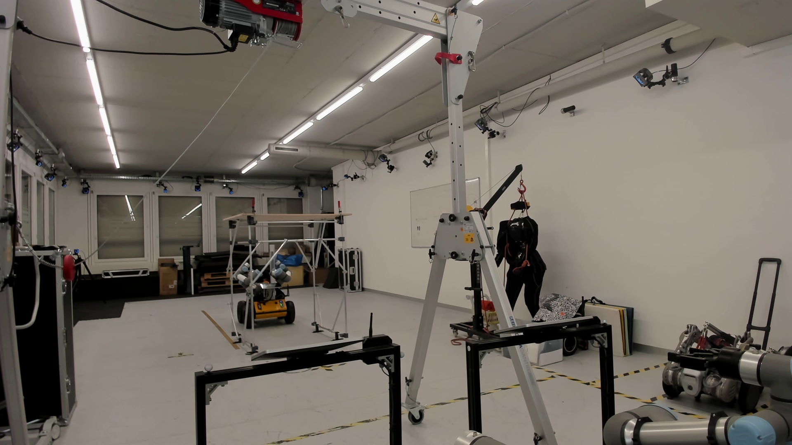

### left / markers_10 / Cam_21 / cover

**Workspace**

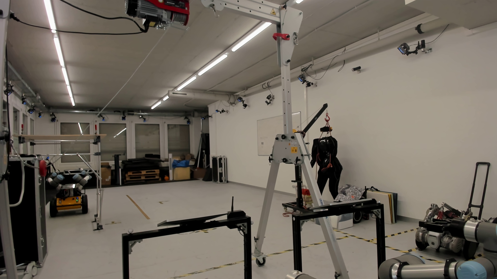

### left / markers_6 / Cam_12 / cover

**Workspace**

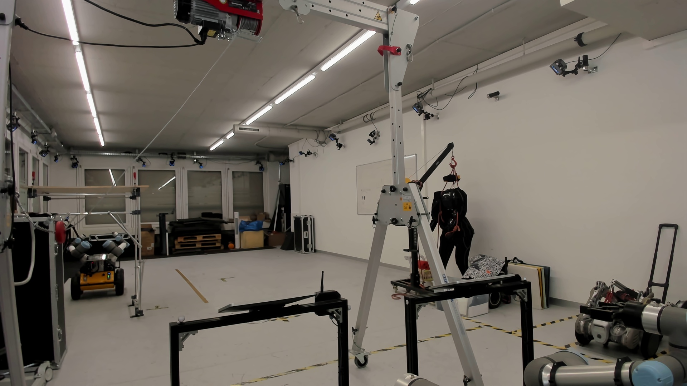

### left / markers_8 / Cam_21 / cover

**Workspace**

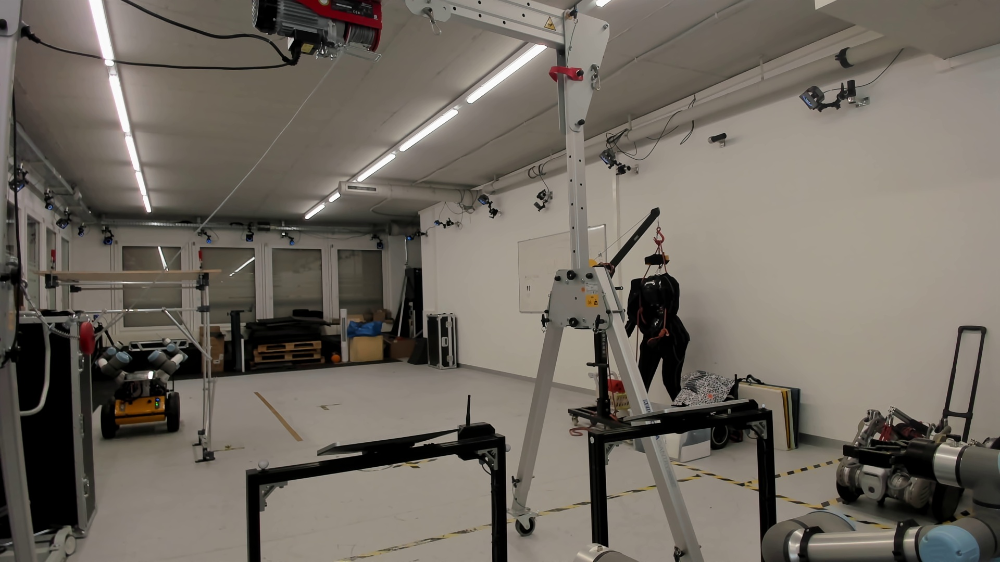

### right / markers_10 / Cam_21 / cover

**Workspace**

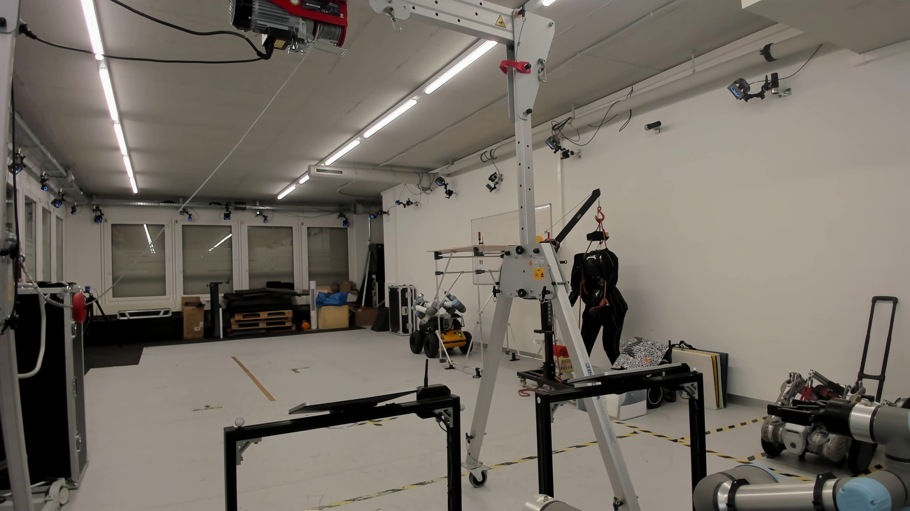

### right / markers_6 / Cam_12 / cover

**Workspace**

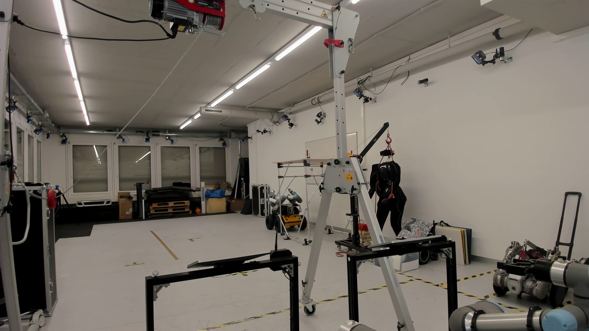

### right / markers_8 / Cam_21 / cover

**Workspace**

## Webcam Timelapse

### ws_center_markers6_allcam_cover_take4 | center | markers_6 | Cam_12 | cover | take1

- Status: `created`
- Captured frames: `71`
- Frame interval: `0.5` sec
- Video: `../reference_media/20260317_135256_ws_center_markers6_allcam_cover_take4--center--markers_6--cam_12--cover--take1/workspace_timelapse.mp4`

<video controls preload="metadata" src="../reference_media/20260317_135256_ws_center_markers6_allcam_cover_take4--center--markers_6--cam_12--cover--take1/workspace_timelapse.mp4" style="max-width: 100%; height: auto;"></video>

### ws_right_markers6_allcam_cover_take4 | right | markers_6 | Cam_12 | cover | take1

- Status: `created`
- Captured frames: `71`
- Frame interval: `0.5` sec
- Video: `../reference_media/20260317_135526_ws_right_markers6_allcam_cover_take4--right--markers_6--cam_12--cover--take1/workspace_timelapse.mp4`

<video controls preload="metadata" src="../reference_media/20260317_135526_ws_right_markers6_allcam_cover_take4--right--markers_6--cam_12--cover--take1/workspace_timelapse.mp4" style="max-width: 100%; height: auto;"></video>

### ws_left_markers6_allcam_cover_take4 | left | markers_6 | Cam_12 | cover | take1

- Status: `created`
- Captured frames: `71`
- Frame interval: `0.5` sec
- Video: `../reference_media/20260317_135753_ws_left_markers6_allcam_cover_take4--left--markers_6--cam_12--cover--take1/workspace_timelapse.mp4`

<video controls preload="metadata" src="../reference_media/20260317_135753_ws_left_markers6_allcam_cover_take4--left--markers_6--cam_12--cover--take1/workspace_timelapse.mp4" style="max-width: 100%; height: auto;"></video>

### ws_back_markers6_allcam_cover_take4 | back | markers_6 | Cam_12 | cover | take1

- Status: `created`
- Captured frames: `71`
- Frame interval: `0.5` sec
- Video: `../reference_media/20260317_140226_ws_back_markers6_allcam_cover_take4--back--markers_6--cam_12--cover--take1/workspace_timelapse.mp4`

<video controls preload="metadata" src="../reference_media/20260317_140226_ws_back_markers6_allcam_cover_take4--back--markers_6--cam_12--cover--take1/workspace_timelapse.mp4" style="max-width: 100%; height: auto;"></video>

### ws_center_markers8_allcam_cover_take4 | center | markers_8 | Cam_21 | cover | take1

- Status: `created`
- Captured frames: `71`
- Frame interval: `0.5` sec
- Video: `../reference_media/20260317_140859_ws_center_markers8_allcam_cover_take4--center--markers_8--cam_21--cover--take1/workspace_timelapse.mp4`

<video controls preload="metadata" src="../reference_media/20260317_140859_ws_center_markers8_allcam_cover_take4--center--markers_8--cam_21--cover--take1/workspace_timelapse.mp4" style="max-width: 100%; height: auto;"></video>

### ws_right_markers8_allcam_cover_take4 | right | markers_8 | Cam_21 | cover | take1

- Status: `created`
- Captured frames: `71`
- Frame interval: `0.5` sec
- Video: `../reference_media/20260317_141145_ws_right_markers8_allcam_cover_take4--right--markers_8--cam_21--cover--take1/workspace_timelapse.mp4`

<video controls preload="metadata" src="../reference_media/20260317_141145_ws_right_markers8_allcam_cover_take4--right--markers_8--cam_21--cover--take1/workspace_timelapse.mp4" style="max-width: 100%; height: auto;"></video>

### ws_left_markers8_allcam_cover_take4 | left | markers_8 | Cam_21 | cover | take1

- Status: `created`
- Captured frames: `71`
- Frame interval: `0.5` sec
- Video: `../reference_media/20260317_141520_ws_left_markers8_allcam_cover_take4--left--markers_8--cam_21--cover--take1/workspace_timelapse.mp4`

<video controls preload="metadata" src="../reference_media/20260317_141520_ws_left_markers8_allcam_cover_take4--left--markers_8--cam_21--cover--take1/workspace_timelapse.mp4" style="max-width: 100%; height: auto;"></video>

### ws_back_markers8_allcam_cover_take4 | back | markers_8 | Cam_21 | cover | take1

- Status: `created`
- Captured frames: `71`
- Frame interval: `0.5` sec
- Video: `../reference_media/20260317_141755_ws_back_markers8_allcam_cover_take4--back--markers_8--cam_21--cover--take1/workspace_timelapse.mp4`

<video controls preload="metadata" src="../reference_media/20260317_141755_ws_back_markers8_allcam_cover_take4--back--markers_8--cam_21--cover--take1/workspace_timelapse.mp4" style="max-width: 100%; height: auto;"></video>

### ws_center_markers10_allcam_cover_take4 | center | markers_10 | Cam_21 | cover | take1

- Status: `created`
- Captured frames: `71`
- Frame interval: `0.5` sec
- Video: `../reference_media/20260317_143058_ws_center_markers10_allcam_cover_take4--center--markers_10--cam_21--cover--take1/workspace_timelapse.mp4`

<video controls preload="metadata" src="../reference_media/20260317_143058_ws_center_markers10_allcam_cover_take4--center--markers_10--cam_21--cover--take1/workspace_timelapse.mp4" style="max-width: 100%; height: auto;"></video>

### ws_right_markers10_allcam_cover_take4 | right | markers_10 | Cam_21 | cover | take1

- Status: `created`
- Captured frames: `71`
- Frame interval: `0.5` sec
- Video: `../reference_media/20260317_143456_ws_right_markers10_allcam_cover_take4--right--markers_10--cam_21--cover--take1/workspace_timelapse.mp4`

<video controls preload="metadata" src="../reference_media/20260317_143456_ws_right_markers10_allcam_cover_take4--right--markers_10--cam_21--cover--take1/workspace_timelapse.mp4" style="max-width: 100%; height: auto;"></video>

### ws_left_markers10_allcam_cover_take4 | left | markers_10 | Cam_21 | cover | take1

- Status: `created`
- Captured frames: `71`
- Frame interval: `0.5` sec
- Video: `../reference_media/20260317_143655_ws_left_markers10_allcam_cover_take4--left--markers_10--cam_21--cover--take1/workspace_timelapse.mp4`

<video controls preload="metadata" src="../reference_media/20260317_143655_ws_left_markers10_allcam_cover_take4--left--markers_10--cam_21--cover--take1/workspace_timelapse.mp4" style="max-width: 100%; height: auto;"></video>

### ws_back_markers10_allcam_cover_take4 | back | markers_10 | Cam_21 | cover | take1

- Status: `created`
- Captured frames: `71`
- Frame interval: `0.5` sec
- Video: `../reference_media/20260317_143940_ws_back_markers10_allcam_cover_take4--back--markers_10--cam_21--cover--take1/workspace_timelapse.mp4`

<video controls preload="metadata" src="../reference_media/20260317_143940_ws_back_markers10_allcam_cover_take4--back--markers_10--cam_21--cover--take1/workspace_timelapse.mp4" style="max-width: 100%; height: auto;"></video>

## Take Files

- `ws_center_markers6_allcam_cover_take4 | center | markers_6 | Cam_12 | cover | take1`: `/home/yijiangh/ros2_ws/src/husky-assembly-teleop/data/mocap_experiments/20260317/20260317_cover_study_marker_adding/takes/20260317_135256_ws_center_markers6_allcam_cover_take4--center--markers_6--cam_12--cover--take1.json` (2102 frames)
  - `workspace`: `../photo_library/ws_center_markers6_allcam_cover_take4__workspace.jpg`
- `ws_right_markers6_allcam_cover_take4 | right | markers_6 | Cam_12 | cover | take1`: `/home/yijiangh/ros2_ws/src/husky-assembly-teleop/data/mocap_experiments/20260317/20260317_cover_study_marker_adding/takes/20260317_135526_ws_right_markers6_allcam_cover_take4--right--markers_6--cam_12--cover--take1.json` (2100 frames)
  - `workspace`: `../photo_library/ws_right_markers6_allcam_cover_take4__workspace.jpg`
- `ws_left_markers6_allcam_cover_take4 | left | markers_6 | Cam_12 | cover | take1`: `/home/yijiangh/ros2_ws/src/husky-assembly-teleop/data/mocap_experiments/20260317/20260317_cover_study_marker_adding/takes/20260317_135753_ws_left_markers6_allcam_cover_take4--left--markers_6--cam_12--cover--take1.json` (2102 frames)
  - `workspace`: `../photo_library/ws_left_markers6_allcam_cover_take4__workspace.jpg`
- `ws_back_markers6_allcam_cover_take4 | back | markers_6 | Cam_12 | cover | take1`: `/home/yijiangh/ros2_ws/src/husky-assembly-teleop/data/mocap_experiments/20260317/20260317_cover_study_marker_adding/takes/20260317_140226_ws_back_markers6_allcam_cover_take4--back--markers_6--cam_12--cover--take1.json` (2101 frames)
  - `workspace`: `../photo_library/ws_back_markers6_allcam_cover_take4__workspace.jpg`
- `ws_center_markers8_allcam_cover_take4 | center | markers_8 | Cam_21 | cover | take1`: `/home/yijiangh/ros2_ws/src/husky-assembly-teleop/data/mocap_experiments/20260317/20260317_cover_study_marker_adding/takes/20260317_140859_ws_center_markers8_allcam_cover_take4--center--markers_8--cam_21--cover--take1.json` (2101 frames)
  - `workspace`: `../photo_library/ws_center_markers8_allcam_cover_take4__workspace.jpg`
- `ws_right_markers8_allcam_cover_take4 | right | markers_8 | Cam_21 | cover | take1`: `/home/yijiangh/ros2_ws/src/husky-assembly-teleop/data/mocap_experiments/20260317/20260317_cover_study_marker_adding/takes/20260317_141145_ws_right_markers8_allcam_cover_take4--right--markers_8--cam_21--cover--take1.json` (2101 frames)
  - `workspace`: `../photo_library/ws_right_markers8_allcam_cover_take4__workspace.jpg`
- `ws_left_markers8_allcam_cover_take4 | left | markers_8 | Cam_21 | cover | take1`: `/home/yijiangh/ros2_ws/src/husky-assembly-teleop/data/mocap_experiments/20260317/20260317_cover_study_marker_adding/takes/20260317_141520_ws_left_markers8_allcam_cover_take4--left--markers_8--cam_21--cover--take1.json` (2101 frames)
  - `workspace`: `../photo_library/ws_left_markers8_allcam_cover_take4__workspace.jpg`
- `ws_back_markers8_allcam_cover_take4 | back | markers_8 | Cam_21 | cover | take1`: `/home/yijiangh/ros2_ws/src/husky-assembly-teleop/data/mocap_experiments/20260317/20260317_cover_study_marker_adding/takes/20260317_141755_ws_back_markers8_allcam_cover_take4--back--markers_8--cam_21--cover--take1.json` (2101 frames)
  - `workspace`: `../photo_library/ws_back_markers8_allcam_cover_take4__workspace.jpg`
- `ws_center_markers10_allcam_cover_take4 | center | markers_10 | Cam_21 | cover | take1`: `/home/yijiangh/ros2_ws/src/husky-assembly-teleop/data/mocap_experiments/20260317/20260317_cover_study_marker_adding/takes/20260317_143058_ws_center_markers10_allcam_cover_take4--center--markers_10--cam_21--cover--take1.json` (2101 frames)
  - `workspace`: `../photo_library/ws_center_markers10_allcam_cover_take4__workspace.jpg`
- `ws_right_markers10_allcam_cover_take4 | right | markers_10 | Cam_21 | cover | take1`: `/home/yijiangh/ros2_ws/src/husky-assembly-teleop/data/mocap_experiments/20260317/20260317_cover_study_marker_adding/takes/20260317_143456_ws_right_markers10_allcam_cover_take4--right--markers_10--cam_21--cover--take1.json` (2100 frames)
  - `workspace`: `../photo_library/ws_right_markers10_allcam_cover_take4__workspace.jpg`
- `ws_left_markers10_allcam_cover_take4 | left | markers_10 | Cam_21 | cover | take1`: `/home/yijiangh/ros2_ws/src/husky-assembly-teleop/data/mocap_experiments/20260317/20260317_cover_study_marker_adding/takes/20260317_143655_ws_left_markers10_allcam_cover_take4--left--markers_10--cam_21--cover--take1.json` (2101 frames)
  - `workspace`: `../photo_library/ws_left_markers10_allcam_cover_take4__workspace.jpg`
- `ws_back_markers10_allcam_cover_take4 | back | markers_10 | Cam_21 | cover | take1`: `/home/yijiangh/ros2_ws/src/husky-assembly-teleop/data/mocap_experiments/20260317/20260317_cover_study_marker_adding/takes/20260317_143940_ws_back_markers10_allcam_cover_take4--back--markers_10--cam_21--cover--take1.json` (2101 frames)
  - `workspace`: `../photo_library/ws_back_markers10_allcam_cover_take4__workspace.jpg`
