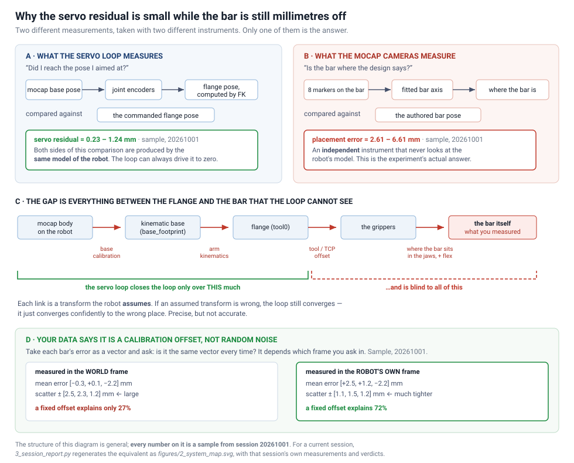

# Bar-holding accuracy manual

> **Migration notes for the split jointing/release export:**
> [`i-made-new-bar-smooth-floyd.md`](../.claude/plans/i-made-new-bar-smooth-floyd.md)
> — a step-by-step audit of what every step below needs from the data, checked
> against `260929_phase1_retest`, and the changes that followed. Local only:
> `.claude/plans/` is git-ignored, so the link resolves on this machine.

How to measure how accurately the robot places a bar: run a session with the
live monitor, then turn the recorded mocap takes into numbers and pictures.

| part | what is in it |
|---|---|
| [1 · Before you start](#1--before-you-start) | where the data lives, what a take file holds, movement roles, setup |
| [2 · Running a session](#2--running-a-session) | pre-flight checklist, launch, steps A–C, troubleshooting |
| [3 · Looking at the results](#3--looking-at-the-results) | the `0_`, `1_` and `2_` scripts |
| [4 · Other](#4--other) | old data compatibility |

---

## 1 · Before you start

Read this part once. It explains where everything lives and what the words in
the rest of the manual mean.

---

### Where the data lives

Experiment data now lives on Google Drive (not the local repo). The scripts read
`EXPERIMENT_DATA_DIRECTORY` from `husky_assembly_teleop/__init__.py`, currently:

```
/home/su/Insync/.../2025-03 Husky Assembly/data_experiment/bar_holding_acc_data/
```

Layout — one date folder per session, one JSON per "Save markerset data" click:

```
bar_holding_acc_data/
  20260517/
    bar_holding_acc_20260517_1406.json    <- one saved batch (>=1 take)
  20260706/
    bar_holding_acc_20260706_1556.json
```

You pass the **date folder name** (the batch) as the script argument, e.g. `20260517`.

---

### What a saved take file contains

Every time you press **Save markerset data** the monitor writes one
`bar_holding_acc_<date>_<time>.json` into the session folder. It holds the
marker readings themselves plus enough context to say *which bar, at which
movement, and where that bar was supposed to be* — which is what lets the
offline scripts score it later without you remembering anything.

| field | meaning |
|-------|---------|
| `mocap_axis_convention` | `rhino` (current) or legacy `rotated`; drives axis correction on load |
| `bar_action_path` | absolute path to the BarAction **half** the movement came from — a Step B take names `B4__R.json`, since M3 lives in the release file |
| `movement_id` | **string** role of the chosen movement, e.g. `M2`, `M3` |
| `bar_name` | active bar id, e.g. `bar_B6` |
| `bar_start_position` / `bar_start_quaternion` | bar world pose in the movement's **start state** (the reference `1_` compares against) |
| `bar_dimensions` | bar AABB extents `[dx, dy, dz]` in metres; the longest is the nominal bar length |
| `raw_data` | list of takes; each has a `bar_rig` marker dict (`Record + Fit + Viz` also stamps `joint_conf`, base poses) and a `tool_ft` dict — both wrists' raw `[fx,fy,fz,tx,ty,tz]` plus force/torque magnitudes at the instant of the take, so a strained hold can be told from a clean one after the session. `null` on a rig with no FT reading |

`bar_start_position/quaternion` and `bar_dimensions` are stamped so the offline
scripts don't have to re-parse (and re-resolve) the BarAction file. Older takes
lack them — see **Old data** below.

---

### Movement roles — which index is which

Load BarAction opens both halves, so the Movement slider runs 0…9 over the whole
cycle. The number inside a movement's **id** is its position in its own file, not
its classic role: **`B4_J_M3_CDFM_transfer_to_approach` is M1, not M3.** Steer by
the role the UI prints, or by this table:

| idx | movement id | role | what it is |
|-----|-------------|------|------------|
| 0 | `B4_J_M0_free_to_load` | **M0** | free travel to the bar-loading pose |
| 1 | `B4_J_M1_manual_mount_bar` | — | you mount the bar by hand |
| 2 | `B4_J_M2_tool_grasp_bar` | — | grasping screws clamp the bar |
| 3 | `B4_J_M3_CDFM_transfer_to_approach` | **M1** | bar-held transfer to the approach |
| 4 | `B4_J_M4_tool_tighten_joint` | — | jointing screws start tightening |
| 5 | `B4_J_M5_LM_insert` | **M2** | bar-held linear insert (assembled pose) |
| 6 | `B4_R_M0_tool_untighten_joint` | — | jointing screws untighten |
| 7 | `B4_R_M1_tool_ungrasp_bar` | — | grasping screws release the bar |
| 8 | `B4_R_M2_LM_retreat` | **M3** | per-arm linear retreat — **Step B measures here** |
| 9 | `B4_R_M3_free_home` | **M4** | free travel home — Step C |

The dashed rows move no arm at all; this protocol never executes them. On a
legacy single-file export (`260715_phase1_test`) the cycle is the familiar
0…4 = M0…M4.

---

### Setup

For the three offline scripts (`0_`, `1_`, `2_`), the venv is all you need —
they add the repo to the import path themselves:

```bash
cd /home/su/ros2_ws
source venv/bin/activate
```

The overlay is still needed for anything that talks to ROS (the live monitor):

```bash
source install/setup.bash
```

> **If you ever see `ModuleNotFoundError: No module named 'husky_assembly_teleop'`**
> running one of these scripts, you are on an older checkout. Running a file
> directly puts only *its own folder* on the import path — not the directory you
> are standing in — so the package import failed even from the repo root. The
> scripts now insert the repo root themselves.

---

## 2 · Running a session

This is the **mount-once** protocol: the instrumented bar is mounted in the
grippers once at the start of the session and **never dismounted**. For every
bar-action you drive the mobile base to that action's parked pose, let the
visual-servoing loop bring the held bar onto the action's assembled pose with
the **constrained (bar-held) transfer planner**, record marker takes, and move
on to the next bar. Bars already "built" earlier in the sequence are *not*
physically there — they only serve as different reaching locations — so their
collisions are ignored automatically (see the `[mocap-acc]` log line in Step B).

> The bar/movement metadata (`bar_action_path`, `movement_id`, `bar_start_*`,
> `bar_dimensions`) is stamped from the **currently loaded movement**, so you
> must Load BarAction *and* Load Movement before recording — otherwise those
> fields save as `null` and the take can't be matched later.

---

### Pre-flight checklist (per session)

**1. Monitor flags** — class attributes on `HuskyMonitor`
([`husky_monitor.py`](../husky_assembly_teleop/husky_monitor.py)), listed in the
order they appear in the file. `USE_MOCAP`, `USE_CELL_STATE_BASE_POSE` and
`BAR_ACTION_MOCAP_ACCURACY_TEST` move together (bold below); the file carries
the same note next to `BAR_ACTION_MOCAP_ACCURACY_TEST`.

| Flag | Line | Mocap accuracy test | Robot-centric demo |
|------|------|---------------------|--------------------|
| `USE_MOCAP` | ~258 | **1** | 0 |
| `FAKE_HARDWARE` | ~259 | 0 | 0 |
| `CONNECT_COMPLIANT_CONTROLLER` | ~282 | 0 | 0 |
| `USE_CELL_STATE_BASE_POSE` | ~290 | **0** | 1 |
| `USE_DPG_UI` | ~291 | 1 | 1 |
| `CALIBRATION`, `PUNCH_CALIB_VALIDATION`, `DUAL_ARM_*` | ~294, ~365 | 0 | 0 |
| `BAR_ACTION_LIVE_REPLAN_EXE` | ~296 | 1 | 1 |
| `BAR_ACTION_MOCAP_ACCURACY_TEST` | ~306 | **1** | 0 |
| `MOCK_LIVE_POSE_FOR_REPLAN` | ~346 | 0 | 0 |
| `REPLAN_SKIP_ENV_COLLISIONS_IN_MOTION_PLAN` | ~356 | 0 | 0 |

With `USE_MOCAP=0` no mocap client starts; with `USE_CELL_STATE_BASE_POSE=1`
the live base is never written into the movement state
(`_base_pose_is_tracked()`), so every replan would silently plan from the
authored base. With `BAR_ACTION_MOCAP_ACCURACY_TEST=0` the Record / Servo
buttons are not built at all.

`CONNECT_COMPLIANT_CONTROLLER=0` is deliberate here: Steps A–C drive the arms
with joint tracking only, never the cartesian compliance path, so the flag only
saves five 2.5 s service waits at startup. Zeroing the force sensors still works
with it off (Step A step 5) — only the startup wait for those services is behind
the flag. **Set it to 1 for any session that actually executes M2 or M3.**

**2. Design problem** — `DESIGN_PROBLEM_NAME = '260929_phase1_retest'` in
[`__init__.py`](../husky_assembly_teleop/__init__.py) (~line 90). It holds 30
bar-actions, `B1, B4 … B79` plus `B84`, `B86`, `B88`; all use the same **1.4 m**
bar held the same way — the left tool sits 1180 mm along the bar, the right at
220 mm, both 80 mm off its axis — so one physical bar + rig serves the whole
session.

This export splits each bar's cycle into **two files**, `B4__J.json` (jointing:
travel out, mount, grasp, transfer, tighten, insert) and `B4__R.json` (release:
untighten, ungrasp, retreat, home), so the folder holds 60 files. The monitor
lists one entry per bar — the `__J` file — and **opens both halves**, so the
Movement slider still walks the whole cycle. See *Movement roles* below for
which index is which.

**3. Calibration date** — `CALIBRATION_DATE`
([`__init__.py:80`](../husky_assembly_teleop/__init__.py#L80)), with the offline
scripts' `CALIBRATION_ANALYSIS_DATE` right below it. The date folders
on the gdrive under `data_experiment/calibration_data/` (`CALIBRATION_DATA_DIRECTORY`,
see [`calibration_manual.md` §4.3](calibration_manual.md#43-data-folder-structure)) are
**per robot and per arm**, not a timeline:

| Folder | Robot / arm | Output file |
|--------|-------------|-------------|
| `20260622` | Cindy 0806, **left** arm | `calibrated_transformation_0806_rhino.json` |
| `20260623` | Alice 0804, single arm | `calibrated_transformation_0804_rhino.json` |
| `20260625` | Cindy 0806, **right** arm | `calibrated_transformation_0806_rhino.json` |

**In use now: `20260916`** — a newer Cindy dataset, set in
[`__init__.py:80`](../husky_assembly_teleop/__init__.py#L80) since 2026-09-21,
and the one both the 20260928 and 20260929 sessions ran under. Keep it unless
you deliberately re-calibrate, so the takes stay comparable.

The table above still explains the earlier folders, and the reasoning behind
them still applies. The monitor consumes only `base_mocap_from_base_footprint`
from the chosen file (the arm mount offsets come from the URDF, not from here),
and 0622/0625 are two independent estimates of that one transform which differ
by ≈(1.0, 2.9, 0.6) mm and ≈0.2°. The bar's world pose is defined through the
**left** tool0 in every BarAction (`attached_to_link = left_ur_arm_tool0`), so a
left-arm calibration keeps that chain exact; the takes from 20260716 … 20260806
used `20260622` for exactly that reason. Expect ≈3 mm / 0.2° as the floor of the
**right** arm's residual — it is the left/right calibration discrepancy, not a
servoing failure. `20260623` is Alice's single-arm calibration and does not apply
to Cindy at all.

**4. Motive**

- Rigid bodies with the right **Streaming IDs**: husky base `a200_0806` = **1860**
  (`ROBOT_CONFIGS` in [`husky_world.py`](../husky_assembly_teleop/husky_world.py)),
  bar rig = **1002** (the `bar_rig` `TrackedObject`, ~line 346; the name comes
  from `MOCAP_SET_RIG_RB_NAME`). If Motive shows a different id for the bar rig,
  change it in Motive rather than in the code.
- In **Edit > Settings > Streaming**: NatNet enabled, and **both labeled and
  unlabeled markers ON** — the fit reads the labeled-marker stream, not the
  rigid body (see [`check_mocap_data.md`](../data/bar_holding_acc_data/check_mocap_data.md)).
- `CLIENT_IP` / `MOCAP_IP` at the top of `husky_monitor.py` (~216-217) must match
  this workstation and the Motive PC.

**5. Robot**

- On the husky: `ros2 launch crl_husky crl_dual_ur5e.launch.py namespace:='/a200_0806' gripper:=none`
- Pendant in **Remote** mode, with the **correct tool TCP loaded**. A constant
  tool-Z offset in the "not in correct start pose!" message is a *pendant tool
  setting*, not a code frame bug — check the pendant first.
- In every workstation terminal (these are **not** in `~/.bashrc`):
  ```bash
  export ROS_DOMAIN_ID=86
  export RMW_IMPLEMENTATION=rmw_cyclonedds_cpp
  ```

---

### Launch

```bash
cd /home/su/ros2_ws
source venv/bin/activate
python3 -m colcon build --symlink-install --packages-select husky_assembly_teleop
source install/setup.bash
ros2 run husky_assembly_teleop husky_monitor
```

Confirm on startup: the green `mocap client connected: True` line, the indexed
`Found 30 BarAction files:` list (one `__J` entry per bar), and the real
(coloured) husky moving in PyBullet when you nudge the base. Loading a BarAction
takes a while and reports `tools loaded: 4` — this cell's `RobotCell.json` is
355 MB and ships the two support robots (`ObstacleRobotAlice`,
`ObstacleRobotBelle`) as tool models alongside `AT3L` / `AT3R`.

---

### Step A — mount the bar (first action only)

The mount pose is **M1's start**, the bar-loading configuration; M0 is the free
motion that takes the arms there. In this protocol M1 itself is **never
executed** (Step B transfers from the bar-loading pose straight to each bar's
assembled pose), so only M1's *start* is needed. **You choose it by hand** —
the automatic derivation (a 120 s sweep) is kept as a fallback, see the note.

1. Set **BarAction file (idx)** to your first action (e.g. `B1__J.json`) and
   click **Load BarAction** — both halves of that bar open together.
2. **Movement (idx)** → **3** (M1, the transfer; see *Movement roles*) →
   **Load Movement**. Then pick the bar-loading pose on the sliders and confirm
   it:
   - **M1 home anchor** — the carry: `1` horizontal (bar across the front),
     `2` vertical (bar upright in front), `3` back (bar fore-aft over the
     robot); `0` tries them in that order and keeps the first that works.
   - **M1 manual start: slide along bar (m)** — along the bar's own axis
     (`+` toward the left gripper's end).
   - **M1 manual start: roll about bar (deg)** — turns the bar about its own
     axis (the tools swing with it). This is the knob for the "bar rolled 180°
     between start and goal" look: try `0` and `180`.
   - **shift perp. 1 / perp. 2 (m)** — moves the bar along the two robot-base
     axes that are perpendicular to it (the log names them on every confirm):

     | anchor | bar along | perp. 1 | perp. 2 |
     |---|---|---|---|
     | horizontal | base y (left) | forward (x) | up (z) |
     | vertical | base z (up) | forward (x) | left (y) |
     | back | base x (forward) | left (y) | up (z) |

   - As soon as M1 is loaded, and while you drag any of these sliders, a
     **see-through orange bar** (a cylinder with a stub at each grasp point
     showing where the tools sit, so the roll is visible) in PyBullet shows
     the pose you are describing, placed at the live base (no IK yet — the
     arms appear after Confirm; anchor `0` previews horizontal).
   - **M1: Confirm manual start pose (IK check)** — solves the dual-arm IK
     that holds the bar there with the same grasps as at the goal (branch
     nearest the goal), checks it against the full cell, and prints the bar
     pose in the robot frame plus the verdict. On success it shows both
     endpoints (**Traj viz time** `0` = START, `1` = GOAL on the green preview
     robot, bar in the grippers; **Constrained t** on the PyBullet panel steps
     the red cfab robot) and **adopts the start at once** — M1's start and
     M0's goal are written (and the `.live-solved.json` sidecar too when the
     *Adopt also saves* toggle is ticked). Each confirm takes well under a
     second: adjust and confirm again until the pose looks right for mounting.
   - If it fails: *no arm configuration holds the bar there* = out of reach
     (slide / shift the bar closer, or another anchor); *the arms collide* =
     the colliding pair is drawn (usually the bar or a forearm against the
     base) — roll, slide or shift the bar, or change the anchor.
3. **Movement (idx)** → **0** → **Load Movement** →
   **Plan Movement**: M0 is the free dual-arm motion from wherever the arms are
   now to that start.

   > *Alternatives*: **M1: Derive Start/Goal only (no RRT)** runs the
   > automatic start derivation (up to 120 s, may use the whole budget and is
   > sensitive to the base pose — see `m1_planner_changelog.md`), then
   > **M1: Adopt derived start -> M0 goal**. **Plan Movement** on M1 runs the
   > BiRRT from whichever start is stored (several minutes) and ends in the
   > same state, plus an M1 trajectory you will not use here.
4. Scrub **Traj viz time** to preview the M0 path, set **traj time** to ≥ 20 s,
   then **Exec Selected Mv Traj (auto)** (M0 runs joint tracking and re-zeros
   the force sensors at the end — the only safe place to tare).
5. **Zero Force Sensor (BOTH)** — tare now, while the tools are **empty**.
   Zeroing after the bar is mounted subtracts the bar's own weight, which is
   exactly the load that would show it bending later. (Works with
   `CONNECT_COMPLIANT_CONTROLLER=0`; only the startup service wait is behind
   that flag.) **Toggle FT Watch (live)** then streams the wrench into the
   force/torque plots — a reading that climbs while the arms stand still is the
   bar taking strain.
6. With the arms parked at the bar-loading pose: fit **four pairs** of mocap
   markers on the bar. The **outer two pairs must sit at the bar's ends**; the
   inner two pairs' exact positions don't matter (the fit pairs markers by
   cross-bar distance and uses the end pairs for length and axis).
7. Mount the bar (with rig) into both tools. Fit the two male joints if you want
   the physical geometry to match — the marker fit ignores them, and the
   collision model already carries them either way.
8. Sanity check: the red rig cylinder in PyBullet follows the real bar, and one
   **Record + Fit + Viz (shared)** click reports `bar_len ≈ 1.400 m` with a small
   `max_resid`. Then click **Discard unsaved takes**. This take was made at the
   bar-loading pose, which is *not* a measurement pose — there is no valid
   reference for it (M0's bar frame is a placeholder; M1 has no predecessor
   targets) — and every recorded take stays in memory until the next Save, so
   without the discard it would land in the first bar's file in Step B and be
   scored against that bar's assembled pose. **Never press `Save markerset
   data` in Step A.**

> **If no start can be confirmed or M0 will not plan**, fall back to the older
> protocol for the mount only: **Movement (idx)** → **8** (M3) →
> **Load Movement** → drive
> the base to the ghost → **3) Servo to Mv Start (live loop)** (the *free*
> planner, no bar mounted) → mount the bar at the assembled pose. Later bars do
> not need M1 at all.

Step B below is unchanged by the manual start: the transfer loop always plans
from the live arm configuration (the bar already in the grippers) and never
calls the start derivation.

---

#### Diagnosing a slow or failing M1 derivation

The derivation tries a thousand home bar poses and normally uses its whole
120 s budget. Every run — from the button above **or** from the headless
script — is recorded for a small web dashboard that shows which home poses were
tried, why each one failed (no IK solution / the IK jumped to another branch /
which link hit which body), where the time went, and the scene in 3D.

Start it once per session, in its own terminal:

```bash
cd /home/su/ros2_ws
source venv/bin/activate && source install/setup.bash
bash src/husky-assembly-teleop/scripts/fetch_dashboard_vendor.sh   # first time only
python src/husky-assembly-teleop/scripts/m1_dashboard_server.py    # http://127.0.0.1:8765
```

Open the page and leave it open: each new derivation appears by itself (it can
open automatically, or wait for you to click **Open**). Click any dot in the
charts to inspect that attempt in the 3D viewer — drag to orbit, scrub the
slider to walk the bar from the goal pose to where the attempt died, and the
colliding link and body are highlighted.

**How to read what it shows — including what each outcome means and how to tell
a reach problem from a branch problem — is in
[`m1_derive_dashboard.md`](m1_derive_dashboard.md).**

To reproduce a derivation at the desk, with no robot and no mocap:

```bash
python src/husky-assembly-teleop/scripts/derive_m1_headless.py --bar B1
python src/husky-assembly-teleop/scripts/derive_m1_headless.py --bar B1 --anchor back
```

Run files land in `recorded_data/m1_derive_runs/` and the baked 3D scene in
`recorded_data/m1_dashboard_scenes/<problem>/` (exported once per design
problem, a few seconds). Both are local and git-ignored — copy a run to the
Drive by hand if it is worth keeping.

---

---

### Step B — per-bar loop (bar stays mounted)

Repeat for each bar-action. Nothing here dismounts the bar.

1. **BarAction file (idx)** → next action → **Load BarAction**, then
   **Movement (idx)** → **8** (M3 = the assembled pose, the same
   reference the 20260717 takes used) → **Load Movement**.
   **Load BarAction** prints
   `[mocap-acc] ignoring collisions with N built assembly bodies during planning/IK.`
   and the rest of the assembly disappears from the view — that is the
   "other bars are only reaching locations" rule being applied. It is printed by
   *Load BarAction*, not by Load Movement, because it is done once per bar (the
   first movement is auto-loaded there), so scroll up if you are looking for it.
   The ghost robot now stands at this action's parked base pose, and a **thick
   pink line** (with a label) marks the bar's central axis where it sits when
   assembled (M3's start pose, the reference the takes are scored against);
   it stays until the next Load BarAction (log line `[BarAction] pink line =
   bar_B… at its assembled pose`).
2. **Drive the mobile base** (joystick, or
   `ros2 run teleop_twist_keyboard teleop_twist_keyboard --ros-args -r /cmd_vel:=/a200_0806/joy_teleop/cmd_vel`)
   until the mocap-tracked husky roughly overlaps the ghost — i.e. until the
   bar in the grippers can plausibly reach the pink line. A few centimetres
   and a couple of degrees are fine — the servo loop absorbs the rest.
3. **`traj time` sets itself.** After each plan the loop writes a duration
   suited to how far that path travels (≈3 °/s, floor 3 s) into the slider and
   logs it, so a forgotten slider no longer runs a long transfer at M3's 5 s
   default. Drag it during the pause to override — the live value is what gets
   sent.
4. **3b) Servo to Mv Start (transfer loop)** — every iteration plans a *bar-held
   constrained transfer*, so both tool0s stay rigidly locked to the mounted bar.
   - Iteration 1 = live-base IK + constrained plan (up to 120 s; the GUI is
     deliberately frozen during the search), then a **confirm pause** reading
     `N waypoints, travels X deg (ends Y deg from where it starts), over T s`.
     Scrub **Traj viz time** — it logs `[traj viz] waypoint i/N` so you can tell
     a motionless path from a stuck slider — check the **Movement Preview**
     window, then click **Confirm Exec**.
   - Later iterations run unattended **unless the path travels more than 5°**,
     which always pauses. Judge it by the *travels* figure, not by the waypoint
     count: a dense path can be harmless, and a path that ends where it began
     can still sweep the bar through a full turn (see **Known hazard** at the
     end of Troubleshooting).
   - **Cancel Exec** stops before the next send and leaves the movement loaded
     and the bar attached, so you can go straight to Record + Fit + Viz. A
     trajectory already sent still finishes.
   - The loop also stops by itself, reporting `nothing left to plan`, once the
     correction it would ask for is under 0.5 mm at both flanges — at that point
     the arms are as close as this grasp allows and further iterations would only
     ask the planner for a zero-length move.
   - Watch progress with **Toggle Servoing Tracker**. The loop stops when both
     arms are under 0.2 mm or after 8 iterations, and auto-saves
     `servoing_data_<ts>.json` + `servoing_performance_<ts>.png` under
     `<YYYYMMDD>-servoing/`. A typical good run: iteration 1 leaves a few mm,
     by iteration 3–5 both arms sit at 0.2–0.5 mm.
   - If the mounted grasp does not match the authored one, the log says so and
     **splits the difference between the arms** (`~X mm per flange`) instead of
     leaving the left perfect and the right carrying all of it. Two residual
     lines then appear per iteration: *vs aimed targets* (what servoing can still
     null out, which should converge) and *vs AUTHORED* (the honest bar-placement
     error, which will not drop below half the mismatch).
5. **Record + Fit + Viz (shared)** once per take — take at least 3, watching
   `max_resid` (a few mm or less) and `bar_len` (≈ 1.400 m). A bad fit can be
   thrown out with **Discard unsaved takes** (it drops *all* takes recorded
   since the last Save, so re-record the good ones). Then **Save markerset
   data** once for this bar — one file, one reference pose, all its takes. The log prints the saved path; the
   stamped reference pose must not be null — an `ERROR ... NULL reference pose`
   line means the take was saved without one (keep it, the offline script can
   re-derive it from the BarAction).
6. Go back to 1 for the next bar. Do **not** press:
   - **Exec Selected Mv Traj (auto)** while M3 is loaded — for M2/M3 it
     dispatches to the *cartesian compliance controller*, which is the assembly
     execution path, not this measurement path;
   - **Move Arms to Movement Start (offline target)** — it drives to the
     authored configuration, which belongs to the authored base, not the live one.

---

### Step C — wrap up

1. Unmount the bar and rig.
2. Optionally send the arms home: **Movement (idx)** → **9** (M4) →
   **Load Movement** →
   **Plan Movement** → **Exec Selected Mv Traj (auto)**.
3. Everything is already on the Drive under
   `EXPERIMENT_DATA_DIRECTORY/bar_holding_acc_data/<YYYYMMDD>/`. Process it with
   `0_bar_acc_data_processing.py` then `1_compare_to_cell_state.py`
   ([part 3](#3--looking-at-the-results)),
   passing today's date folder as the batch.

---

### Troubleshooting

- **`IK at live base FAILED`** — the collision diagnosis draws and highlights
  whatever rejected the solution. Usually the base is parked too far off or at
  the wrong yaw: re-park closer to the ghost and retry. Environment obstacles
  are still collision-checked (only the *built bars* are ignored), and their
  Rhino placement is approximate, so a marginal park can read as a collision.
- **`[M1 manual] the arms collide holding the bar there`** — the drawn pair says
  what blocks (forearm / bar against the base or a tool): roll the bar 180°,
  slide it along its axis, or shift it forward/up with the perpendicular
  sliders; `vertical` hangs the bar in front of the base with its lower end
  near the floor, `back` carries it over the robot.
- **`GOAL COLLISION: CC.4 between attached rigid body 'bar_…' and rigid body
  'joint_…_male'`** on 3b — the bar and its own fitted joints were re-attached
  for the mount-once test without the allowed-touch lists of the movement they
  were copied from, so cfab checked the two overlapping held bodies against
  each other. Fixed on 2026-09-28 (`_ensure_bar_attached_for_mocap` now carries
  the touch lists along and lets every held body touch every other held body);
  if it reappears, the loaded movement's M2 sibling lacks those lists.
- **`ERROR … NULL reference pose`** on Save — the take is written but cannot be
  scored. Once **3b** has run, the bar is held, so the reference pose is rebuilt
  as *authored flange target × grasp*, and the flange target comes from the last
  movement before M3 that authored one — the **insert (M2)**, two screw events
  earlier and in the *other* half of the cycle. If this appears, the insert is
  not in the loaded list: check that Load BarAction opened both halves (its
  banner names two files) rather than a lone `__R`.
- **`[transfer plan] constrained plan failed`** — click **3b** again (the
  planner is randomized), or improve the base alignment first. The very first
  transfer of a session (bar-loading pose → assembled pose) is the longest path
  and the most likely to need a retry.
- **A slider seems to be ignored** — any UI rebuild (`Load Movement`, live-base
  IK) recreates the widgets, and a freshly rebuilt slider can miss its next drag
  callback. Drag it again and read the printed value; `traj time`, the M2 split,
  the swept-check and the BarAction/Movement sliders are all re-read live at the
  moment they matter.
- **The UI drops to ~1 fps** — a known intermittent DearPyGui vsync stall, not a
  planner problem. Restart the monitor before concluding anything from timings.
- **Base drifts ~1 mm between iterations** — expected: the arms' centre of
  gravity moves the husky on its suspension. That is exactly what the loop
  re-solves for, and why the residual converges rather than jumping.
- **Right arm plateaus around 3 mm / 0.2°** — that is the left/right calibration
  discrepancy described in the pre-flight checklist, not something servoing can
  remove.
- **`mounted grasp differs from authored by X mm`** — the bar sits in the tools
  differently from the authored grasp, so both tool0 targets cannot be met at
  once. The loop splits it, ~X/2 mm per flange, and the `vs AUTHORED` residual
  settles there. More iterations will not help: re-mount the bar if X is large
  enough to matter for the measurement.
- **The safeguard pauses on a plan that looks like nothing** — read the
  *travels* figure. `travels 180 deg (ends 0 deg from where it starts)` is the
  known planner fault in **Known hazard** below: cancel and replan rather
  than confirming.
- **`mocap client connected: False`** — check `CLIENT_IP` / `MOCAP_IP`, the
  Motive streaming pane, and that both machines are on the same network.

#### ⚠️ Known hazard: the planner can return a path that goes nowhere, the long way

On 2026-09-30 a transfer iteration planned **127 waypoints** that began and ended
at the same configuration — a full 360° sweep of the held bar — and the servo
loop sent it in 3 s because it measured the move as "0.0°". Two planner-side
faults cause it, **both still present**; what changed is that the loop no longer
asks for such a plan, and no longer sends one unseen.

```
 the arms are already on target (or one joint is reported a full turn off,
 which is the same pose written differently: -198.3 deg == +161.7 deg)
            |
            v
 the loop asks the bar-held planner: "move the bar from pose P to pose P"
            |
            v
 (1) the planner has no "I am already there" exit, so it samples at random
     husky_assembly_tamp .../dual_arm_task_space_rrt/core.py  plan_pose_birrt
            |
            v
 (2) it compares P with P and gets 180 deg, because a rotation written as
     q and as -q is the SAME rotation but quat_angle_between() omits abs()
     pybullet_planning .../env_manager/pose_transformation.py:226
            |
            v
     ceil(pi / 0.025 rad) = 126 steps  ->  127 waypoints, slerped the long
     way round and back to where they started
            |
            v
 the old safeguard compared only the FIRST and LAST waypoint -> "0.0 deg"
 -> called a tiny correction -> sent over a hardcoded 3 s
```

**What protects you now**

| | |
|---|---|
| the loop stops before asking | when the correction it would request is under 0.5 mm at both flanges |
| the goal is written the short way round | a joint reported a full turn off is rewritten before planning |
| the safeguard measures the journey | *how far the path travels*, not where it ends — a 360° loop reads 360°, not 0° |
| the preview works | **Traj viz time** scrubs the real path and logs `[traj viz] waypoint i/N` |
| the speed suits the path | `traj time` is set from the travel distance every iteration; your drag still overrides |

**What to watch for in the log**

- `N waypoints, max joint delta 0.0°` — the old wording. If you ever see it
  again, the gate has been bypassed.
- `travels X deg (ends Y deg from where it starts)` with X large and Y ≈ 0 — a
  loop path. Cancel, do not confirm; replanning usually gives a sane one.
- `tree_b=1` in the birrt log — the goal tree added no nodes, i.e. start and
  goal were already the same pose.

**Still owed, in the planner submodules** (deliberately not fixed here): `abs()`
on the dot product in `quat_angle_between`, and a trivial-path exit in
`plan_pose_birrt` when start ≈ goal.

---

## 3 · Looking at the results

Three scripts turn the raw mocap takes into answers. Run them in order:

- **`0_bar_acc_data_processing.py`** — fits the bar axis from the markers and
  reports its pose, orientation and length. No BarAction needed; this is the
  raw "what does mocap say the bar is" pass, and the one that shows up a bad
  take.
- **`1_compare_to_cell_state.py`** — compares that fitted bar against the
  *intended* pose, giving the deviation in mm and degrees. This is the accuracy
  number.
- **`2_session_viewer.py`** — draws the whole session at once as a single
  offline 3D web page you can rotate, zoom and click.

---

### `0_bar_acc_data_processing.py` — fit + report

The `batch` (session folder) argument is optional and **defaults to the newest
session on disk**; pass a folder name to pick another.

All three scripts put the repo on the import path themselves, so they run from
any directory with nothing but the venv active — no `PYTHONPATH`, no
`source install/setup.bash`.

```bash
cd /home/su/ros2_ws
source venv/bin/activate
P=src/husky-assembly-teleop/data/bar_holding_acc_data/0_bar_acc_data_processing.py

python $P                      # the newest session, found automatically
python $P 20261001             # one named session
python $P 20261001 --no-export # don't write compiled_bar_holding_acc.json
python $P 20261001 --viewer    # 3D matplotlib panel per take, plus the layout diagram
```

Writes `compiled_bar_holding_acc.json` in the batch folder (unless `--no-export`).

**Per-take line, how to read it:**

| field | meaning |
|-------|---------|
| `ocf` | fitted bar mid-point (Object Coordinate Frame origin), metres, rhino frame |
| `d_ocf_from_take0` | signed OCF drift vs take 0 in this file (mm) — repeatability across takes |
| `axis` | fitted bar direction (unit vector) |
| `angle_to_Z` | angle between the bar axis and world +Z (deg); ~0 = vertical |
| `bar_len` | fitted tip-to-tip length (m) |
| `bar_len_err_vs_nominal` | `bar_len − max(bar_dimensions)` (mm); only shown when dims were stamped |
| `center_to_line_dist_max` / `_rms` | how well the pair mid-points sit on one line (mm). **Fit-quality gate**: a few mm or less = clean; large = bad marker pairing or noise, treat that take with suspicion |

Use `0_` to spot bad takes (large `center_to_line_dist_*`) and to check
run-to-run repeatability (`d_ocf_from_take0`) before trusting `1_`.

---

### `1_compare_to_cell_state.py` — compare to the intended pose

The `batch` argument is optional and **defaults to the newest session on disk**.

```bash
cd /home/su/ros2_ws
source venv/bin/activate
C=src/husky-assembly-teleop/data/bar_holding_acc_data/1_compare_to_cell_state.py

python $C                   # the newest session, found automatically
python $C 20261001          # one named session
python $C 20261001 --export # write compared_to_cell_state.json
python $C 20261001 --viewer # 3D goal-vs-fitted plots + the marker-validation panel
python $C 20261001 --pp-viewer                                   # pybullet: cell state + goal bar + takes
python $C 20261001 --movement M2 --bar-action /abs/path/B6.json  # overrides
```

**Reference pose:** if the take has `bar_start_position/quaternion`, that stamped
pose is used directly (no BarAction parse). Otherwise the script falls back to
re-parsing the BarAction and deriving the goal from `target_ee_frames ∘ grasp`
(attached bar) or the installed `frame`. In that fallback it doesn't trust the
stamped filename: it scans the take's `BarActions/` folder (re-rooted onto this
machine), uses the file the take named when it's still there or else the first
one, and warns when several exist (pass `--bar-action` to pick).

**Per-take deviations, how to read them:**

| field | meaning |
|-------|---------|
| `start_dev` | distance from the fitted bar's lower tip to the reference pose origin (mm) — the primary position error (see caveat) |
| `angle_dev` | angle between fitted and reference bar axes (deg) |
| `lateral_dev` | perpendicular offset of the fitted OCF from the reference bar axis (mm) — sideways slip |
| `pos_dev(ocf↔goal)` / `d_ocf_vs_goal` | OCF-vs-reference (mm). **Not** the true centre error while the OCF-origin caveat holds |
| `d_mid_vs_goalmid` | mid-point-vs-mid-point per-axis diff (mm), reconstructed along the reference axis |

The `--export` JSON and the final `=== aggregate ===` block report mean / std /
max of `start_dev`, `angle_dev`, `lateral_dev`, and the fit-quality residual.

#### ⚠️ OCF-origin caveat (temporary)

The rhino RobotCell export writes the bar's **lower tip** (smallest world-Z) as
the frame origin instead of the mid-point. So the reference `bar_start_position`
is a *tip*, not the centre. The script works around this by comparing the fitted
bar's lower tip to it (`start_dev`), which is the trustworthy position metric.
`pos_dev`/`d_ocf_vs_goal` compare mid-point to tip and will read ~half a bar
length off — kept only for reference. Remove this workaround once the export is
fixed.

---

### `2_session_viewer.py` — the whole session in 3D

Where `0_` and `1_` report one bar at a time, this draws the **whole session at
once** as a web page you can rotate, zoom and click: every bar where mocap found
it, coloured by error, with the cell around it and the robot at each parking
spot.

```bash
cd /home/su/ros2_ws
source venv/bin/activate
python src/husky-assembly-teleop/data/bar_holding_acc_data/2_session_viewer.py 20261001
```

The argument is just the **session folder name**, the same as the other two
scripts, so a new test needs no code change — run it with the new date and you
get that session's page. It writes

```
bar_holding_acc_data/<batch>-viz/session_<batch>.html
```

**Examples** — each line is complete and runnable (from `/home/su/ros2_ws`, with
the venv active). `V=src/husky-assembly-teleop/data/bar_holding_acc_data/2_session_viewer.py`:

```bash
# the newest session on disk, found automatically
python $V

# one named session
python $V 20261001

# build it and open it in the browser straight away
python $V 20261001 --open

# skip the robots: no URDF load, a few seconds faster, smaller file
python $V 20261001 --no-robots

# skip the mocap camera rig
python $V 20261001 --no-cameras

# force a different Rhino file for the environment
python $V 20261001 --env-3dm "/home/su/Insync/2025-03 Husky Assembly/assembly - demo/260929_phase1_retest.3dm"

# write it somewhere else, e.g. to mail it
python $V 20261001 --out ~/Desktop/bar_session.html --open
```

#### What it reads

| | |
|---|---|
| `<batch>/bar_holding_acc_*.json` | the marker takes, one per bar |
| `<batch>-servoing/servoing_data_*.json` | how the arms converged |
| the design problem's `.3dm` | environment solids on the **`env`** layer |
| each bar's BarAction | where the robot was told to stand |

`<batch>-archive/`, if present, is **deliberately not read** — it holds records
set aside on purpose.

The `.3dm` is found automatically from the design problem the takes name, so it
follows a re-export without being told.

#### Opening it

One file, ~1.5 MB, with the 3D library inside it. **No server, no install, no
internet** — copy it anywhere, mail it, open it in any browser.

| action | what it does |
|---|---|
| **left drag** | rotate · **right drag** move · **scroll** zoom |
| **left click a bar** (or one of its markers) | selects it: a detail card opens above the colour key, and that robot appears |
| **right click** empty space, **Esc**, or the card's **×** | unpins it |
| clicking empty space | **does nothing** — the selection stays until you unpin it |
| **M** | cycles the colour metric |
| *reset view* | re-frames on the bars |

The selected bar glows, so you can rotate away and still see which one the card
is describing. The checkboxes hide the environment, the authored poses, the
markers, the robot positions, the mocap cameras or the labels.

Each bar is drawn where mocap found it, with its **8 markers** and a thin white
outline at the **authored pose**, so the error reads as a visible gap and not
only as a colour. Each bar is also **labelled with the measurement currently
being coloured** — `B19 · 1.95 mm` — so switching the metric relabels every bar
and the scene answers "how much?" as well as "how bad?" without a click. Untick
**labels** if they crowd.

Every robot shows as a flat **dashed dark-blue footprint outline** on the floor
with a solid triangle at its front giving the direction it faced — unfilled, so
it never hides what is behind it. The bar you click gets **the robot itself**,
drawn from the URDF link meshes, so the dual-arm pose is readable. No tool
instances are drawn.

The link shapes are sent once and each robot adds only one matrix per link, so
20 robots cost about 300 KB in total rather than 20 copies of the geometry.

#### What the detail card shows

Clicking a bar opens a card at the bottom-left, directly above the colour key,
with everything measured for that bar in three blocks:

| block | fields |
|---|---|
| **mocap** | placement error, rotation error, fit residual, bar length, number of takes and their spread |
| **servo**, last iteration | tool0 left/right (mm), rotation left/right (deg), iteration count |
| **load** | the imbalance, with both wrist magnitudes under it |

#### The mocap cameras

Tick **mocap cameras** to show the Motive rig: a small body at each camera and a
teal cone opening from the lens along its line of sight, so you can see which
part of the cell each one covers. They sit up among the overhead beams.
Positions and orientations come from the `Mocap::mocap_cameras` layer of the
same `.3dm`.

The rig hangs 2–6 m up and as much as 10 m out from the bars, so ticking it on
**also pulls the view back** to take it in — otherwise it would appear to do
nothing. Press *reset view* after unticking to frame the bars again.

Two caveats worth knowing:

- **The cone width is a stand-in.** Motive records no field of view, so the cone
  says where a camera *points*, not exactly what it can see.
- **The cone follows the green Y axis, not the grey "view" line.** Each camera is
  drawn in Rhino as three coloured axis lines (red X, green Y, blue Z) plus a
  long grey line that
  [visualization_manual.md §2.4](visualization_manual.md) calls the viewing
  direction. **That grey line is wrong** — measured over all 11 cameras it sits
  a median of **88.3°** from the direction to the mocap origin, while the green
  Y axis sits at **11.9°** (3.7–20.5°). The cone follows green. See the warning
  box in that manual for the likely cause and the fix owed to
  `import_mocap_cameras_rhino.py`.

The layer also holds each camera drawn three times over (the Rhino importer
having been run more than once); they are de-duplicated by position, so ten
cameras come out of thirty points.

⚠️ The repo's own camera data (`data/mocap_experiments/.../takes/*.json`, via
`collect_mocap_camera_data()` / `export_mocap_cameras.py`) is **not** used here:
its only snapshot is from 2026-03-11 and describes a different rig — 21 cameras
against today's 30 points, only 6 names in common, and those 6 sit metres away
under every possible axis mapping. Once you press **collect cameras data** with
Motive connected, that export becomes the better source.

#### Servo residual vs placement error — why they disagree



These two numbers measure **different things with different instruments**, and
the gap between them is the point of the experiment:

| | servo residual | placement error |
|---|---|---|
| what | the **wrists** against their commanded poses | the **bar** against its authored pose |
| measured by | the robot, from its own encoders and model | the mocap cameras, independently |
| 20261001 | 0.23 – 1.24 mm (median 0.73) | 1.95 – 5.62 mm (median **4.22**) |

Placement is about **6× the servo residual**, and they correlate only r = +0.51 —
B1 converged to 0.23 mm and still landed 4.34 mm out, 18× worse.

The reason is that the servo loop compares two quantities it computes *itself*,
through the same assumed transforms: mocap body → kinematic base → arm → flange.
It can always drive that to zero. Everything past the flange — the tool offset,
where the bar actually sits in the jaws, bar flex — plus any error inside those
assumed transforms, is invisible to it. **Precise, but not accurate.**

**It is a calibration offset, not noise.** Taking each bar's error as a vector:
in the world frame the mean is `[−0.3, +0.1, −2.2] mm` with ±`[2.5, 2.3, 1.2]`
scatter, so a single fixed offset explains only **53%**. Re-expressed in each
robot's *own base frame* the mean is `[+2.5, +1.2, −2.2] mm` with much tighter
±`[1.1, 1.5, 1.2]` — a fixed offset now explains **87%**. The error travels with
the robot, which points at the base/tool calibration chain rather than at the
mocap-to-world registration or at random noise.

#### Reading the colour

There are **two identical "colour by" dropdowns** — one at the top of the right
panel, and one **inside the legend** at the bottom-left, next to the colour bar
itself. Either switches the gradient; the key **M** cycles through them. The
legend relabels itself and recounts the bars in each band.

The ramp runs **green → yellow → red** across the band, with a flat **purple**
for anything past the top of it (those bars are also named in the legend) and
grey for "not measured".

| metric | gradient | above it |
|---|---|---|
| **placement error** (default) | 0 – 5 mm | purple |
| rotation error | 0 – 0.25 deg | " |
| servo residual (last iteration) | 0 – 1.5 mm | " |
| **load imbalance** | 0 – 2 N | " |

⚠️ Two things to keep in mind about this ramp. Red and green are the classic
pair colour-blind readers cannot separate — brightness still rises then falls
across it, and the legend counts the bars per band, so no number depends on hue
alone. And because the scale tops out at **5 mm**, a typical bar in this session
(4.1–4.6 mm) lands in the **orange**: that is honest, it really is at ~85% of
the limit, but if you would rather the normal band read calm, raise `high` for
the `placement` metric in `METRICS` (`2_session_viewer.py`).

Anything past the top of the scale gets a single warning colour rather than a
gradient step, so one bad bar cannot flatten the range the good ones live in.
Grey means **not measured**.

The placement error is the same `start_dev` `1_compare_to_cell_state.py` prints —
same helpers, so the two cannot disagree. (Checked on 20261001: all 20 bars
agree.)

#### Reading the load — is the robot bending the bar?

Both grippers hold one rigid bar, so they pull against each other along its
axis: the two wrists read **equal and opposite** force. A *balanced* pair means
the bar is in clean axial load. **The number to watch is the gap between the two
magnitudes** — that is the part the bar has to absorb sideways, which is
bending. The panel shows the imbalance first, with both wrist magnitudes under
it.

⚠️ **"load not measured"** means the force sensor was zeroed while the bar was
already gripped, so the bar's own weight was tared away. Such a record reads
near zero and says nothing about bending — it is greyed out and left out of the
load gradient rather than coloured as a perfect result. Tare with **nothing but
the tool in hand**, before mounting (Step A).

#### Matching a servo run to its bar

A servo run file **never names its bar** — nothing in it identifies one. Takes
do. The session alternates "servo into place, then record", so each take is
matched to the **last run saved before it**, read from the **filenames** (not
file timestamps, which an edit would change). Two checks run automatically:
every run must be used exactly once, and the take's force must match that run's
last iteration. Both are printed; a warning there means the matching is suspect.

#### If the environment comes out thin

```
[layout] 40 of 46 solid(s) on layer 'env' carry no saved mesh and are not drawn.
```

`rhino3dm` can only read a mesh Rhino **already saved** in the file — it has no
mesher of its own. Fix it on the Rhino side: open that `.3dm`, set the viewport
to **Shaded** so the meshes get built, and save. Only solids are read (meshes,
extrusions, polysurfaces); the curves, hatches and text on that layer are
whole-building floor plan, not environment.

⚠️ **Close Rhino before generating.** A `.3dm.rhl` lock file next to the model
means Rhino still has it open, and the solid count you get may be from a
half-saved state. If the environment looks wrong, check for that lock, save and
close in Rhino, then re-run.

#### If it says the 3D library is missing

```
scripts/fetch_dashboard_vendor.sh
```

Three files (`three.core.min.js`, `three.module.min.js`, `OrbitControls.js`) are
needed **only to generate** the page — they are not kept in git. The finished
page carries its own copy, so it keeps working anywhere.

---

### Layout diagram (assembly context panel)

`--viewer` draws **each bar-action in its own cell** (two per row), and overlays a
small **layout inset at that cell's top-right** showing **where this bar sits in
the whole assembly**: **origin** yellow, all bars **grey**, tested bar **red**,
environment **blue** (steelblue), and the **robot base** orange **parked for this
bar's action** (it differs per bar). `0_`'s inset is a **2D top view**; `1_`'s is a
**3D** view. With many bars the figure is tall and opens in a **scrollable window**
— drag the right scrollbar to see more rows (see Viewer controls below).

#### Where each element's data comes from

| Element | Data source |
|---|---|
| **current tested bar** (red) | The take JSON's `bar_name` field (e.g. `bar_B2`) picks *which* bar; its geometry is the same as any whole-model bar below. For a batch, the set of all takes' `bar_name`s. Fallback if that bar isn't in the cell-state: the goal/fitted endpoints from the take. |
| **whole bars** (grey) | Poses from `<problem>/BarActions/*.solved_keyframe.json` → each bar's `frame` (point + x/y axes), read as **raw JSON**. Lengths from `<problem>/RobotCell.json` → bar mesh AABB. `<problem>` is resolved from the take's `bar_action_path` (or the `--problem` override). |
| **environment** (blue) | Meshes on layer **`Environment Obstacles`** in a Rhino `.3dm`. Auto-loaded from **`DEFAULT_ENV_3DM`** (see below) — no flag needed; override per-run with `--env-3dm <path>`. Optional `WalkableGround.json` floor when present (drawn only in `1_`'s 3D view). |
| **robot base** (orange) | `robot_base_frame.point` from the **tested bar's own** BarAction (`bar_action_path`). The base is parked per bar — constant across that bar's M0..M4 but different between bars — so it's read from the tested file, not an arbitrary one. |
| **world origin** (yellow) | Fixed `(0,0,0)` — the Rhino world origin; not read from any file. |

Two notes on alignment:
- Bars + robot base come from a **problem folder** (RobotCell / solved-keyframe);
  the environment comes from the **`.3dm`**. Different files, but both in
  Rhino-world coordinates, so they overlay (roughly — see the placement TODO).
- The `.3dm` lives outside any problem folder, so its path is a config value
  (`DEFAULT_ENV_3DM`) with a per-run `--env-3dm` override.

#### Setting the environment `.3dm`

The environment auto-loads from **`DEFAULT_ENV_3DM`** in
[`husky_assembly_teleop/__init__.py`](../husky_assembly_teleop/__init__.py) (next to
`DESIGN_PROBLEM_NAME`) — so `--viewer` shows it with no extra flag. To use a
different file for one run, pass `--env-3dm "<abs path to .3dm>"` (the argument is
a real path, not a placeholder). To change it permanently, edit `DEFAULT_ENV_3DM`.
Reading the `.3dm` needs `rhino3dm` (`pip install rhino3dm`).

Read notes: bar world poses come from `*.solved_keyframe.json` as **raw JSON**
(not `parse_bar_action`, so it survives an in-progress `rs_data_structure`
refactor); `RobotCell.json` (~146 MB) is loaded once and cached; the `.3dm`
env layer is cached per path.

If no populated cell-state is found, it **degrades** to origin + the tested bar
only and prints a `[layout] no solved cell-state ...` note (never crashes).
Validated on `260715_phase1_test_batch_solve` (81 bars, full model).

**Viewer controls:** drag the **right scrollbar** to scroll through the bar-actions
(two per row); **mouse-wheel** over any subplot zooms it in/out (2D + 3D panels and
the marker-validation figure); **drag** to rotate the 3D panels; the toolbar
pans/saves. The scrollable window needs a Qt backend (the session default) — on
other backends it falls back to a single non-scrollable window. The per-take plot
titles are compact 3-line (`file`, `bar / bar_len`, `angle / ctr→line`).

**Flags** (both scripts) — two overrides drive the layout panel:

```bash
# force the layout model to any problem folder (abs path or name under DESIGN_DATA_DIRECTORY)
0_bar_acc_data_processing.py 20260708 --viewer --problem 260715_phase1_test_batch_solve
# use a DIFFERENT environment .3dm than DEFAULT_ENV_3DM (else it auto-loads)
0_bar_acc_data_processing.py 20260708 --viewer \
  --env-3dm "…/assembly - demo/260715_phase1_test_v2.3dm"
```

> **⚠️ TODO (important): Rhino environment placement accuracy.** The environment +
> bars are placed **roughly** in Rhino (by hand, from approximate mocap-camera
> positions). The Rhino-origin ↔ bar relationship is internally consistent, but is
> **not** accurately tied to the real world — so the diagram shows bar positions
> only roughly. A calibrated Rhino↔mocap placement method should be worked out
> later (deferred on purpose; do not fix inline). The panel draws the fixed world
> origin (0,0,0, yellow) and the robot base (orange square) as separate labeled
> markers; the world origin's tie to the real cell is still uncalibrated.

---

## 4 · Other

### Old data compatibility

- **Wrong home dir in `bar_action_path`.** Takes stamped on another machine
  (e.g. `/home/yijiangh/...`) are re-rooted onto this machine's Google Drive
  copy automatically (any path under `2025-03 Husky Assembly`).
- **BarAction won't parse.** Some older BarActions reference renamed classes;
  `1_` skips those takes with a message instead of crashing. Newer takes carry
  the stamped `bar_start_position`, so they don't need the BarAction at all.
- **Missing metadata.** Takes with no `bar_action_path` and no stamped pose
  (e.g. recorded before a movement was loaded) are skipped by `1_`; `0_` still
  fits and reports them (it needs only the markers).
